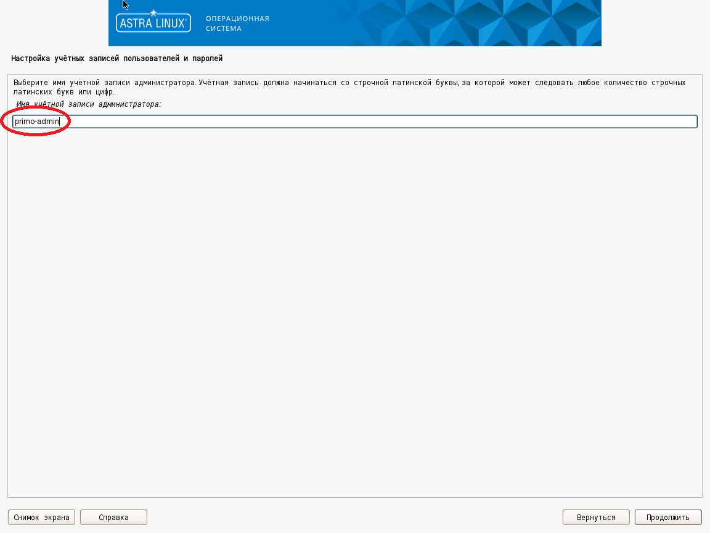
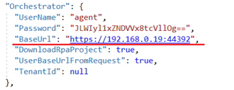

# Настройка машины робота

## Действия при установке Astra Linux 1.7

При установке машины робота под управлением Astra Linux 1.7 необходимо:
- на экране **Настройка учётных записей и паролей** создать пользователя-администратора (далее - primo-admin).



Установка дополнительного ПО и создание дополнительных пользователей будет описана ниже.

## Настройка дополнительного ПО

1. Выполните подключение машины робота к репозиториям `main`, `update`, `base` и `extended`. Сами репозитории описаны в статье [Интернет-репозитории Astra Linux Special Edition x.7](https://wiki.astralinux.ru/pages/viewpage.action?pageId=158598882). Настройка локальных зеркал этих репозиториев описана в статье [Создание репозиториев для операционной системы Astra Linux Special Edition x.7 в закрытом сегменте](https://wiki.astralinux.ru/pages/viewpage.action?pageId=199148426)

**!!ВАЖНО!! Локальные репозитории необходимо выгружать на машине, имеющей доступ в Интернет.**

Рекомендуется выделить одну машину под управлением Astra Linux 1.7 для размещения на ней сервера репозиториев.

2. Проверьте доступность репозиториев, используя следующую команду:
```
[primo-admin@astra-robot ~]$ sudo apt update
```

Репозитории `main`, `update`, `base` и `extended` должны присутствовать в выводе команды.

3. Установите необходимо для работы робота ПО:
```
[primo-admin@astra-robot ~]$ sudo apt -y install at xvfb python3-numpy python3-opencv xdotool dotnet-sdk-6.0 graphicsmagick-imagemagick-compat
```

## Настройка учетной записи агента

Для работы агента оркестратора и роботов необходима общая группа:
```
[primo-admin@astra-robot ~]$ sudo groupadd primo-rpa
```

Для работы агента оркестратора необходима учётная запись:
```
[primo-admin@astra-robot ~]$ sudo useradd -g primo-rpa -m -s /bin/bash agent
```

Если необходимо, то учётной записи можно задать пароль:
```
[primo-admin@redos-robot ~]$ sudo passwd agent
Новый пароль : ***
Повторите ввод нового пароля : ***
passwd: пароль успешно обновлён
```

Для запуска агентом оркестратора заданий роботов без прав пользователя `root` необходима следующая настройка:
```
[primo-admin@astra-robot ~]$ sudo sh -c "echo 'agent ALL = (%primo-rpa) NOPASSWD: /usr/bin/at' > /etc/sudoers.d/primo-rpa-agent"
```

## Установка агента

Разворачивание файлов агента оркестратора на машине роботов (файл `Agent-linux.zip` должен находиться в каталоге `/srv/samba/shared/install`):
```
[primo-admin@astra-robot ~]$ sudo mkdir -p /opt/Primo/Agent /opt/LTools
[primo-admin@astra-robot ~]$ sudo unzip /srv/samba/shared/install/Agent-linux.zip -d /opt/Primo/Agent
[primo-admin@astra-robot ~]$ sudo chmod a+x /opt/Primo/Agent/Primo.Orchestrator.Agent
[primo-admin@astra-robot ~]$ sudo chown -R agent.primo-rpa /opt/Primo/Agent /opt/LTools
[primo-admin@astra-robot ~]$ sudo chmod g+w /opt/Primo/Agent /opt/LTools
```

Устанавливаем агент оркестратора как службу и настраиваем автозапуск:
```
[primo-admin@astra-robot ~]$ sudo cp /opt/Primo/Agent/Primo.Orchestrator.Agent.service /etc/systemd/system/
[primo-admin@astra-robot ~]$ sudo systemctl daemon-reload
[primo-admin@astra-robot ~]$ sudo systemctl enable /etc/systemd/system/Primo.Orchestrator.Agent.service
```

В конфигурационном файле `appsettings.ProdLinux.json` необходимо указать адрес Оркестратора и TenantId (если эта машина не в тенанте по-умолчанию) и пользователя из тенанта:



Запуск службы:
```
[primo-admin@astra-robot ~]$ sudo systemctl start Primo.Orchestrator.Agent
```

Просмотр статуса службы:
```
[primo-admin@astra-robot ~]$ sudo systemctl status Primo.Orchestrator.Agent
```

Просмотр журнала службы:
```
[primo-admin@astra-robot ~]$ sudo journalctl -u Primo.Orchestrator.Agent
```

## Настройка правила брандмауэра `ufw`

Установка и настройка брандмауэра `ufw` описана в статье [Межсетевой экран ufw](https://wiki.astralinux.ru/pages/viewpage.action?pageId=27362474).

Для разрешения доступа к API агента оркестратора необходимо выполнить следующее:
```
[primo-admin@astra-robot ~]$ sudo ufw allow 5002/tcp
```

## Настройка учетной записи робота

Создание учётной записи робота `robot1`:
```
[primo-admin@astra-robot ~]$ sudo useradd -g primo-rpa -m -s /bin/bash robot1
```

Установка пароля учётной записи робота `robot1`:
```
[primo-admin@astra-robot ~]$ sudo passwd robot1
Новый пароль : ***
Повторите ввод нового пароля : ***
passwd: пароль успешно обновлён
```

После создания учётной записи робота на машине робота необходимо войти в графический сеанс этой учётной записи для инициализации графического окружения.

Рекомендуется отключить фон рабочего стола для экономии памяти. Для этого используйте: 

ПКМ на рабочем столе -> Свойства -> Обои, удалить обои и логотип.

Запомните разрешение экрана, при котором тестируются действия робота - поиск изображений, клики и т.п., чтобы настроить такое же разрешение пользователю робота в Оркестраторе:

Пуск -> Настройка монитора.

**Рекомендации по настройке пользователя робота в Оркестраторе (пользователя РДП):**  
Для экономии памяти следует использовать минимально необходимую глубину цвета экрана - 24 или 16 бит.
