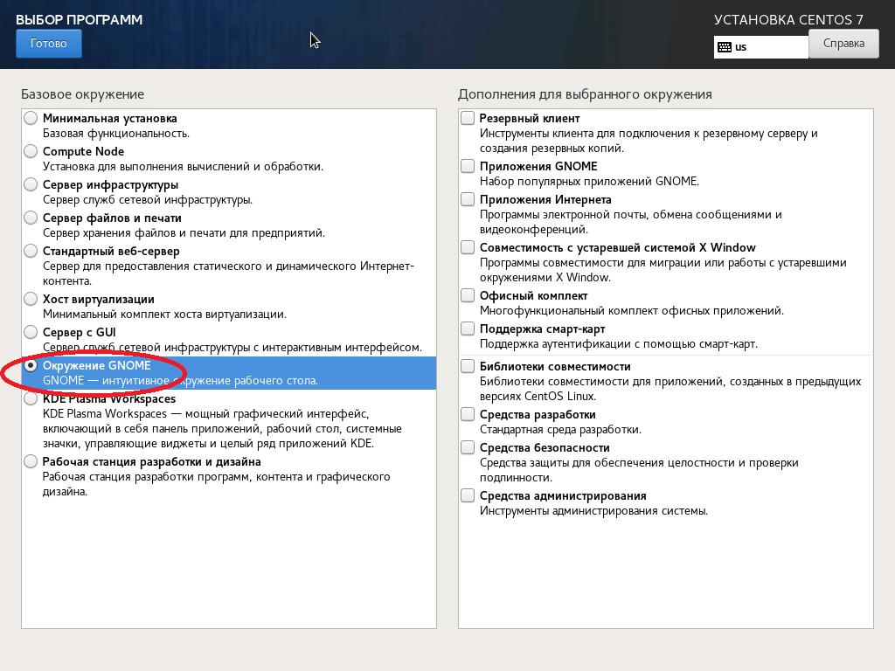
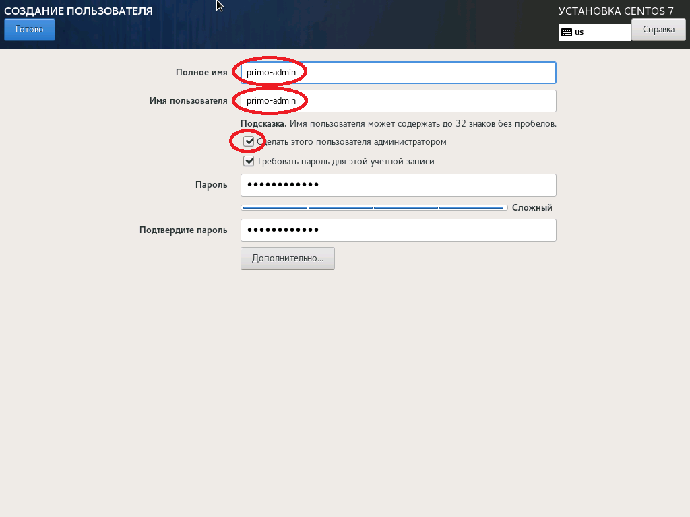

# Настройка машины робота

## Действия при установке Centos 7

При установке машины робота под управлением Centos 7 необходимо:
- на экране **ВЫБОР ПРОГРАММ** отметить базовое окружение **Рабочая станция**;



- на экране **СОЗДАНИЕ ПОЛЬЗОВАТЕЛЕЙ** создать пользователя-администратора (далее - `primo-admin`).



Установка дополнительного ПО и создание дополнительных пользователей будет описана ниже.

## Настройка дополнительного ПО

1. Выполните подключение машины робота к репозиториям `base`, `extra` и `updates`. Настройка локальных зеркал этих репозиториев описана в [Create Local Repos](https://wiki.centos.org/HowTos(2f)CreateLocalRepos.html)

**!!ВАЖНО!! Локальные репозитории необходимо выгружать на машине, имеющей доступ в Интернет.**

Рекомендуется выделить одну машину под управлением Centos 7 для размещения на ней сервера репозиториев.


2. Проверьте доступность репозиториев `base`, `extra` и `updates`, используя следующую команду:
```
[primo-admin@centos-robot ~]$ sudo yum repolist
```

Репозитории `base`, `extra` и `updates` должны присутствовать в выводе команды.

3. Установите необходимое для работы робота ПО:
```
[primo-admin@centos-robot ~]$ sudo yum -y install at xorg-x11-server-Xvfb numpy opencv-python ImageMagick
[primo-admin@centos-robot ~]$ sudo yum -y install epel-release
[primo-admin@centos-robot ~]$ sudo yum -y install xdotool
[primo-admin@centos-robot ~]$ sudo rpm -Uvh https://packages.microsoft.com/config/centos/7/packages-microsoft-prod.rpm
[primo-admin@centos-robot ~]$ sudo yum -y install dotnet-sdk-6.0
```

Для установки пакетов `xdotool` и `dotnet-sdk-6.0` необходимо подключение к сети Internet.

## Настройка учетной записи агента

Для работы агента оркестратора и роботов необходима общая группа:
```
[primo-admin@centos-robot ~]$ sudo groupadd primo-rpa
```

Для работы агента оркестратора необходима учётная запись:
```
[primo-admin@centos-robot ~]$ sudo useradd -g primo-rpa -m -s /bin/bash agent
```

Если требуется, то учётной записи можно задать пароль:
```
[primo-admin@centos-robot ~]$ sudo passwd agent
Изменяется пароль пользователя agent.
Новый пароль : ***
Повторите ввод нового пароля : ***
passwd: все данные аутентификации успешно обновлены.
```

Для запуска агентом оркестратора заданий роботов без прав пользователя `root` требуется следующая настройка:
```
[primo-admin@centos-robot ~]$ sudo sh -c "echo 'agent ALL = (%primo-rpa) NOPASSWD: /usr/bin/at' > /etc/sudoers.d/primo-rpa-agent"
[primo-admin@centos-robot ~]$ sudo sh -c "echo 'agent ALL = (ALL) NOPASSWD: /usr/sbin/reboot' >> /etc/sudoers.d/primo-rpa-agent"
```

## Установка агента

Разворачивание файлов агента оркестратора на машине роботов (файл `Agent-linux.zip` должен находиться в каталоге `/srv/samba/shared/install`):
```
[primo-admin@centos-robot ~]$ sudo mkdir -p /opt/Primo/Agent /opt/LTools
[primo-admin@centos-robot ~]$ sudo unzip /srv/samba/shared/install/Agent-linux.zip -d /opt/Primo/Agent
[primo-admin@centos-robot ~]$ sudo chmod a+x /opt/Primo/Agent/Primo.Orchestrator.Agent
[primo-admin@centos-robot ~]$ sudo chown -R agent.primo-rpa /opt/Primo/Agent /opt/LTools
[primo-admin@centos-robot ~]$ sudo chmod g+w /opt/Primo/Agent /opt/LTools
```

Установите агент оркестратора как службу и настройте автозапуск:
```
[primo-admin@centos-robot ~]$ sudo cp /opt/Primo/Agent/Primo.Orchestrator.Agent.service /etc/systemd/system/
[primo-admin@centos-robot ~]$ sudo systemctl daemon-reload
[primo-admin@centos-robot ~]$ sudo systemctl enable /etc/systemd/system/Primo.Orchestrator.Agent.service
```

В конфигурационном файле `appsettings.ProdLinux.json` укажите адрес Оркестратора и TenantId (если эта машина не в тенанте по-умолчанию) и пользователя из тенанта, а также адрес машины робота:
<pre>
  "Orchestrator": {
    "UserName": "agent",
    "Password": "Qwe123!@#",
    "BaseUrl": <b>"https://192.168.1.154:5001",</b>
    "DownloadRpaProject": true,
    "UserBaseUrlFromRequest": true,
    "TenantId": ""
  },
  ...
  "Agent": {
    ...
    "IpAddress": <b>"192.168.0.20",</b>
    ...
  },
</pre>

Убедитесь, что в конфигурационном файле `appsettings.ProdLinux.json` правильно указаны команды, с помощью которых агент запускает роботов и управляет машиной (здесь указаны правильные команды для Centos 7):
<pre>
  "AgentCommands": {
    "At": <b>"/usr/bin/at",</b>
    "Reboot": <b>"/usr/sbin/reboot",</b>
    "Xvfb": <b>"/usr/bin/xvfb-run",</b>
    "Session": <b>"/usr/bin/gnome-session"</b>
  },
</pre>

Запуск службы:
```
[primo-admin@centos-robot ~]$ sudo systemctl start Primo.Orchestrator.Agent
```

Просмотр статуса службы:
```
[primo-admin@centos-robot ~]$ sudo systemctl status Primo.Orchestrator.Agent
```

Просмотр журнала службы:
```
[primo-admin@centos-robot ~]$ sudo journalctl -u Primo.Orchestrator.Agent
```

## Настройка правила брандмауэра Firewall

Установка и настройка брандмауэра Firewall описана в [Using Firewalls](https://access.redhat.com/documentation/en-us/red_hat_enterprise_linux/7/html/security_guide/sec-using_firewalls).

Для разрешения доступа к API агента оркестратора выполните следующее:
```
[primo-admin@centos-robot ~]$ sudo firewall-cmd --zone=public --add-port=5002/tcp --permanent
[primo-admin@centos-robot ~]$ sudo firewall-cmd --reload
```

## Настройка учетной записи робота

Создание учётной записи робота `robot1`:
```
[primo-admin@centos-robot ~]$ sudo useradd -g primo-rpa -m -s /bin/bash robot1
```

Установка пароля учётной записи робота `robot1`:
```
[primo-admin@centos-robot ~]$ sudo passwd robot1
Изменяется пароль пользователя robot1.
Новый пароль : ***
Повторите ввод нового пароля : ***
passwd: все данные аутентификации успешно обновлены.
```

После создания учётной записи робота на машине робота войдите в графический сеанс этой учётной записи для инициализации графического окружения.

Рекомендуется отключить фон рабочего стола для экономии памяти. Для этого используйте: 

*ПКМ на рабочем столе -> Изменить фон*

Запомните разрешение экрана, при котором тестируются действия робота - поиск изображений, клики и т.п., чтобы настроить такое же разрешение пользователю робота в Оркестраторе:

*Приложения -> Системные -> Параметры -> Устройства -> Дисплеи*

**Рекомендации по настройке пользователя робота в Оркестраторе (пользователя РДП):**  
Для экономии памяти следует использовать минимально необходимую глубину цвета экрана - 24 или 16 бит.

## Обновление агента оркестратора

Остановка службы:
```
[primo-admin@centos-robot ~]$ sudo systemctl stop Primo.Orchestrator.Agent
```

Обновление файлов агента оркестратора на машине роботов (файл `Agent-linux.zip` должен находиться в каталоге `/srv/samba/shared/install`):
```
[primo-admin@centos-robot ~]$ sudo unzip -o -u /srv/samba/shared/install/Agent-linux.zip -d /opt/Primo/Agent -x appsettings.ProdLinux.json appsettings.json
[primo-admin@centos-robot ~]$ sudo chmod a+x /opt/Primo/Agent/Primo.Orchestrator.Agent
```

Запуск службы:
```
[primo-admin@centos-robot ~]$ sudo systemctl start Primo.Orchestrator.Agent
```

Просмотр статуса службы:
```
[primo-admin@centos-robot ~]$ sudo systemctl status Primo.Orchestrator.Agent
```
