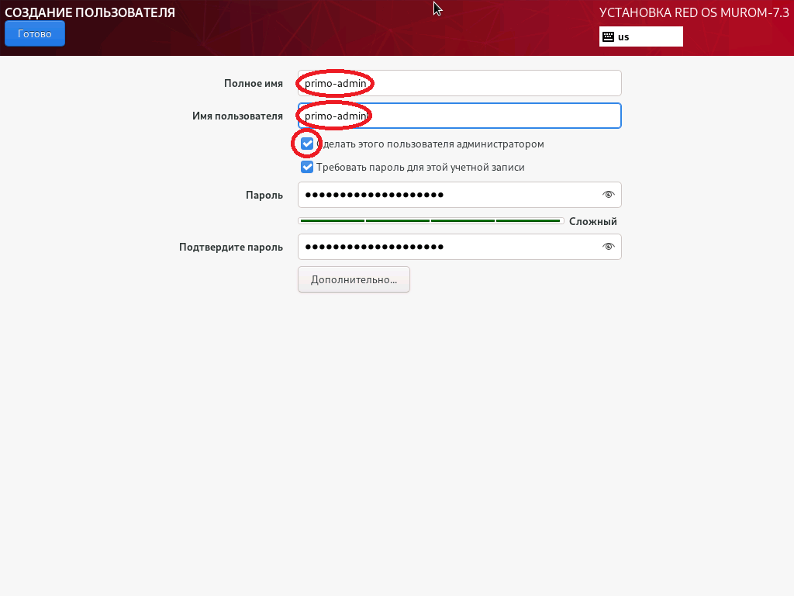

# Настройка машины робота

## Действия при установке РЕДОС 7.3

При установке машины робота под управлением РЕДОС 7.3 необходимо:
- на экране ВЫБОР ПРОГРАММ отметить базовое окружение "Рабочая станция с графическим окружением (MATE)";


- создать пользователя-администратора (далее - admin).



Установка дополнительного ПО и создание дополнительных пользователей будет описана ниже.

## Настройка дополнительного ПО

1. Выполните подключение машины робота к репозиториям `base` и `updates`. Настройка локальных зеркал этих репозиториев описана в [Руководстве РЕДОС](https://redos.red-soft.ru/base/server-configuring/service-repositories/create-repo/)

**!!ВАЖНО!! Локальные репозитории необходимо выгружать на машине, имеющей доступ в Интернет.**

Рекомендуется выделить одну машину под управлением РЕДОС 7.3 для размещения на ней сервера репозиториев.

2. Проверьте доступность репозиториев, используя следующую команду:
```
[admin@redos-robot ~]$ sudo dnf repolist
```

Репозитории `base` и `updates` должны присутствовать в выводе команды.

3. Удалите приложения для автообновления ПО (чтобы избежать засорения рабочего стола робота оповещениями):
```
[admin@redos-robot ~]$ sudo dnf -y remove dnfdragora
```

4. Установите необходимо для работы робота ПО:
```
[admin@redos-robot ~]$ sudo dnf -y install xorg-x11-server-Xvfb python3-numpy python3-opencv xdotool dotnet-sdk-6.0
```

## Настройка учетной записи агента

Для работы агента оркестратора и роботов необходима общая группа:
```
[admin@redos-robot ~]$ sudo groupadd primo-rpa
```

Для работы агента оркестратора необходима учётная запись:
```
[admin@redos-robot ~]$ sudo useradd -g primo-rpa agent
```

Если необходимо, то учётной записи можно задать пароль:
```
[admin@redos-robot ~]$ sudo passwd agent
Изменение пароля пользователя agent.
Новый пароль: ***
Повторите ввод нового пароля: ***
passwd: данные аутентификации успешно обновлены.
```

Для запуска агентом оркестратора заданий роботов без прав пользователя `root` необходима следующая настройка:
```
[admin@redos-robot ~]$ sudo sh -c "echo 'agent ALL = (%primo-rpa) NOPASSWD: /bin/at' > /etc/sudoers.d/primo-rpa-agent"
```

## Установка агента

Разворачивание файлов агента оркестратора на машине роботов (файл `Agent-linux.zip` должен находиться в каталоге `/srv/samba/shared/install`):
```
[admin@redos-robot ~]$ sudo mkdir -p /opt/Primo/Agent /opt/Primo/LTools
[admin@redos-robot ~]$ sudo unzip /srv/samba/shared/install/Agent-linux.zip -d /opt/Primo/Agent
[admin@redos-robot ~]$ sudo chmod a+x /opt/Primo/Agent/Primo.Orchestrator.Agent
[admin@redos-robot ~]$ sudo chown -R agent.primo-rpa /opt/Primo/Agent /opt/Primo/LTools
```

Устанавливаем агент оркестратора как службу и настраиваем автозапуск:
```
[admin@redos-robot ~]$ sudo cp /opt/Primo/Agent/Primo.Orchestrator.Agent.service /etc/systemd/system/
[admin@redos-robot ~]$ sudo systemctl daemon-reload
[admin@redos-robot ~]$ sudo systemctl enable /etc/systemd/system/Primo.Orchestrator.Agent.service
```

В конфигурационном файле `appsettings.ProdLinux.json` необходимо указать адрес Оркестратора и TenantId (если эта машина не в тенанте по-умолчанию) и пользователя из тенанта:


Запуск службы:
```
[admin@redos-robot ~]$ sudo systemctl start Primo.Orchestrator.Agent
```

Просмотр статуса службы:
```
[admin@redos-robot ~]$ sudo systemctl status Primo.Orchestrator.Agent
```

Просмотр журнала службы:
```
[admin@redos-robot ~]$ sudo journalctl -u Primo.Orchestrator.Agent
```

## Настройка правила брандмауэра Firewall

Установка и настройка брандмауэра Firewall описана в [Руководстве РЕДОС](https://redos.red-soft.ru/base/server-configuring/firewall/configuring-firewall/).

Для разрешения доступа к API агента оркестратора необходимо выполнить следующее:
```
[admin@redos-robot ~]$ sudo firewall-cmd --zone=public --add-port=5002/tcp --permanent
[admin@redos-robot ~]$ sudo firewall-cmd --reload
```

## Настройка учетной записи робота

Создание учётной записи робота `robot1`:
```
[admin@redos-robot ~]$ sudo useradd -g primo-rpa robot1
```

Установка пароля учётной записи робота `robot1`:
```
[admin@redos-robot ~]$ sudo passwd robot1
Изменение пароля пользователя robot1.
Новый пароль: ***
Повторите ввод нового пароля: ***
passwd: данные аутентификации успешно обновлены.
```

После создания учётной записи робота на машине робота необходимо войти в графический сеанс этой учётной записи для инициализации графического окружения.

Рекомендуется отключить фон рабочего стола для экономии памяти. Для этого используйте: 

ПКМ на рабочем столе -> Параметры внешнего вида -> Фон -> Без фона рабочего стола

Запомните разрешение экрана, при котором тестируются действия робота - поиск изображений, клики и т.п., чтобы настроить такое же разрешение пользователю робота в Оркестраторе:

Пуск -> Параметры -> Экраны

**Рекомендации по настройке пользователя робота в Оркестраторе (пользователя РДП):**  
Для экономии памяти следует использовать минимально необходимую глубину цвета экрана - 24 или 16 бит.
