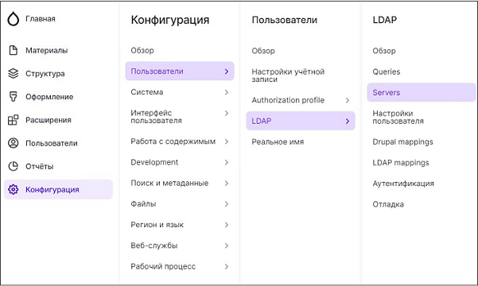
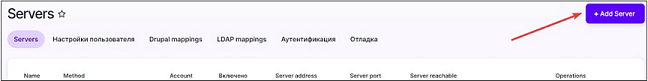
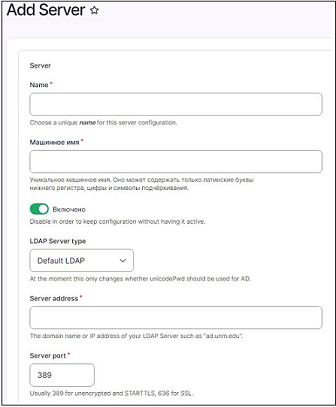

# Интеграция Idea Hub с LDAP #

Настройка интеграции Idea Hub с LDAP производится следующим образом:

В вертикальном меню слева выберите иконку с изображением шестеренки – будет открыто меню **Конфигурация**. Далее выберите пункт **Пользователи -> LDAP -> Servers** - откроется страница **Servers**.

На странице **Servers** нажмите кнопку **Add Server** в правом верхнем углу экрана для доступа в диалог настроек сервера.

В открывшемся диалоге **Add Server** заполните поля необходимой информацией, затем нажмите кнопку **Сохранить**.

Поля диалога **Add Server**:

**Name** – уникальное имя для данной конфигурации.

**Машинное имя** – может состоять только из латинских букв нижнего регистра, цифр и символов подчеркивания.

**Переключатель сохранения конфигурации** с активацией/без активации подключения к серверу.

**LDAP Server type** – по умолчанию используется Default LDAP.

**Server address** – доменное имя или IP адрес LDAP сервера, с которым устанавливается соединение.

**Server port** – порт сервера (обычно используется порт 389 для незашифрованных и STARTTLS соединений, порт 636 – для SSL соединений).
