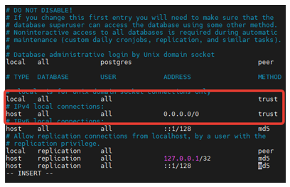
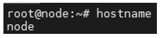
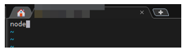
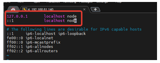

# Установка Primo RPA Orchestrator на Ubuntu Server 22.04
(при наличии интернета на сервере)

- **Шаг 1**:   

Обновите список пакетов и систему
```
sudo apt update
sudo apt upgrade
sudo reboot
```
Перейдите в режим root:  
`sudo -i` (введите пароль) - далее все действия будут выполняться под пользователем root

- **Шаг 2**:  

Скачайте и установите соответствующую вашей операционной системе версию **PostgreSQL**, используя [инструкцию](https://www.postgresql.org/download/). 

Разрешите подключение к PostgreSQL по сети:  

`vim /etc/postgresql/13/main/postgresql.conf`

Найдите строку:  

`listen_addresses = 'localhost'`  

и внесите следующие изменения:   

`listen_addresses = '*'`  

Далее откройте файл pg_hba.conf: 

`vim /etc/postgresql/13/main/pg_hba.conf`

Найдите строки и внесите туда следующие изменения:  


`systemctl restart postgresql`

Далее:  
```
sudo -i -u postgres psql -U postgres -c 'create database ltoolslicense;'
sudo -i -u postgres psql -c 'grant all privileges on database ltoolslicense to postgres;'
sudo -i -u postgres psql -c "alter user postgres with password 'postgres'"
systemctl restart postgresql
systemctl status postgresql
```

- **Шаг 3**

Скачайте и установите нужную версию **RabbitMQ**, используя инструкции для [Debian, Ubuntu и основанных на них дистрибутивах](https://www.rabbitmq.com/docs/install-debian), либо инструкции для [RPM дистрибутивов](https://www.rabbitmq.com/docs/install-rpm).

Далее посмотрите имя вашего сервера:  
`hostname`



`vim /etc/hostname`

Пропишите его в файл:



`vim /etc/hosts`



`reboot`

После перезагрузки от root:
```
adminPassword="Qwe123"'!'"@#"
systemctl enable rabbitmq-server
rabbitmq-plugins enable rabbitmq_management
rabbitmqctl add_user 'admin' ${adminPassword}
rabbitmqctl set_user_tags admin administrator
rabbitmqctl set_permissions -p / admin '.*' '.*' '.*'
systemctl restart rabbitmq-server
```

Проверьте статус:

`systemctl status rabbitmq-server`

- **Шаг 4**

Установите **nginx** из репозиториев

`apt install nginx -y`

Далее используйте архив nginx-linux.zip из `\Primo Orchestrator 1.23.5.0\Distr\Linux`.

Распакуйте его в папку:
`unzip nginx-linux.zip -d /tmp/nginx/`

И скопируйте содержимое:
```
cp /tmp/nginx/* /etc/nginx
systemctl restart nginx
```

> ***Конфигурационный файл и файлы сертификатов из данного архива строго необходимы для работы Оркестратора.***

Проверьте статус:

`systemctl status nginx`

- **Шаг 5**

Установите **веб-интерфейс**:

`unzip UI.zip -d /opt/Primo/UI`

Перейдите адресу: 
[https://ipaddr:44392](https://ipaddr:44392)

- **Шаг 6**

Установите **WebApi**:
```
mkdir -p /opt/Primo/WebApi
unzip WebApi-linux.zip -d /opt/Primo/WebApi/
cp /opt/Primo/WebApi/Primo.Orchestrator.WebApi.service /etc/systemd/system/
systemctl daemon-reload
systemctl enable /etc/systemd/system/Primo.Orchestrator.WebApi.service
chmod -R +x /opt/Primo/WebApi/Primo.Orchestrator.WebApi
vim /opt/Primo/WebApi/appsettings.ProdLinux.json
```
Задайте переменную окружения:
```
export ASPNETCORE_ENVIRONMENT=ProdLinux
systemctl start Primo.Orchestrator.WebApi
systemctl status Primo.Orchestrator.WebApi
```

Дальнейшие пункты (7-12) могут выполняться в произвольном порядке.

- **Шаг 7**

