# Установка WebApi и UI на IIS под Windows 2016 Server

:small_orange_diamond: Перед началом работы установите все последние обновления Windows.

### 1. Включение компьютера в AD 
(не требуется, если используется DHCP)

Перед установкой IIS настройте статический IP адрес и DNS. В DNS пропишите IP контроллера AD. Это нужно для включения компьютера в AD.

Правой кнопкой мыши щелкните по иконке «Network» в правом нижнем углу:


Во всплывающем меню выберите «Open Network and Sharing Center»:

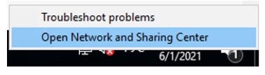

В открывшемся окне «Network and Sharing Center» в левом меню выберите «Change adapter settings»:

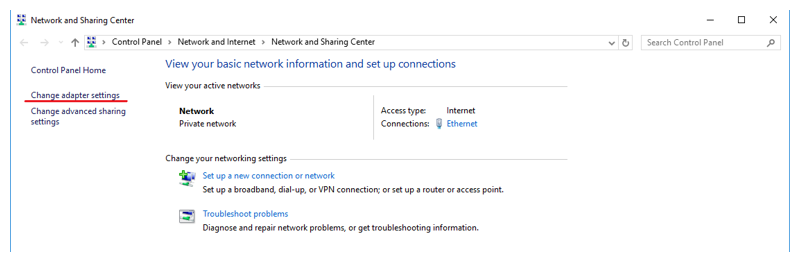

В открывшемся окне «Network Connections» выберите сетевой адаптер и щелкните по нему правой кнопкой мыши:

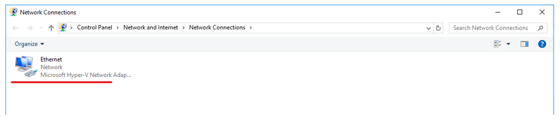

Во всплывающем меню выберите «Properties»:

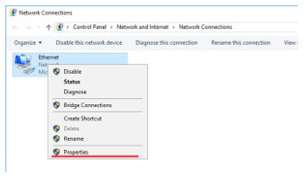

В открывшемся окне «Ethernet Properties» щелкните по «Internet Protocol Version 4 (NCP/IPv4)»:

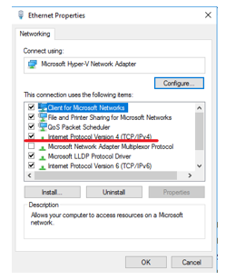

В открывшемся окне «Internet Protocol Version 4 (NCP/IPv4) Properties» (рисунок 7) настройте параметры:

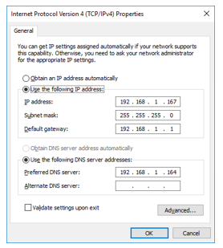

Выберите «Use the following IP address» и пропишите значения полей «IP address», «Subnet mask» и «Default gateway». 
> Для VM значения этих полей можно узнать командой ipconfig

Выберите «Use the following DNS server addresses» и пропишите в поле «Preferred DNS server» IP контроллера домена.

Для удобства дальнейших настроек поменяйте имя компьютера, например, на «IIS». В главном меню Windows выберите пункт «Settings»:

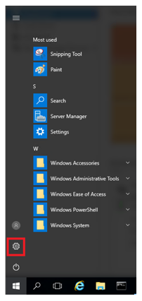

В открывшемся окне «Settings» выберите пункт меню «System»:

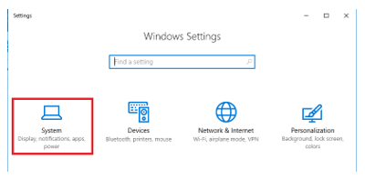

И потом «About»:

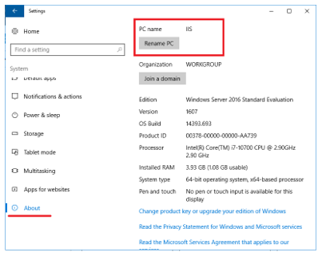

При помощи кнопки «Rename PC» переименуйте компьютер, дождитесь перезагрузки.

Здесь же присоедините компьютер к AD:

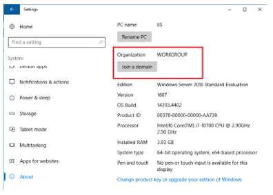

Нажмите кнопку «Join a domain» и выберите имя AD:

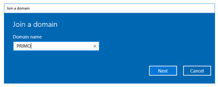

Нажмите кнопку «Next» и введите логин/пароль доменной учетной записи:

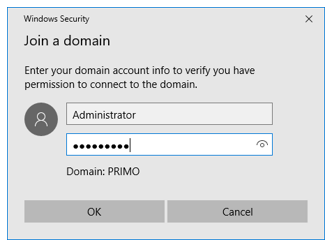

Добавьте информацию о доменной учетной записи на компьютер, выбрав «Account type» = «Administrator»:

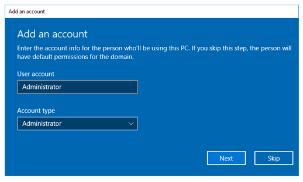

Перезагрузите компьютер:

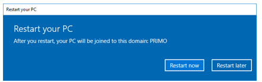

После перезагрузки компьютера появится возможность входа в AD с доменной учетной записью:

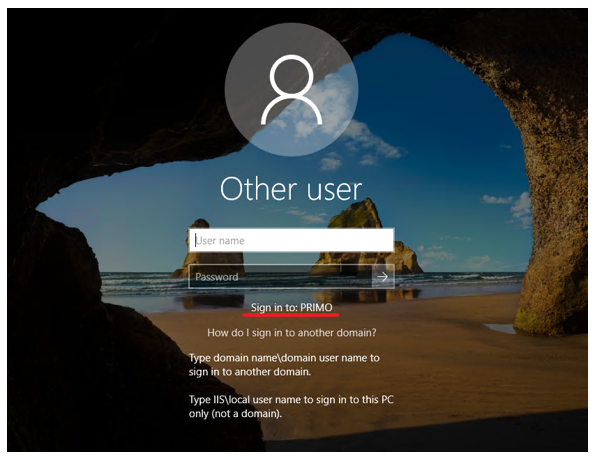

## 2. Установка IIS

Войдите в систему с локальной учетной записью Administrator:

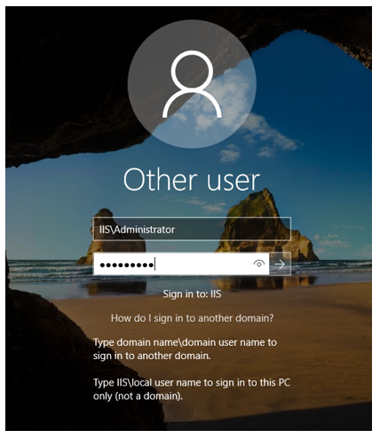

В «Server Manager» (откроется автоматически после входа в систему, также его можно запустить из главного меню), выберите «Add Roles and Features»:

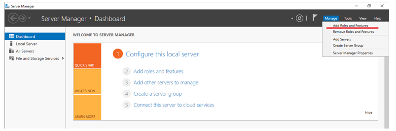

В «Before you begin» нажмите кнопку «Next»:

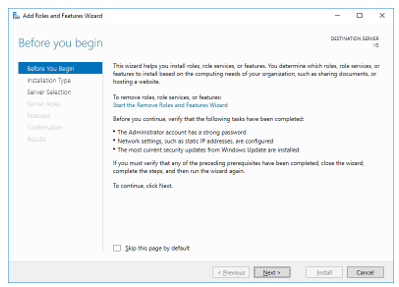

В «Installation Type» оставьте выбор по умолчанию:

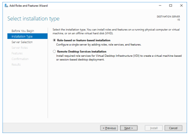

В «Server Selection» оставьте по умолчанию:

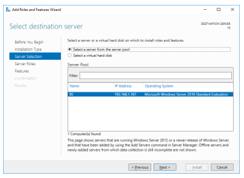

В «Server Roles» выберите «Web Server (IIS)»:

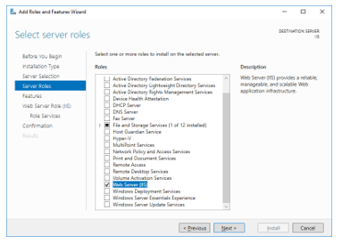

В «Features» оставьте выбор по умолчанию:

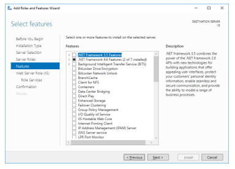

В «Web Server Role (IIS)» нажмите кнопку «Next»:

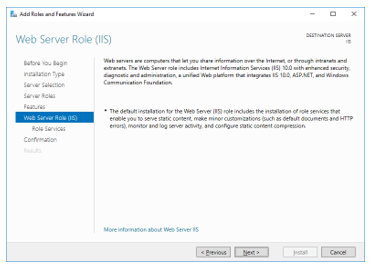

В «Role Services» выберите «HTTP Redirection» и «Windows Authentication»:

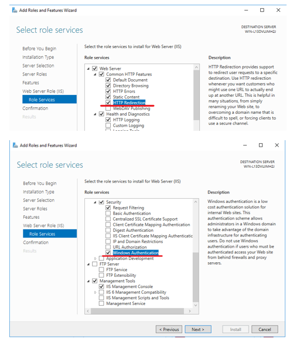

:small_orange_diamond: «WebDAV Publishing» выбирать нельзя. Если он выбран ранее – требуется его отключить, сняв галку.

В «Confirmation» нажмите кнопку «Install» и дождитесь завершения установки:

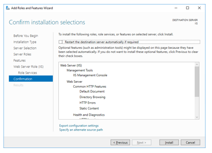

### 3. Разворачивание узлов веб-приложения

Откройте оснастку для управления IIS:

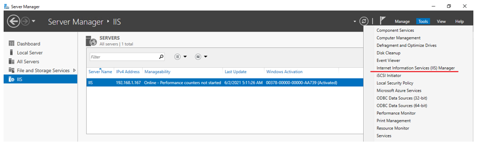

Создайте системную переменную окружения ASPNETCORE_ENVIRONMENT= ProdWin. Для этого в PoweShell выполните команду:
```
[System.Environment]::SetEnvironmentVariable('ASPNETCORE_ENVIRONMENT', 'ProdWin', [System.EnvironmentVariableTarget]::Machine)
```
Для узла WebApi создайте отдельный неуправляемый Application Pool с наименованием Primo.WebApi, 
**Start Mode = AlwaysRunning и Regular Time Interval (minutes) = 0** (чтобы пулл приложений не выгружался, так как при выгрузке сломается работа фоновых служб приложения).

Добавление Application Pool:

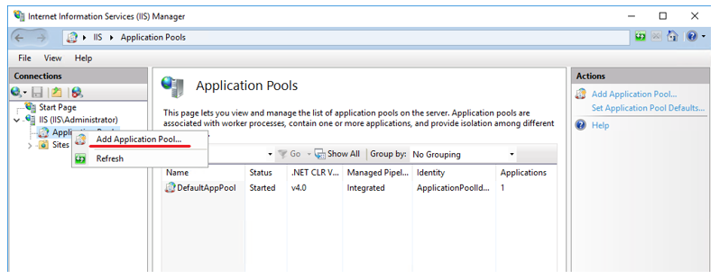

Параметры Application Pool:

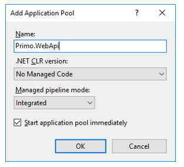

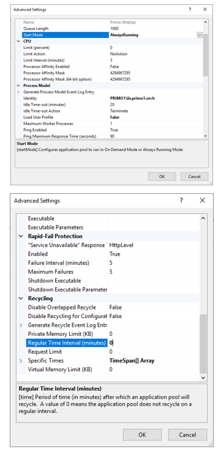

Добавлен Application Pool с наименованием Primo.WebApi:

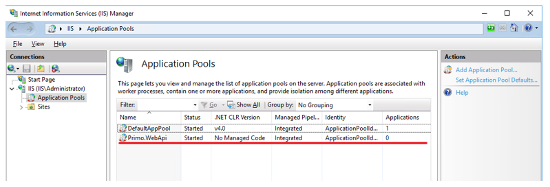


