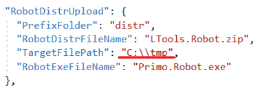
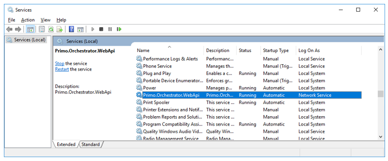

# Установка WebApi как службы под Windows 2016 Server

В версии Windows 2016 Server среда исполнения ASP .NET Core предустановлена, поэтому можно сразу установить WebApi. 

Разархивируйте C:\Install\WebApi.zip в C:\Primo\WebApi. Можно при помощи PowerShell:

`Expand-Archive -LiteralPath "$InstallPath\WebApi.zip" -DestinationPath 'C:\Primo\WebApi' -Force`

Отредактируйтк конфигурационный файл WebApi (`C:\Primo\WebApi\appsettings.ProdWin.json`):  

- Поменяйте на реальный (который у вашего сервера, см. [статью](http://docs.primo-rpa.ru/primo-rpa/orchestrator-new/install/windows/nginx-windows)) IP:  


- Создайте папку для публикации дистрибутивов Робота, например, C:\tmp, и укажите её в конфигурации `appsettings.ProdWin.json`:  


- Поменяйте в секции ConnectionStrings конфигурации `appsettings.ProdWin.json` HOST для всех строк подключения к БД на реальный IP серверов БД:
    - Тут (для PostgreSQL)  
      
    - Или тут (для MS SQL SERVER)  
      
    - Поменяйте это   
      
    - Или это  
    

Если для Postgres используется схема, отличная от public, надо явно указать схему –  SearchPath=schema1.
Если для работы лицензий используется сервис получения параметров оборудования, то настройте WebApi на работу с этим сервисом – введите адрес этого сервиса:


Если поменялся пользователь/пароль БД – их также поиеняйте.

Создайте системную переменную окружения. Для этого в PowerShell выполните команду:  
```
[System.Environment]::SetEnvironmentVariable('ASPNETCORE_ENVIRONMENT', 'ProdWin', [System.EnvironmentVariableTarget]::Machine)
```
Зарегистрируйте `Primo.Orchestrator.WebApi.exe` как службу Windows и сразу запустите её. 
Служба должна работать как локальная служба. Для этого в PowerShell последовательно выполните команды:
```
New-Service -Name Primo.Orchestrator.WebApi -BinaryPathName "C:\Primo\WebApi\Primo.Orchestrator.WebApi.exe" -Description "Primo.Orchestrator.WebApi" -DisplayName "Primo.Orchestrator.WebApi" -StartupType Automatic 
$s = Get-Service "Primo.Orchestrator.WebApi"
$s.Start()
```
После чего созданная служба Primo.Orchestrator.WebApi будет отображаться в списке всех служб как запущенная:



Служба может не запуститься. Наиболее вероятная причина – это неверный коннекшнстринг (пароль) в `appsettings.ProdWin.json` и/или если не развернута/не настроена какая-либо из 4-х БД Оркестратора.

При обновлении службы WebApi может потребоваться дополнительная настройка для RabbitMQ. Для выполнения настройки необходимо перед стартом службы WebApi запустить скрипт из комплекта поставки: deletequeues.bat – для RabbitMQ, запущенном на ОС Windows, и deletequeues.sh – для RabbitMQ, запущеном на ОС Linux. Скрипты необходимо запустить на сервере, на котором запущен RabbitMQ. 
