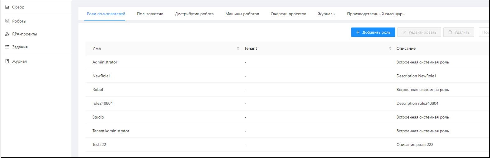

# Роли пользователей

Права пользователей в Оркестраторе настраиваются при помощи ролей. Каждая роль содержит в себе набор прав по работе с сущностями системы. 
Права делятся на категории: «Просмотр», «Создание», «Редактирование», «Удаление», «Управление».

В дальнейшем, при работе с пользователями, роли назначаются пользователю. Управление ролями осуществляется на вкладке **Настройки/Роли пользователей**. 
Добавление новой роли осуществляется по кнопке **Добавить роль**:

