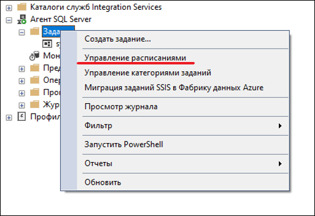
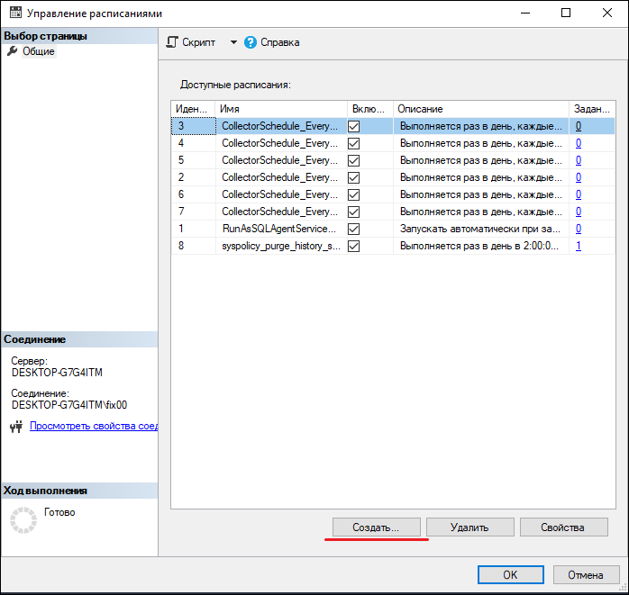
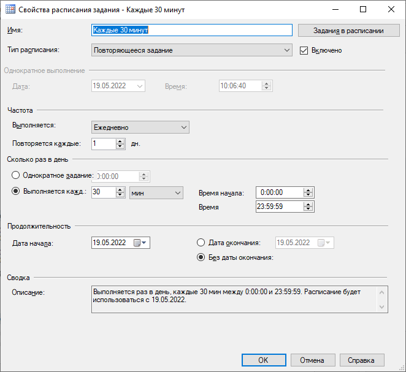
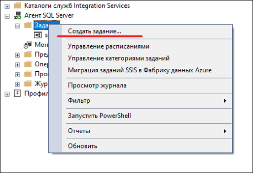
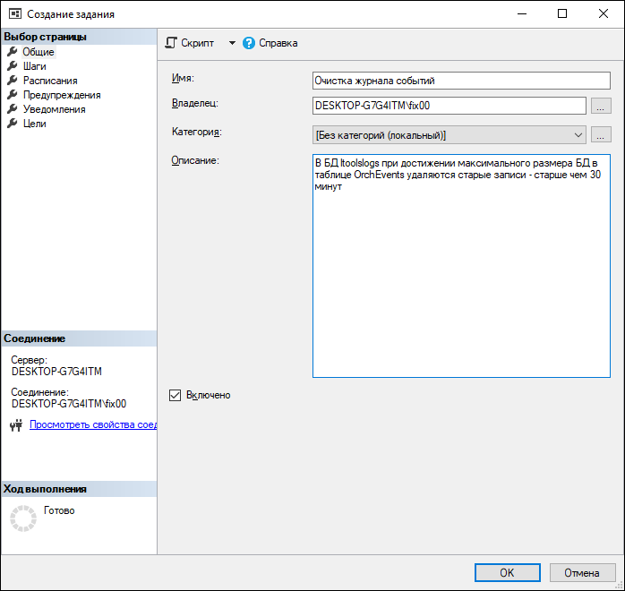
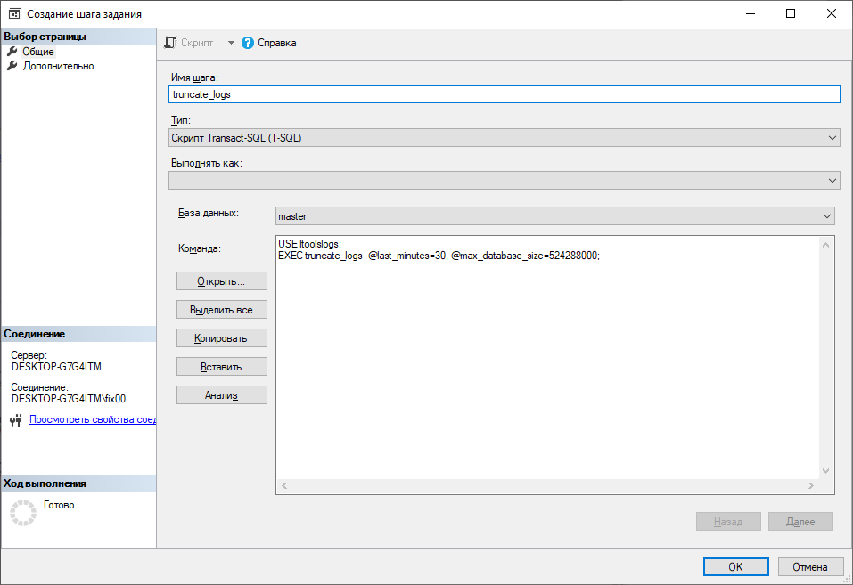
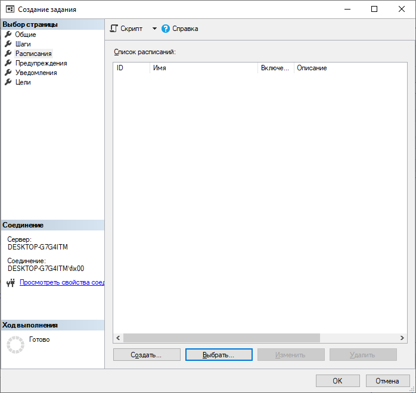
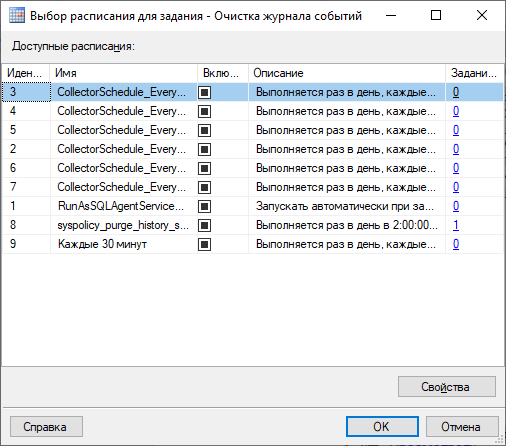
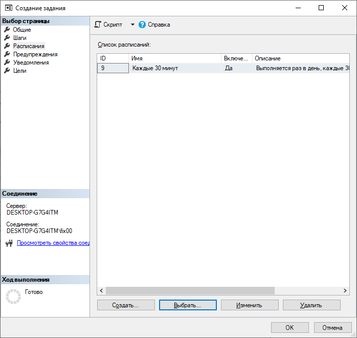
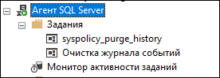

# Настройка автоматической очистки событий Оркестратора для MSSQL

Разверните узел Агент SQL Server, откройте контекстное меню узла **Задания** и выберите **Управление расписаниями**:



В диалоговом окне **Управление расписаниями** выберите **Создать**:



В поле **Имя** введите имя нового расписания - **Каждые 30 минут**.\
Тип расписания - **Повторяющееся задание**. Задание будет выполняться ежедневно каждые 30 минут.\
Если не нужно, чтобы расписание вступило в силу немедленно после создания, снимите флажок **Включено**:




Создаем хранимую процедуру:

```TSQL
USE ltoolslogs;

CREATE PROC truncate_logs(
    @last_minutes INTEGER, 
    @max_database_size INTEGER)  
AS 
BEGIN
    DECLARE @database_size INTEGER;  
	SET @database_size = (SELECT total_size_mb = SUM(size)
                          FROM sys.master_files WITH(NOWAIT)
                          WHERE database_id = DB_ID() 
                          GROUP BY database_id);
    IF (@database_size > @max_database_size) BEGIN
       EXEC msdb.dbo.sp_delete_database_backuphistory @database_name = 'ltoolslogs';
       DELETE FROM OrchEvents 
       WHERE OrchTimestampUtc < DATEADD(mi, -@last_minutes, GETUTCDATE());
    END;
END;
```

Создаем задание, которое будет запускать эту хранимую процедуру по расписанию:



Вводим общие параметры задания:
* Имя - **Очистка журнала событий**; 
* Описание - **В БД ltoolslogs при достижении максимального размера БД в таблице OrchEvents удаляются старые записи - старше чем 30 минут**



Задаем шаги задания: будет один шаг с именем шага **truncate_logs** и командой:
```
USE ltoolslogs;
EXEC truncate_logs  @last_minutes=30, @max_database_size=524288000;
```



Задаем расписание. Чтобы выбрать готовое, нажимаем кнопку **Выбрать**:
  


Откроется список расписаний:
  


Выбираем ранее созданное расписание **Каждые 30 минут**:
  


Нажимаем **ОК**. Задание **Очистка журнала событий** будет отображаться среди всех заданий:
  


