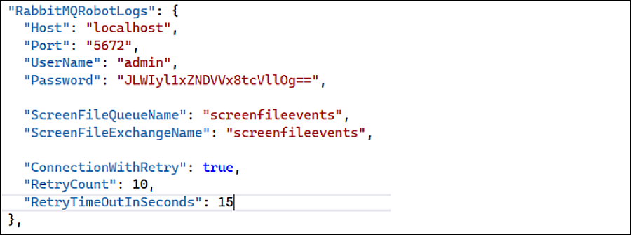
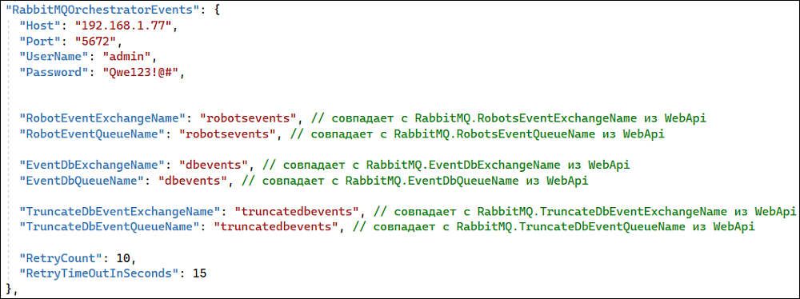
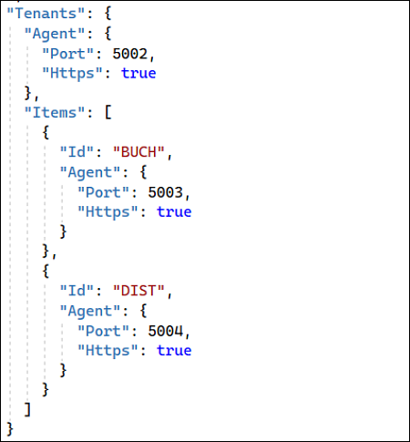
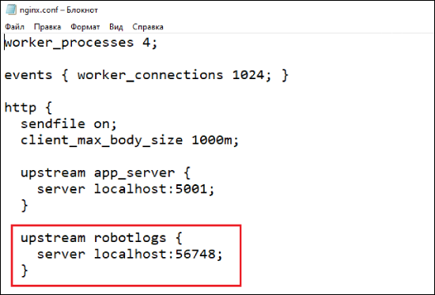
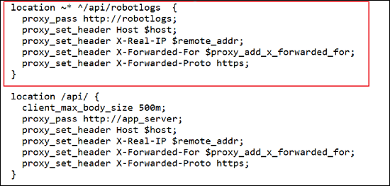
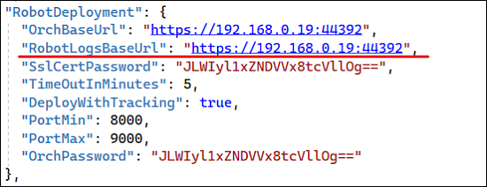

# Установка RobotLogs как службы 
Раздел содержит инструкцию по установке **RobotLogs как службы** под Windows 2016 Server. В версии Windows 2016 Server среда исполнения ASP .NET Core предустановлена, поэтому возможно сразу перейти к установке RobotLogs. 

**Как установить RobotLogs:**

1\. Сначала требуется установить RabbitMQ (см. раздел «Руководство по установке RabbitMQ под Windows 2016 Server»).\
2\. Распакуем архив `C:\Install\RobotLogs.zip` в `C:\Primo\RobotLogs`. Можно при помощи PowerShell:
```
> $InstallPath = "C:\Install"
> Expand-Archive -LiteralPath "$InstallPath\RobotLogs.zip" -DestinationPath "C:\Primo\RobotLogs " -Force
```
3\. Создаем системную переменную окружения (если не создана ранее). Для этого в PoweShell выполняем команду:
```
> [System.Environment]::SetEnvironmentVariable('ASPNETCORE_ENVIRONMENT', 'ProdWin', [System.EnvironmentVariableTarget]::Machine)
```
4\. Вносим изменения в конфигурационный файл:
* Настраиваем строки подключения в БД:


* Настраиваем **UserName** и **Password** сервера RabbitMQ, который используется для обработки логов со скринами рабочего стола:



* Настраиваем **Host, UserName** и **Password** сервера RabbitMQ, который используется для интеграции с Оркестратором:



* Открываем **порт 5672** на файерволе сервера RabbitMQ, который используется для интеграции с Оркестратором.\
  Данный сервер RabbitMQ является общим для очередей **Primo.Orchestrator.RobotLogs** и **Primo.Orchestrator.WebApi**. Поэтому необходимо соблюдать соответствие названий очередей и обменников.

* Настраиваем **URL Оркестратора**. При необходимости можно поменять пароль встроенной системной записи Orchestrator – одновременно через UI Оркестратора и в этой секции конфигурационного файла:


* Настраиваем параметр **ScreenFilePath** – путь до файлов со скринами рабочего стола, которые собираются с машины робота. Папка по этому пути должна быть создана заранее и для нее должны быть настроены права на чтение и запись для всех:


* Настраиваем **список тенантов** в соответствии с конфигурационным файлом WebApi:



5\. Регистрируем **Primo.Orchestrator.RobotLogs.exe** как службу Windows и сразу запускаем ее. Она должна работать как локальная служба. Для этого в PowerShell последовательно выполняем команды:
```
> New-Service -Name Primo.Orchestrator.RobotLogs -BinaryPathName "C:\Primo\RobotLogs\Primo.Orchestrator.RobotLogs.exe" -Description "Primo.Orchestrator.RobotLogs" -DisplayName "Primo.Orchestrator.RobotLogs" -StartupType Automatic 
> $s = Get-Service "Primo.Orchestrator.RobotLogs"
> $s.Start()
```
6\. Созданная служба **Primo.Orchestrator.RobotLogs** будет отображаться в списке всех служб как запущенная.

7\. Открываем **порт 56748** на файерволе (если служба RobotLogs не на одном сервере с nginx для WebApi).

8\. Проверяем, что в конфигурационном файле **nginx** настроено проксирование на RobotLogs - или, если используется IIS, аналогично настроено в IIS для узла UI:





9\. В конфигурационном файле **Primo.Orchestrator.WebApi** переключаем прием логов на сервис RobotLogs и перезапускаем **Primo.Orchestrator.WebApi**:


10\. Если запросы в RobotLogs проксируются через отдельный от WebApi эндпоинт, нужно указать этот эндпоинт в конфигурационном файле **Primo.Orchestrator.WebApi** в параметре **RobotLogsBaseUrl**.

:red_circle: ***В настоящее время не поддерживается. Зарезервирован для дальнейшей оптимизации приема логов от роботов.***



11\.  Тонкая настройка производительности приема логов настраивается в секции **InputBufferRobotLogs**:


* **MaxQueueLength** – максимальный размер входного буфера приема логов от робота. Чем выше, тем больший размер пачек логов робот может слать в Оркестратор без потерь.
* **MaxBatchSize** – максимальный размер пачки, за один раз сбрасываемый сервисом в БД ltoolslogs. Чем выше значение, тем меньше обращений в БД потребуется, но тем большее количество данных за один раз должно быть передано.
* **ThreadSleep** – время (мс) опроса входного буфера.

:white_check_mark: **Готово**: RobotLogs успешно установлен в качестве службы под Windows 2016 Server.
