# Установка TimescaleDB
Расширение для базы данных PostgreSQL 12 – TimescaleDB – используется в Оркестраторе для Logs DB. Раздел содержит инструкцию по установке TimescaleDB под Windows 2016 Server. 

**Как установить TimescaleDB:**

1\. Проверяем, что в системной переменной окружения **Path** установлен путь до соответствующей версии PostgreSQL.

:yellow_circle: ***Если путь отсутствует, добавьте его вручную.***

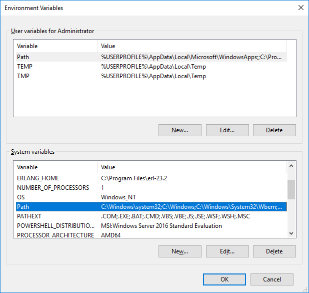

Диалог редактирования переменной окружения:

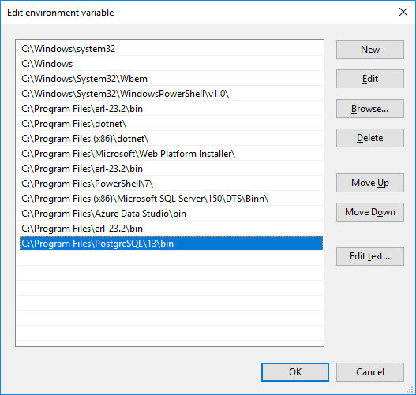

2\. Далее распакуем архив `C:\Install\timescaledb-postgresql-12_1.7.4-windows-amd64.zip` в папку `C:\Install`.\
3\.	Из папки `timescaledb` запускаем установочный файл `setup.exe` от имени Администратора:

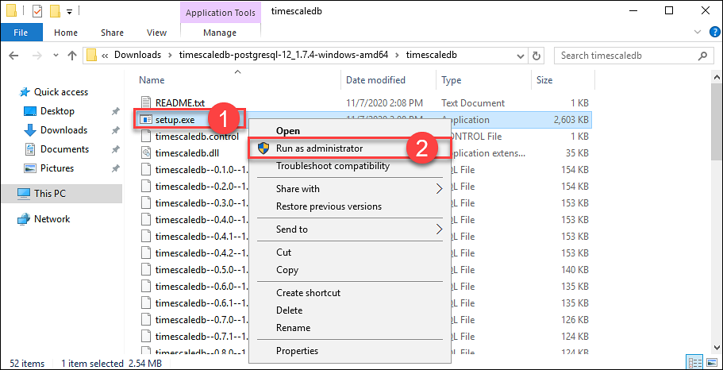

4\. Выбираем **Да** в окне разрешения на установку приложения:

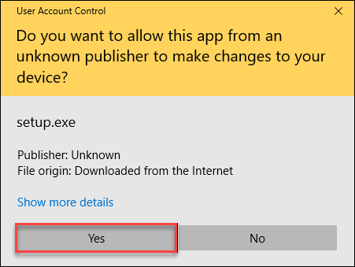

5\. Для начала установки выбираем на клавиатуре латинскую букву `y` и жмем `Enter`:

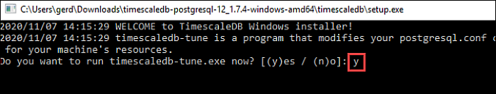

6\. Указываем полный путь к файлу конфигурации `C:\Primo\PostgreSQL\Data\postgresql.conf` и жмем `Enter`:

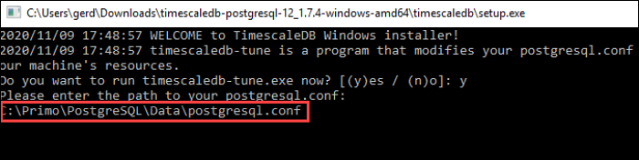

7\. В последующих шагах принимаем все настройки по умолчанию и вводим латинскую букву `y`:

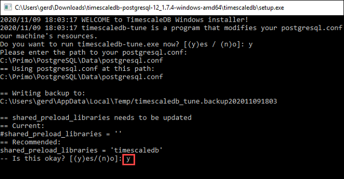

8\.

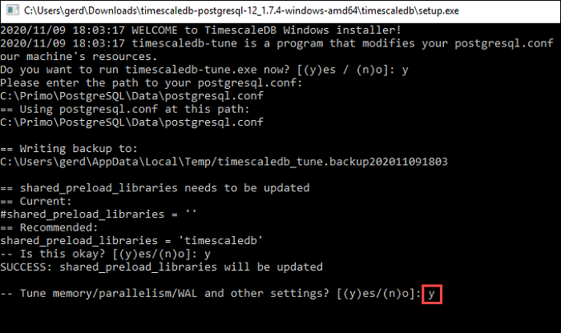

9\.

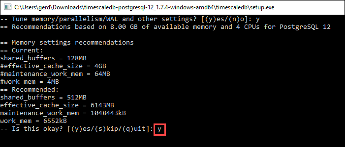

10\. 

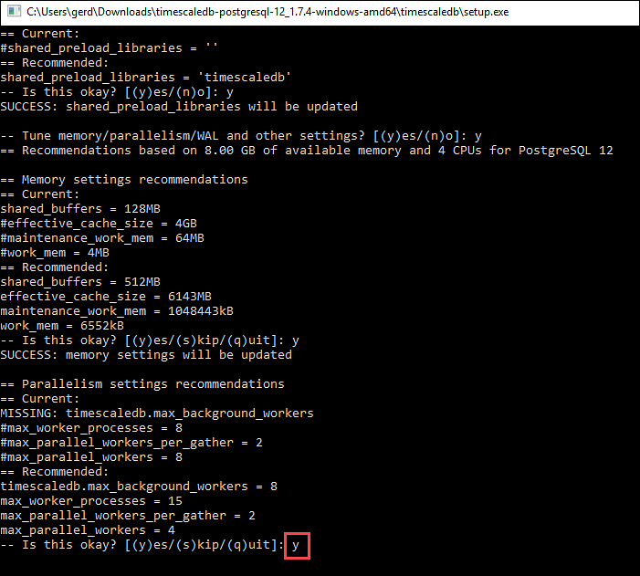

11\.

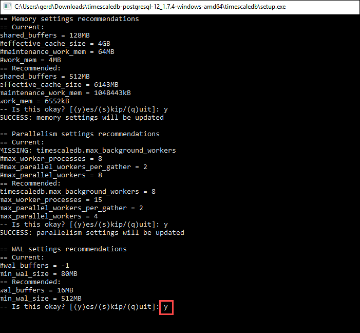

12\.

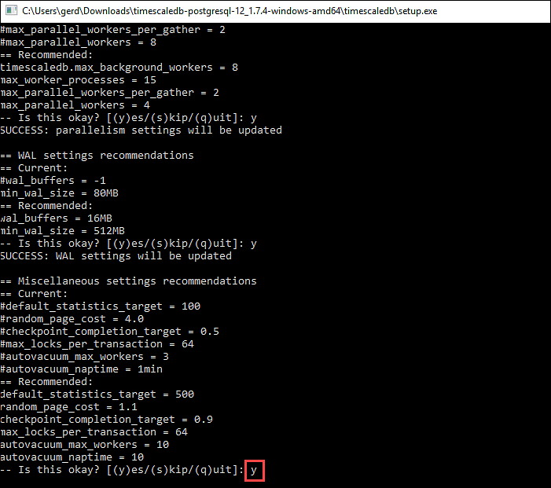

13\. На этом шаге вы должны увидеть уведомление об успешной установке:

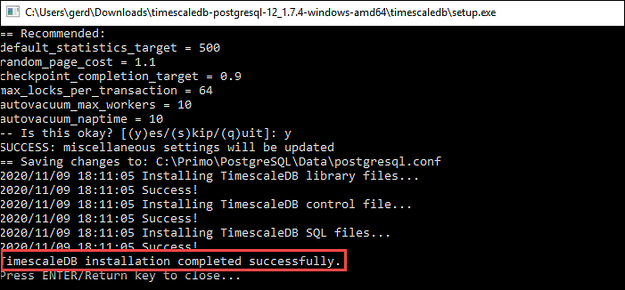

Нажмите `Enter` для закрытия окна терминала.

:white_check_mark: **Готово**: расширение TimescaleDB успешно установлено.
