# Установка и настройка AD для SSO

Руководство по установке и настройке AD для SSO включает в себя:
* настройку AD для тестирования SSO;
* настройку LDAPS;
* настройку леса с доверительными отношениями.

## Настройка AD для тестирования SSO

Для машины контроллера AD и рабочего места пользователя Оркестратора, которое будет введено в AD, должны быть прописаны статические IP. Причем, для рабочего места «DNS» = «IP контроллера AD».
Должно быть установлено:

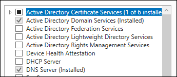

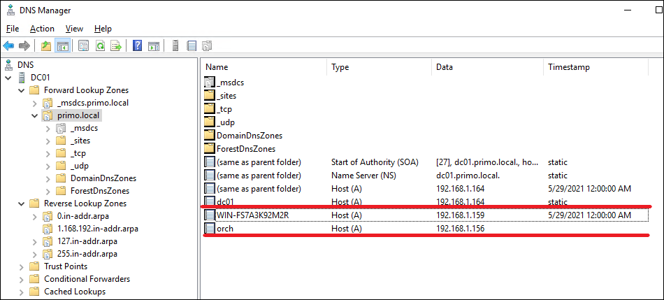

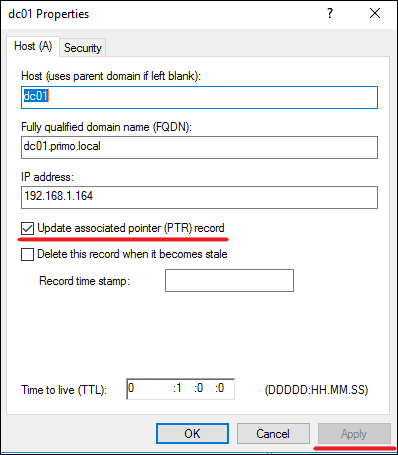

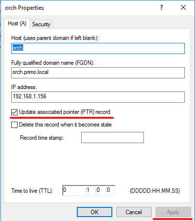

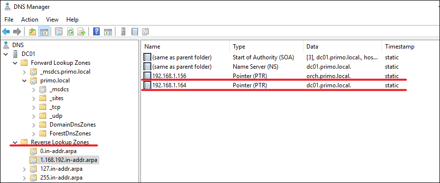

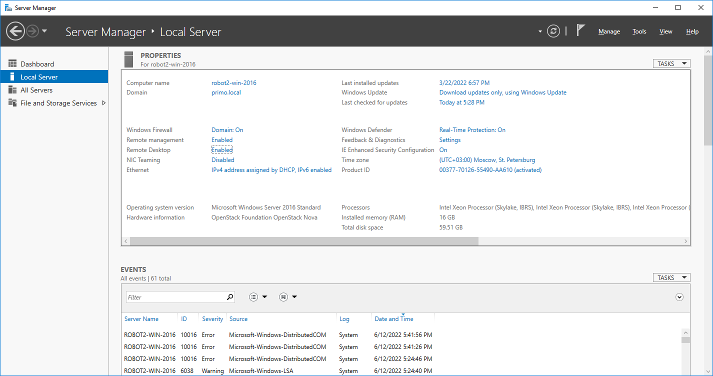

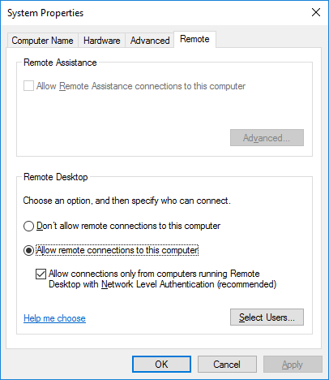

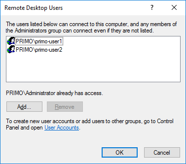

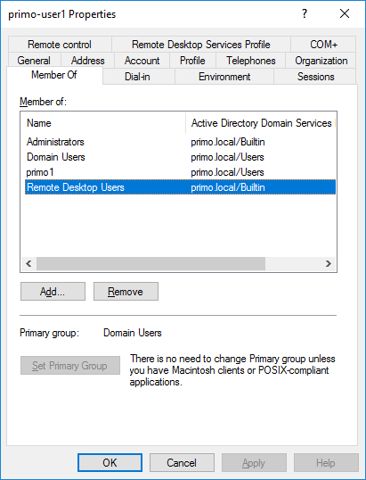

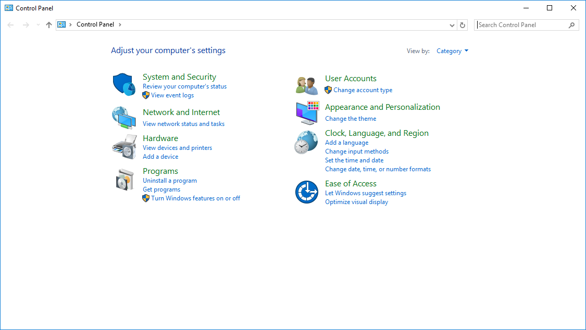

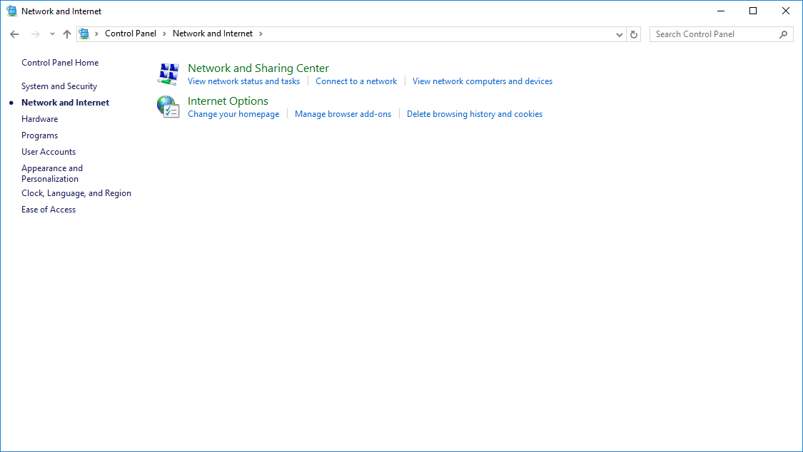

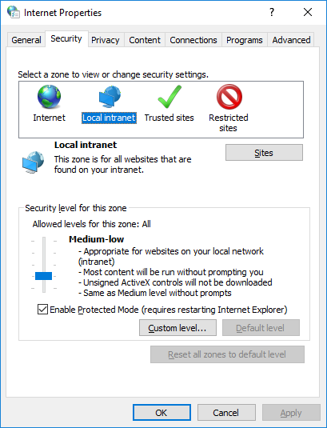

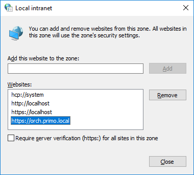

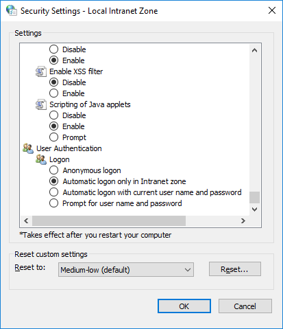

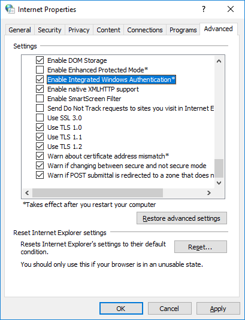

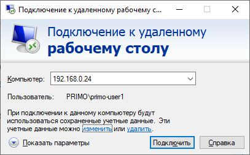

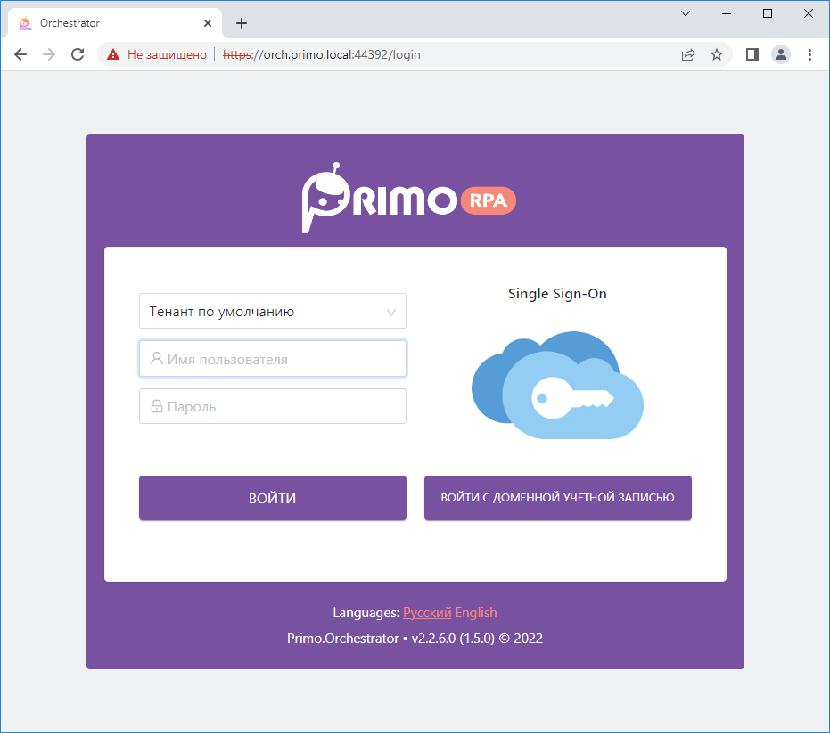

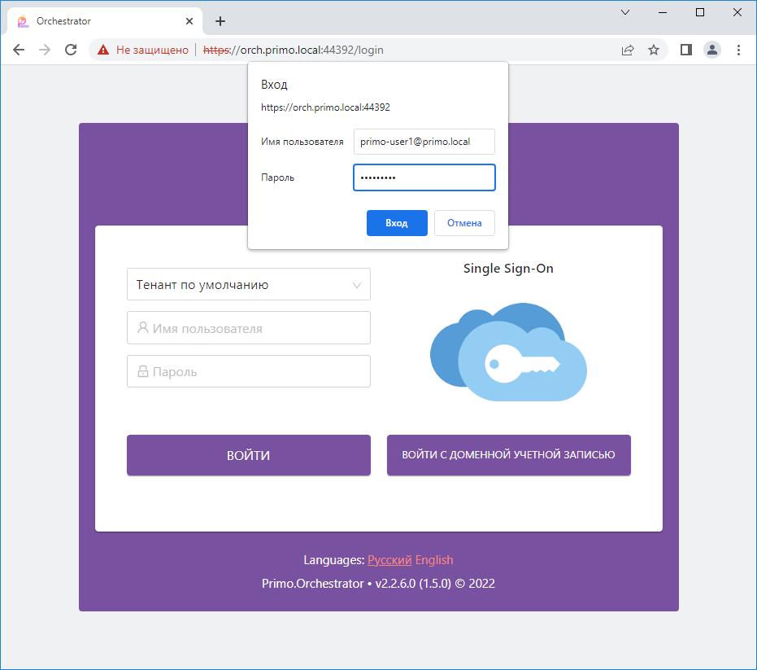
 
AD DS и DNS можно сразу, AD CS – после того, как машина станет контроллером AD.
В DNS надо прописывать сервис в прямую зону. Имя контроллера туда само пропишется при настройке AD.
В DNS надо прописывать обратную зону, как для имени контроллера AD, так и для имени сервиса (Оркестратора):
 
Обратить внимание: orch  – имя сервиса (нижняя строка). Полное имя сервиса  – orch.primo.local. primo.local – это имя домена .
Проставить для них галочки «Update associated pointer (PTR) record»
 

 
 
Создать в AD пользователя для сервиса  Оркестратора (через UI), orch.primo.local (совпадает с полным именем сервиса!!!). Сделать этого пользователя SPN через командную строку:

setspn -A HTTP/orch.primo.local@PRIMO.LOCAL orch.primo.local
 
Обратить внимание: полное имя сервиса совпадает с именем пользователя для Сервиса, регистр имеет значение!

Ассоциировать SPN со службой (регистр имеет значение!!!) через командную строку:

ktpass /princ HTTP/orch.primo.local@PRIMO.LOCAL /mapuser orch.primo.local +setupn /pass Qwe123!@# /out C:\krb5.keytab
 
Обратить внимание: полное имя сервиса совпадает с именем пользователя для Сервиса, регистр имеет значение!

	Полученный keytab файл далее используется в Оркестраторе
 

Если используется IIS, пользователя PRIMO\orch.primo.local нужно сделать пользователем, под которым работает пулл приложений сервиса.
Синхронизировать время на рабочке и контроллере AD (можно вручную просто выставить часы).
На введенной в AD рабочке далее требуется добавить доменных пользователей, которым разрешен вход по удаленному рабочему столу, и настроить (проверить настройки) браузер.
Доменные пользователи удаленного рабочего стола добавляются через «Server Manager/Local Server/Remote Desctop»:
 
	В окне «System Properties» на вкладке «Remote» при помощи кнопки «Select Users…» добавляются пользователи.
  
 
Эти доменные пользователи (настраивается на контроллере AD) должны входить в группу Remote Desctop Users:
 
Настройка браузера производится через «Control Panel/Network and Internet/Internet Options» открывается окно «Internet Options»:
 
 
 
На вкладке «Security» адрес Оркестратора добавляется в сайты зоны «Local intranet»:
 
По кнопке «Custom level…» открывается окно «Security Settings – Local intranet Zone», в котором в разделе (внизу окна) «User Authentication/Logon» выбирается «Automatic logon only in Intranet zone»:
 
На вкладке «Advanced» ставится галочка «Enable Integrated Windows Authentication»
 
Перезагружаем компьютер, на котором были проведены настройки браузера. Заходим под доменным пользователем в систему:
 
Открываем в браузере Оркестратор по доменному имени, например, https://orch.primo.local:44392
 
и при помощи кнопки «Войти с доменной учетной записью» логинимся в Оркестраторе. Первый раз будет предложено ввести доменную учетную запись:
 
	Доменная учетная запись primo-user1 для домена primo.local вводится как 
primo-user1@primo.local
После успешного входа в Оркестратор в дальнейшем вводить доменную учетную запись не потребуется, аутентификация будет происходить автоматически на основе текущей учетной записи Windows.
Настройка LDAPS
Предварительно рекомендуется ознакомится со статьей по ссылке ниже:
https://docs.microsoft.com/ru-RU/troubleshoot/windows-server/identity/enable-ldap-over-ssl-3rd-certification-authority.
	Подготавливаем файл запроса request.inf:

[Version]
Signature="$Windows NT

[NewRequest]
Subject = "CN=WIN-QUE9E7MJCJD.primo.local,OU=Domain Controllers,DC=primo,DC=local"
KeySpec = 1
KeyLength = 1024
; Can be 1024, 2048, 4096, 8192, or 16384.
; Larger key sizes are more secure, but have
; a greater impact on performance.
Exportable = TRUE
MachineKeySet = TRUE
SMIME = False
PrivateKeyArchive = FALSE
UserProtected = FALSE
UseExistingKeySet = FALSE
ProviderName = "Microsoft RSA SChannel Cryptographic Provider"
ProviderType = 12
RequestType = PKCS10
KeyUsage = 0xa0

[EnhancedKeyUsageExtension]
OID=1.3.6.1.5.5.7.3.1 ; this is for Server Authentication

Достаточно заменить только строку «Subject», указав свой сервер контроллера AD (FQDN). В PowerShell (run as Administrator) на сервере контроллера AD выполняем команду:
PS C:\1> certreq -new request.inf request.req
Вывод экрана:
CertReq: Request Created
Получившийся в ходе выполнения команды файл запроса сертификата request.req необходимо отправить в CA. Запускаем Server Manager:
 
Выбираем Tools->Certification Authority. Если оснастка открывается с ошибкой: The system cannot find the file specified. 0x80070002 (WIN32: 2 ERROR_FILE_NOT_FOUND) и пустой, в этом случае требуется предварительная настройка CA.
	Нажимаем желтый треугольник как на рисунке ниже:
 
Далее по шагам:      

	После этого оснастка (certsrv.msc) должна открыться:
 
Добавляем созданный нами request.req на создание сертификата:
 
Выбираем Submit new request:
 	 
В открывшемся окне выбираем наш файл request.req. Созданный запрос на создание отобразится на вкладке Pending Requests, открываем этот раздел, выбираем наш запрос – он будет единственный, нажимаем правую клавишу мыши и кликаем Issue (Выпустить).
 

Выпущенный сертификат отобразится в разделе Issued Certificates, заходим в раздел, кликаем дважды на сертификате, переходим на вкладку «Details» и нажимаем «Copy to file»: 
 
В открывшемся мастере выбираем кодировку и папку для сохранения сертификата:
 
После выгрузки сертификата снова запускаем PowerShell (run as Administrator) и выполняем команду (primo02.cer – имя выгруженного сертификата):
PS C:\1> certreq -accept primo02.cer
Installed Certificate:
  Serial Number: 7d0000000298de70f33181e1b4000000000002
  Subject: CN=WIN-QUE9E7MJCJD.primo.local, OU=Domain Controllers, DC=primo, DC=local
  NotBefore: 9/5/2022 2:38 PM
  NotAfter: 9/5/2023 2:48 PM
Сертификат установлен в хранилище локального ПК.

Проверяем связь:
Запускаем LDP.EXE, нажимаем Connect, указываем порт 636, и полное имя сервера как в сертификате (WIN-QUE9E7MJCJD.primo.local), нажимаем «Connect», проверяем, что соединение прошло без ошибок. 
Леса с доверительными отношениями
Машина пользователя не обязательно должна быть в том же AD, в котором зарегистрирован сервис. Тогда требуется настроить доверительные отношения между AD1 и AD2:
 
Сначала требуется настроить DNS (прописать доверенный AD в Conditional Forwarders):
 
И настроить доверенные отношения:
 

Дальнейшее управление RabbitMQ можно осуществлять через этот веб-интерфейс.

:white_check_mark: **Готово**: RabbitMQ успешно установлен под Windows 2016 Server и готов к работе.
