# Разворачивание узлов веб-приложения

Данная инструкция является частью руководства [по установке WebApi и UI на IIS под Windows 2016 Server](https://github.com/PrimoRPA/Docs.Rus/blob/139-%D0%B4%D0%BE%D0%B1%D0%B0%D0%B2%D0%B8%D1%82%D1%8C-%D0%B4%D0%BE%D0%BA%D1%83%D0%BC%D0%B5%D0%BD%D1%82%D1%8B-%D0%B0%D0%B4%D0%BC%D0%B8%D0%BD%D0%B0-%D0%B2-%D1%80%D0%B0%D0%B7%D0%B4%D0%B5%D0%BB-%D0%BE%D1%80%D0%BA%D0%B5%D1%81%D1%82%D1%80%D0%B0%D1%82%D0%BE%D1%80%D0%B0/orchestrator/admin/Windows/webapi/install-webapi-introduction.md).\
Разворачивание узлов выполняется после:
* [включения компьютера в AD](https://github.com/PrimoRPA/Docs.Rus/blob/139-%D0%B4%D0%BE%D0%B1%D0%B0%D0%B2%D0%B8%D1%82%D1%8C-%D0%B4%D0%BE%D0%BA%D1%83%D0%BC%D0%B5%D0%BD%D1%82%D1%8B-%D0%B0%D0%B4%D0%BC%D0%B8%D0%BD%D0%B0-%D0%B2-%D1%80%D0%B0%D0%B7%D0%B4%D0%B5%D0%BB-%D0%BE%D1%80%D0%BA%D0%B5%D1%81%D1%82%D1%80%D0%B0%D1%82%D0%BE%D1%80%D0%B0/orchestrator/admin/Windows/webapi/install-webapi-introduction.md#%D0%B2%D0%BA%D0%BB%D1%8E%D1%87%D0%B5%D0%BD%D0%B8%D0%B5-%D0%BA%D0%BE%D0%BC%D0%BF%D1%8C%D1%8E%D1%82%D0%B5%D1%80%D0%B0-%D0%B2-ad) - не нужно, если используется DHCP;
* [установки IIS](https://github.com/PrimoRPA/Docs.Rus/edit/139-%D0%B4%D0%BE%D0%B1%D0%B0%D0%B2%D0%B8%D1%82%D1%8C-%D0%B4%D0%BE%D0%BA%D1%83%D0%BC%D0%B5%D0%BD%D1%82%D1%8B-%D0%B0%D0%B4%D0%BC%D0%B8%D0%BD%D0%B0-%D0%B2-%D1%80%D0%B0%D0%B7%D0%B4%D0%B5%D0%BB-%D0%BE%D1%80%D0%BA%D0%B5%D1%81%D1%82%D1%80%D0%B0%D1%82%D0%BE%D1%80%D0%B0/orchestrator/admin/Windows/webapi/webapi-install-iis.md).

## Как развернуть узлы веб-приложения

1\. Открываем оснастку для управления IIS:


2\. Создаем системную переменную окружения ASPNETCORE_ENVIRONMENT= ProdWin. Для этого в PoweShell выполняем команду:
```
> [System.Environment]::SetEnvironmentVariable('ASPNETCORE_ENVIRONMENT', 'ProdWin', [System.EnvironmentVariableTarget]::Machine)
```

3\. Для узла WebApi создаем отдельный неуправляемый Application Pool:

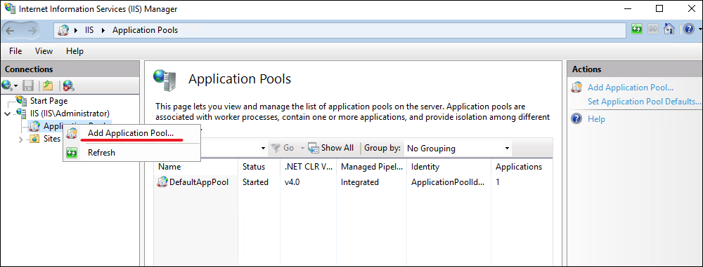

* Задаем ему имя **Primo.WebApi**:

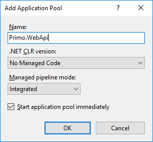

* Выбираем для **Start Mode** значение **AlwaysRunning**:

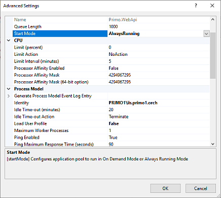

* И для **Regular Time Interval** (minutes) значение **0**:

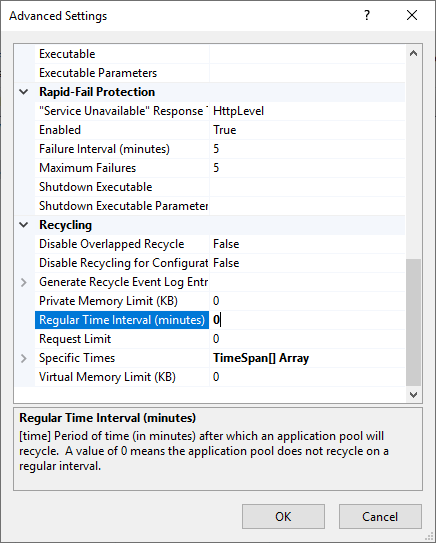

* В результате будет добавлен Application Pool с наименованием **Primo.WebApi**:


4\. Создаем папки `C:\Primo\UI` и `C:\Primo\WebApi`, в которые разархивируем `UI.zip` и `WebApi-IIS.zip` из комплекта поставки.

* Рабочий каталог узла UI:

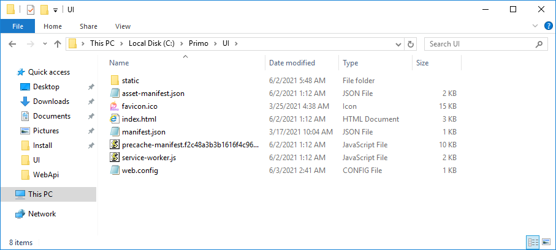

* Рабочий каталог узла WebApi:

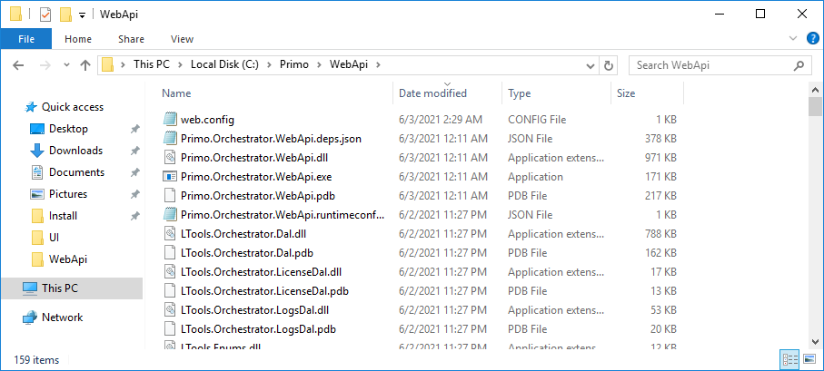

5\. Добавляем веб-узел **Primo.WebApi**.
* Добавление узла Primo.WebApi:

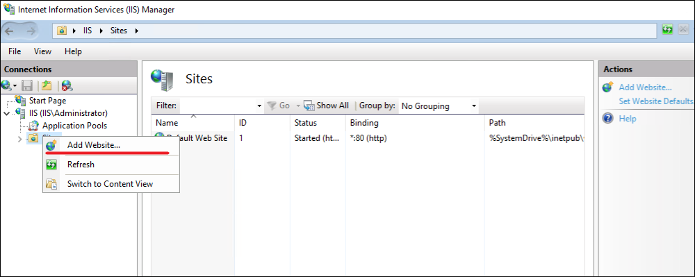

* Параметры узла Primo.WebApi:

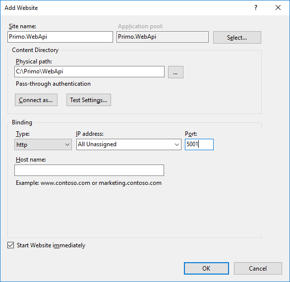

* Добавленный веб-узел узел Primo.WebApi:


6\. Чтобы **Primo.WebApi** заработал под IIS, устанавливаем из комплекта поставки:
* `aspnetcore-runtime-3.1.15-win-x64.exe` - [cсылка на скачивание](https://download.visualstudio.microsoft.com/download/pr/ae6e6b5b-5e7c-45f9-a668-cb1899f22e46/9c917acfab934ddd64340ba46490264e/aspnetcore-runtime-3.1.15-win-x64.exe);
* `dotnet-hosting-3.1.15-win.exe` -  [cсылка на скачивание](https://download.visualstudio.microsoft.com/download/pr/c8eabe25-bb2b-4089-992e-48198ff72ad8/a55a5313bfb65ac9bd2e5069dd4de5bc/dotnet-hosting-3.1.15-win.exe).
  
После чего перезагружаем компьютер.

7\. Для создания узла UI сначала создадим для веб-сервера SSL-сертификат, так как этот узел будет работать по https.

:grey_exclamation: ***Для промышленного узла необходимо использовать SSL-сертификат, выданный доверенным удостоверяющим центром.***

Выполняем шаги:

* Открываем оснастку управления сертификатами:

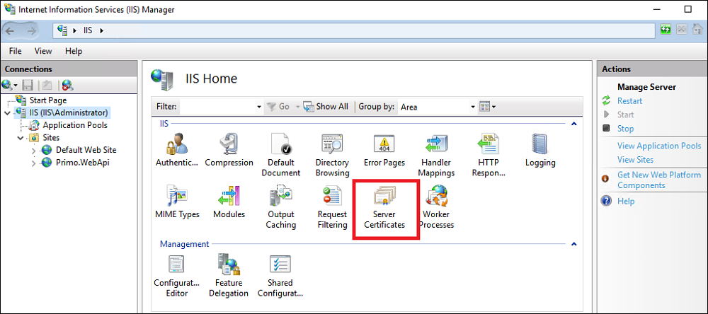

* Добавляем самоподписанный SSL-сертификат:


* Настраиваем параметры SSL-сертификата:

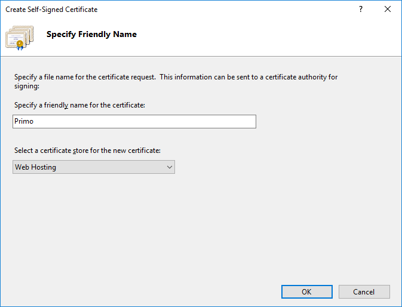

* SSL-сертификат с наименованием Primo установлен:


8\. Добавляем веб-узел **Primo.UI**, устанавливаем для него Application Pool с наименованием **DefaultAppPool** и выбираем ранее созданный SSL-сертификат с наименованием **Primo**: 

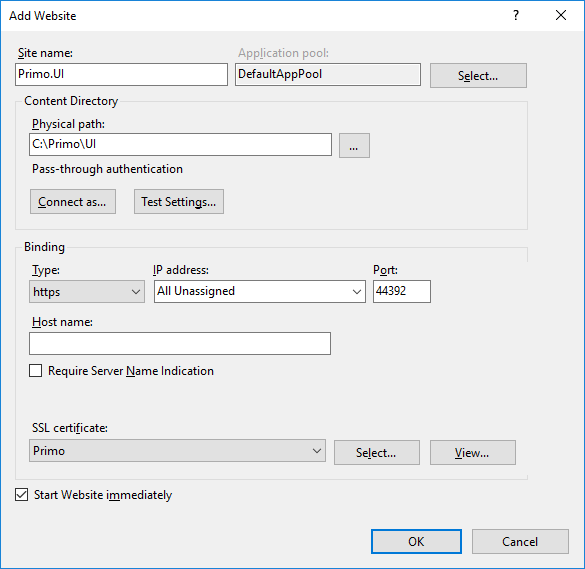

На этом шаге узлы **Primo.WebApi** и **Primo.UI** по отдельности рабочие. Далее надо связать **Primo.UI** и **Primo.WebApi**, настроив реверс-прокси для API. Предварительно надо установить модули IIS из комплекта поставки, обеспечивающие функциональность реверс-прокси - см. шаг 9.

9\. Устанавливаем модули IIS (обязательно в приведенной ниже последовательности):
* `rewrite_amd64_en-US.msi`
* `requestRouter_amd64.msi`

10\. На узле **Primo.UI** настраиваем реверс-прокси для API.
* Выбираем иконку оснастки управления правилами URL Rewrite:

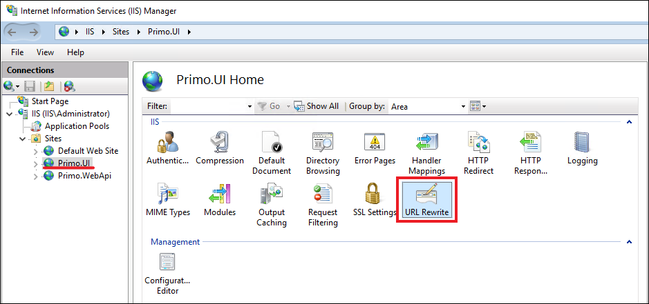

* Добавляем правила URL Rewrite:

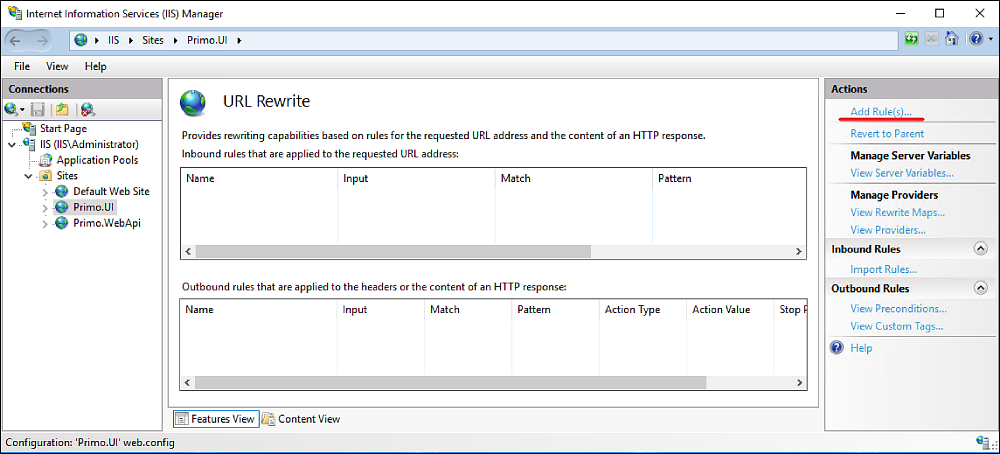

* Выбираем шаблон правила URL Rewrite:

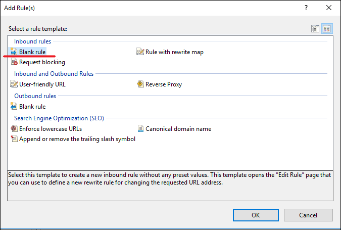

* Настраиваем параметры правила URL Rewrite:
  * Name: `Reverse Proxy to API`
  * Pattern: `^api/(.*)`
  * Rewrite URL: `http://localhost:5001/api/{R:1}`
  * Устанавливаем галочку в чекбоксе **Stop processing of subsequent rules**.

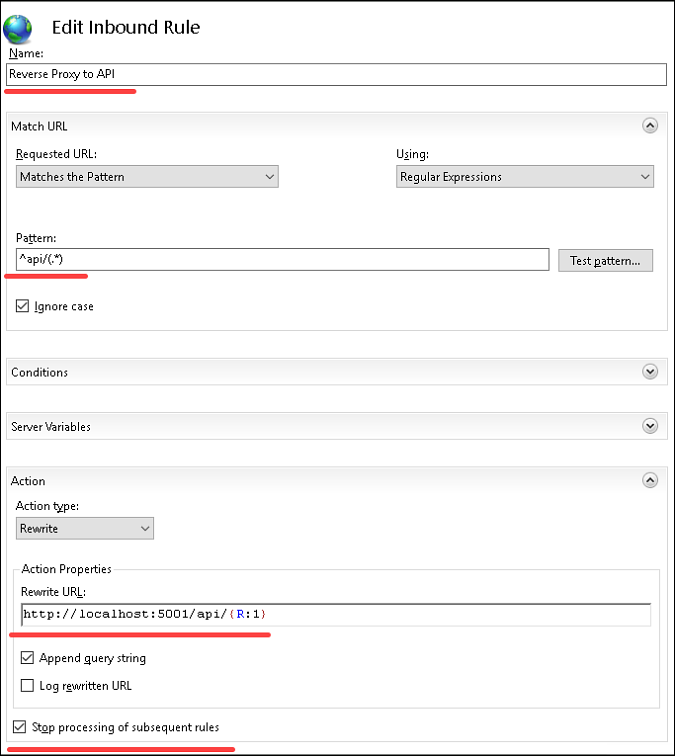

* Правило URL Rewrite добавлено:

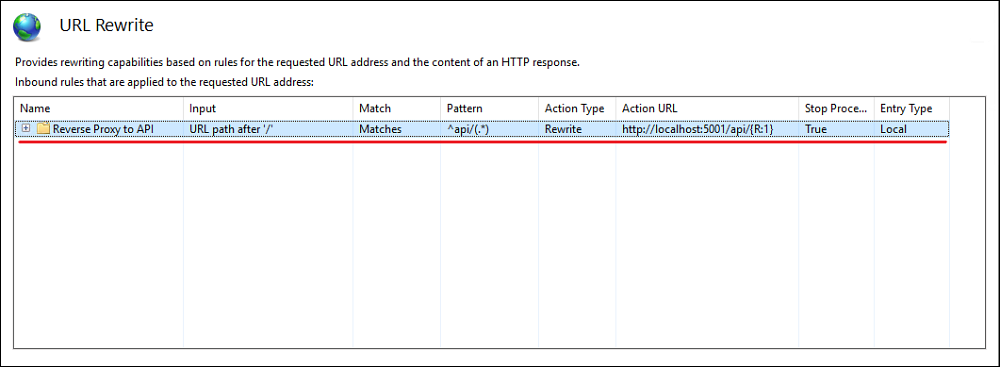

11\. Чтобы ARR заработал, надо его активировать. Для этого пробуем добавить **Reverse Proxy** правило:

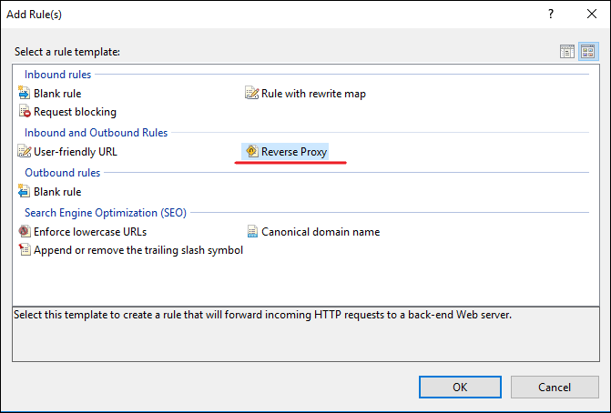

12\. IIS выдаст предупреждение об активации ARR, на которое надо согласиться и нажать **ОК**:

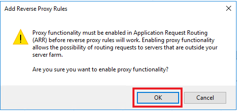

13\. Добавлять **Reverse Proxy** правило не надо, это все нужно было только для активации ARR. Нажимаем **Cancel**:

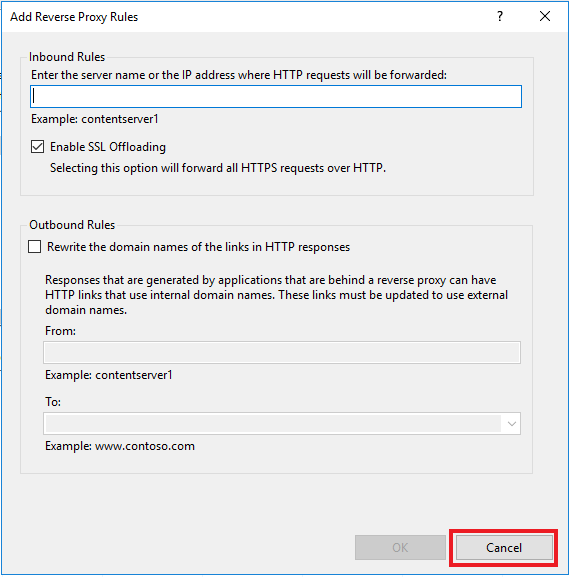

Теперь ARR активировано, и узел **Primo.UI** может работать как реверс-прокси.

:green_circle: ***Управлять правилами также можно из файла `Web.config` (секция `<rewrite/>`) узла **Primo.UI**:***


***Секция `<rewrite/>` в web.config:***


14\. Для каждого узла – **Primo.UI** и **Primo.WebApi** - настраиваем максимальный размер загружаемых файлов. Настройки указываются в файлах `web.config`. Файлы `web.config` для каждого узла идут в комплекте поставки: 
* для **Primo.WebApi** в архиве `WebApi-IIS.zip`;
* для **Primo.UI** в папке `Distr\Windows`.

Размер файлов для узла **Primo.UI**:


Размер файлов для узла **Primo.WebApi**:


15\. Проверяем, что в файле `appsettings.ProdWin.json` для `UseIISIntegration` установлено значение `true`. Остальные настройки `appsettings.ProdWin.json` выставляем аналогично «Руководствe по установке WebApi как службы под Windows 2016 Server». 

16\. Проверяем работоспособность, запуская приложение в браузере по адресу: **https://<адрес>:44392**

17\. Если WebApi работает с MS SQL SERVER, используя Windows-аутентификацию (Trusted_Connection=True), то для Application Pool с наименованием **Primo.WebApi** необходимо задать этого (доменного) Windows-пользователя:
* Правой кнопкой мыши открываем окно Advanced Settings и находим свойство **Identity**:

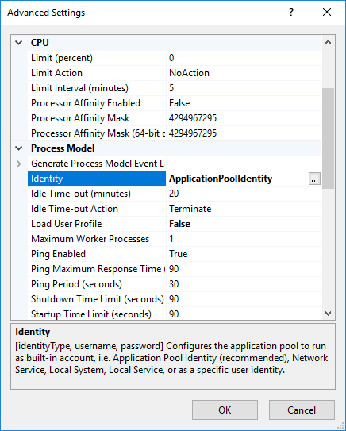

* Меняем значение свойства **Identity**: выбираем параметр **Custom account** и нажимаем кнопку **Set…**:

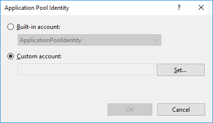

* Устанавливаем учетные данные Windows-пользователя в окне Set Credentials:


:white_check_mark: **Готово**: узлы веб-приложения успешно развернуты. На этом установка WebApi и UI на IIS в Windows 2016 Server завершена.
