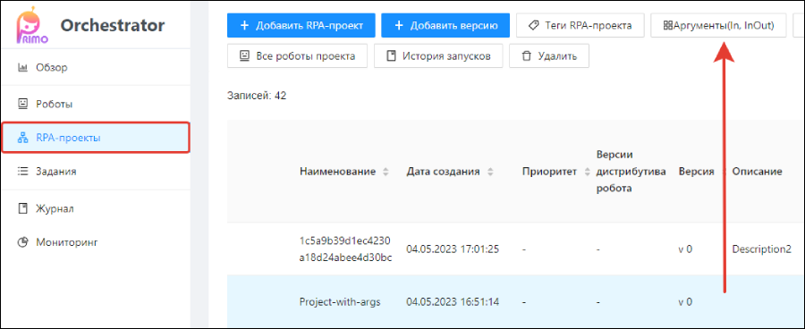
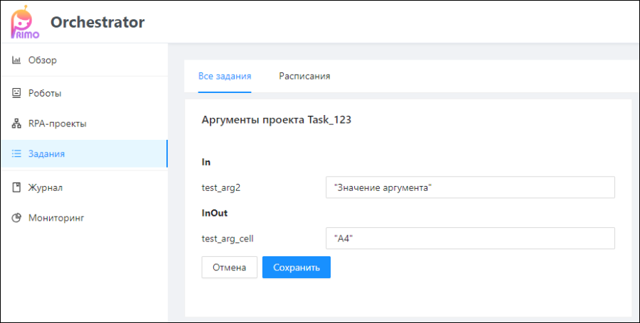
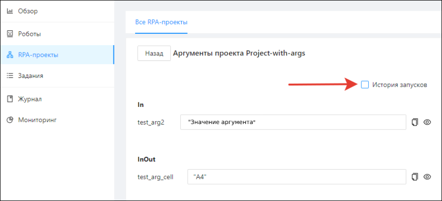
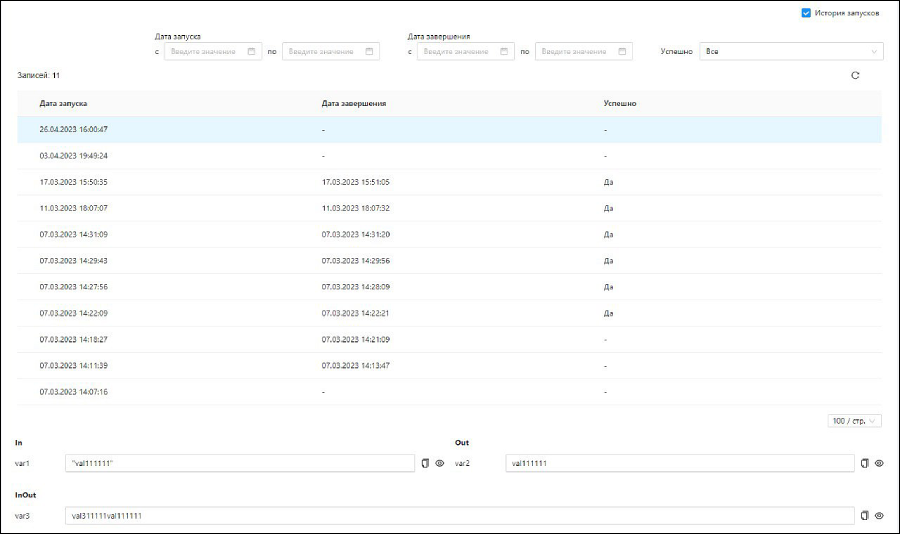

# Аргументы проекта

Аргументы RPA-проекта устанавливаются в Студии, отдельно для каждого процесса. В Оркестратор аргументы загружаются автоматически вместе с архивом проекта. 

Данный раздел описывает возможности Оркестратора для работы с аргументами проекта. Чтобы эти возможности были доступны, необходимо при разработке проекта в Студии указать настройки, допускающие использование аргументов в Оркестраторе. Иначе управлять аргументами проекта можно будет только в Студии. Подробнее см. раздел [Использование аргументов в Оркестраторе](https://docs.primo-rpa.ru/primo-rpa/primo-studio/process/args#argumenty-orkestratora). 

## Просмотр аргументов проекта

Просмотреть аргументы проекта можно на странице **RPA-проекты > Все RPA-проекты**. Для этого выделите запись с проектом и нажмите кнопку **Аргументы**. Кнопка будет активна, только если у проекта есть аргументы.

 

По ее нажатию отобразятся все аргументы проекта и их значения по умолчанию. К просмотру будут доступны аргументы с любым направлением, представленным в проекте: In, InOut, Out. Значения на этой странице предназначены только для просмотра, отредактировать их невозможно.

## Запуск проекта с аргументами

**Запустить проект с аргументами можно, только используя задание.** 

Задание позволяет указать/получить значения аргументов для каждого запуска. Если попытаться запустить проект с аргументами без задания, то появится сообщение об ошибке. Это ожидаемое поведение.

 

Тип запуска задания не важен: это может быть ручной запуск задания или автоматический по триггеру. 

## Изменение аргументов
В рамках созданного задания становится доступным редактирование аргументов проекта. Система позволяет изменять только аргументы с направлениями **In** (входные) и **InOut** (входные-выходные).

Чтобы изменить значение аргумента:
1. На странице **Задания > Все задания** выберите запись с заданием и нажмите кнопку **Аргументы(In/InOut/Out)** — в скобках динамически отображается направление аргументов, имеющихся в проекте. Эта кнопка будет активной только, если у проекта есть аргументы.
  
   Помните, что даже при наличии аргументов с типом **Out**, для редактирования доступны только аргументы с **In** и **InOut**. Все аргументы первоначально отображаются со значениями по умолчанию.

 

2. В окне редактирования аргументов введите новое значение и нажмите **Сохранить**, чтобы изменения применились.

 

## История изменений аргументов

Оркестратор хранит историю изменений аргументов для каждого выполнения проекта. Для просмотра истории:
1. Перейдите на страницу **RPA-проекты > Все RPA-проекты** и выделите нужный проект в таблице.
2. Нажмите кнопку **Аргументы(In/InOut/Out)**. 
3. На странице просмотра аргументов включите параметр **История запусков**. 

 

4. Выберите нужный запуск в списке — внизу отобразятся значения, которые были у аргументов в этом запуске. Это значения, заданные в Оркестраторе до запуска проекта и полученные от робота (для аргументов In/InOut) после его завершения/в процессе работы.
  
  Значения доступны только для просмотра, изменить их в данном разделе нельзя.

 

В случае слишком большой истории запусков используйте фильтры. Вы можете настроить фильтр по дате выполнения задания и (или) по статусу выполнения.

Фильтрация по датам подразумевает указание дат запуска/завершения выполнения проекта либо обоих диапазонов сразу — в этом случае результат отобразится, только если оба условия будут соблюдены.

 

Чтобы отфильтровать историю по статусу выполнения проекта, выберите в параметре **Успешно** одно из значений:
* **Все** — будут отображены все запуски проекта, вне зависимости от состояния его выполнения: успешные, неуспешные и еще не завершенные задания. Значение по умолчанию. 
* **Да** — отобразятся только те запуски, которые завершились успешным выполнением проекта.
* **Нет** — будут выведены только те запуски, в которых выполнение проекта завершилось ошибкой.
* **Не завершен** — отобразятся все запуски, в которых проект по-прежнему находится на стадии выполнения.

