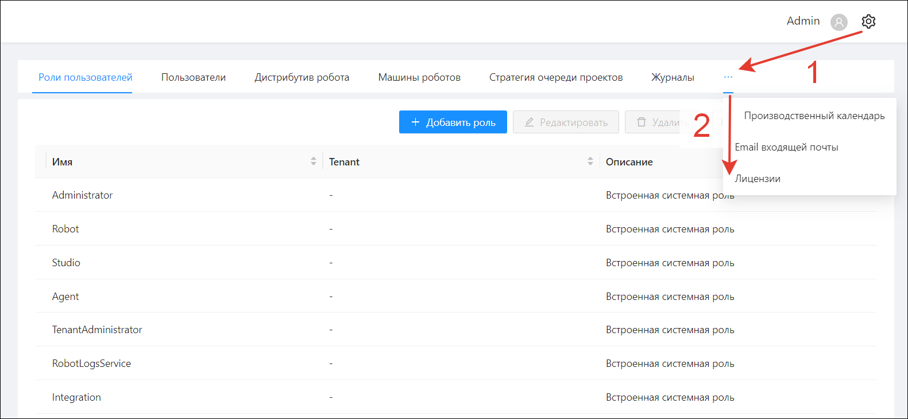
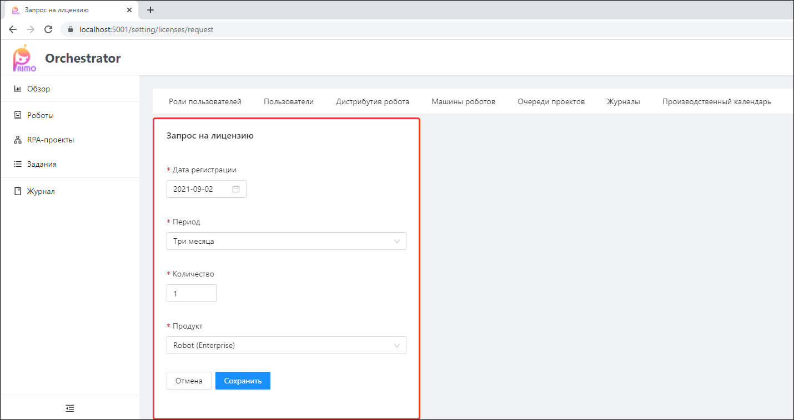
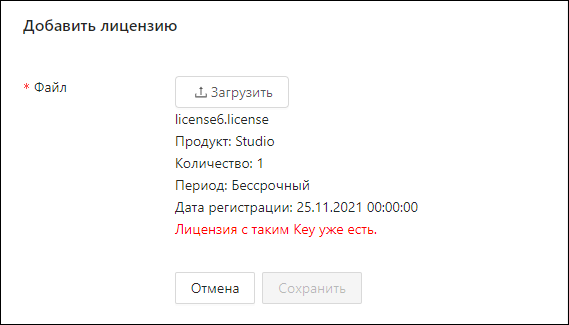
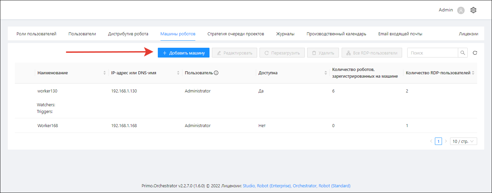

##	Шаг 1 - Получение лицензий

Лицензия приобретается у вендора на основе запроса через интерфейс Оркестратора.

Для запроса лицензии перейдите в раздел **Настройки ➝ Лицензии**. Для этого в правом верхнем углу нажмите значок *Шестеренка*  и выберите пункт **Лицензии**.

Далее нажмите кнопку **Запрос на лицензию**. Откроется форма создания запроса:

В поле **Продукт** из раскрывающегося списка необходимо выбрать тип запрашиваемой лицензии:

#### Таблица 1 - Типы лицензий.

| Продукт Primo  | Мнемоника    | Примечание               |
| -------------- | ------ | ------------------------------------------ |
| Orchestrator    | orchestrator | Предоставляет возможность работать с Оркестратором |
| Robot (Enterprise) | robot | Для Робота Оркестратора        |
| Robot (Desktop)  | robot_desktop | Только для attended-Роботов. Если эту лицензию использует оркестраторный Робот – для него не обеспечивается автоматическая поддержка RDP-сессий для RDP-пользователей машины робота |
| Studio           | studio | Для работы со Студией                   |

> *Особенности лицензий более подробно описаны в разделе [Типы лицензий](https://docs.primo-rpa.ru/primo-rpa/orchestrator/settings/licensing/license-types).*

Сформированный запрос сохраните в текстовый файл (например, robot.txt) и отправьте вендору. В ответ вендор пришлет файл лицензии с расширением \*.license (например, robot.license). Полученный файл нужно добавить в Оркестратор.

## Шаг 2 - Установка лицензии

Файлы лицензий добавляются в разделе Оркестратора **Настройки ➝ Лицензии** по кнопке **Добавить лицензию**:

Следует убедиться в валидности лицензии, а также в том, что ее срок не истек. Соответствующая информация отобразится при проверке добавляемой лицензии:

Если лицензия валидная и непросроченная, то она добавится в Оркестратор и отобразится в общем списке. В соответствующих столбцах будет выведена информация о сроке действия лицензии и ее состоянии:

 

Дата истечения лицензии подсвечивается индикатором процента истечения. Красный индикатор (100%) свидетельствует об истечении лицензии.

> *Если впоследствии произошла смена оборудования БД лицензий (ltoolslicense) заказчиком, то лицензии, добавленные в Оркестратор, становятся невалидными. В этом случае лицензию требуется заменить - процесс замены [описан в данном разделе](https://docs.primo-rpa.ru/primo-rpa/orchestrator/settings/licensing/change-license).*

Внесенная в Оркестратор лицензия по умолчанию считается выданной на дефолтный тенант. Если её нужно выдать на другой тенант, выделите строку с лицензией и нажмите кнопку **Выдать на тенант** - она станет активной, только если лицензия выделена.

**ВАЖНО!** Лицензии между тенантами не делятся. У каждого тенанта свои лицензии.

## Шаг 3 - Публикация дистрибутива

Файл дистрибутива Робота входит в комплект поставки. Имеются дистрибутивы (x86 и 64) для Windows и дистрибутив (64) для Linux. Дистрибутив для Linux имеет ограниченные возможности для работы с UI.

Чтобы загрузить дистрибутив в Оркестратор, перейдите в раздел **Настройки ➝ Дистрибутив Робота** и нажмите кнопку **Добавить дистрибутив Робота**:

 

## Шаг 4 - Настройка и регистрация машин Роботов

Машина Робота настраивается на основе одной из следующих инструкций:
* Windows: Инструкция по настройке машины Робота под Windows 2016 Server **ССЫЛКА**
* Linux: Инструкция по настройке машины Робота под CentOS 8 **ССЫЛКА**

Перед регистрацией машины в Оркестраторе она должна быть доступна из Оркестратора. Для регистрации машины перейдите в раздел **Настройки ➝ Машины роботов** и нажмите кнопку **Добавить машину**:

 

После регистрации убедитесь в доступности машины.

## Устранение проблем

Если при развертывании/запуске Роботов возникли проблемы, проверьте настройки по списку:

1. Секция Оркестратора **RobotDeployment: OrchBaseUrl** – адрес Оркестратора, который должен знать Робот. Симметрично – секция Агента **Orchestrator: BaseUrl** – эти адреса должны совпадать.
2. Порт в секции Агента **Kestrel: EndPoints: ExternalHttps: Url** – на этом порту будет слушать служба Агента. Симметрично – секция Оркестратора **Agent: Port** для Агента по умолчанию и настройки дополнительных Агентов для поддержки RDP-сессий.
3. Секции Оркестратора **RobotDeployment: PortMin** и **RobotDeployment: PortMax** – диапазон портов, используемый для выдачи порта Роботу, на порту из этого диапазона запушенный Робот будет слушать.
4. WebApi должен быть доступен с машины Робота. Как проверить: в браузере на машине Робота запустите Оркестратор.
5. Агент должен быть доступен с машины WebApi. Как проверить: [https://{IP}:5002/api/Worker](https://{IP}:5002/api/Worker). Можно также непосредственно в браузере, **Ctrl+Shift+i**, вкладка **Сеть**, вернет HTTP-статус **204**. 
6. Сетевая связность, файервол, открытые порты, правила фильтрации (обратиться к сетевым администраторам).
