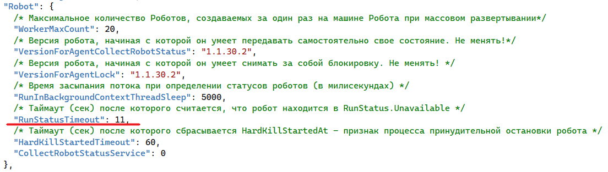

# Таймаут, после которого робот «Не доступен»

Таймаут, после которого робот переходит в статус «Не доступен», задается в секции **Robot** в параметре **RunStatusTimeout**. 

Время таймаута указывается в секундах.

:bangbang: ***Остальные параметры в этой секции запрещено менять без согласования с вендором.***
