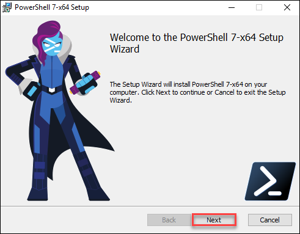
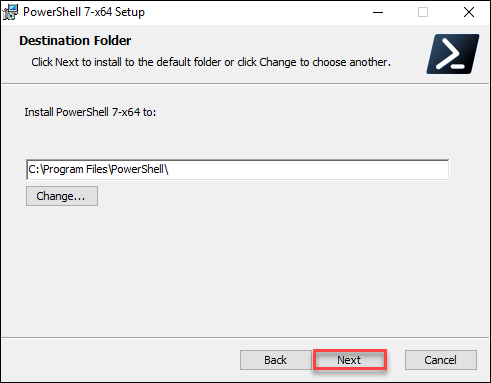
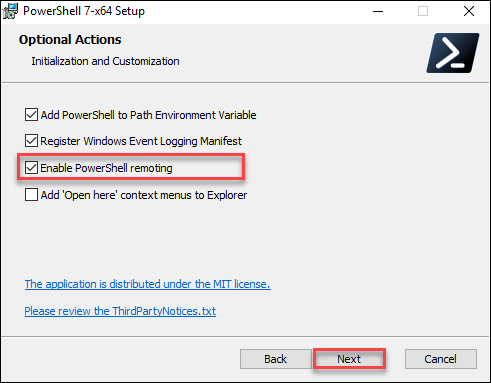
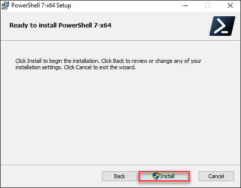
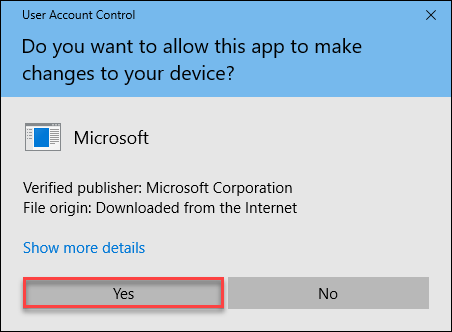
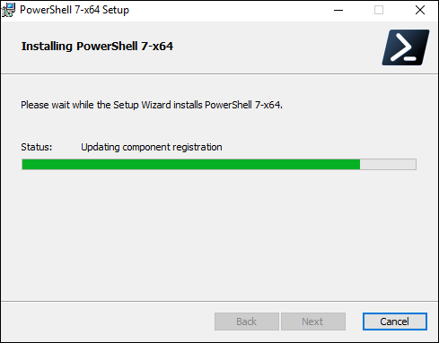
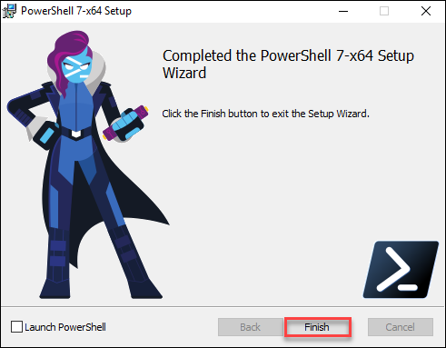

# Установка PowerShell 
Раздел содержит инструкцию по установке PowerShell 7.1.3 под Windows 2016 Server.\
PowerShell Core нужен для настройки окружения и компонентов Оркестратора. Требуется версия не ниже 7.1.3.

**Как установить PowerShell:**

1\. Запускаем файл `C:\Install\PowerShell-7.1.3-win-x64.msi`, в открывшемся окне нажимаем кнопку **Run**.\
2\. В первом установочном окне программы нажимаем **Next**:

3\. В следующем окне оставляем путь по умолчанию для установки программы и нажимаем **Next**:

4\. Ставим галочку напротив пункта **Enable PowerShell remoting** (разрешить выполнение удаленных команд) и жмем **Next**:

5\. Нажимаем кнопку **Install**, чтобы начать установку: 

6\. Появится окно о разрешении приложению вносить изменения в компьютер. Выбираем **Yes**:

После чего начнется установка:

7\. По завершении установки нажимаем кнопку **Finish**:

:white_check_mark: **Готово**: PowerShell 7.1.3 успешно установлен под Windows 2016 Server.

