# Установка Агента Оркестратора из инсталлятора
В инструкции описывается установка Агента и настройка машины робота из инсталлятора `AgentInstaller.zip`. Оркестратор должен быть предварительно развернут и настроен.

## Установка

Инсталлятор требуется распаковать в папку `C:\Install\AgentInstaller`, после чего запустить файл `LTools.Orchestrator.AgentInstaller.exe`:

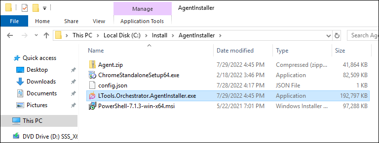

Откроется окно инсталлятора на вкладке **Агент**. Заполните поле **URL Оркестратора** и нажмите кнопку **Проверить**:

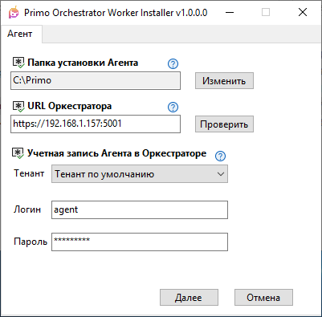

Если URL Оркестратора введен верно и Оркестратор доступен, появится окно подтверждения: 

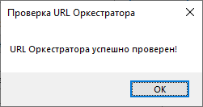

Далее можно выбрать тенант и ввести учетные данные Агента, с которыми он будет авторизоваться в Оркестраторе. Для тенанта по умолчанию может использоваться встроенная учетная запись **agent**. Она имеет предустановленный пароль, который можно изменить в Оркестраторе. Предустановленный пароль сообщает вендор. 

Для другого тенанта должна использоваться учетная запись этого тенанта с ролью **Agent**. 

Теперь по кнопке **Далее** нужно перейти на следующую вкладку инсталлятора - **Регистрация в Оркестраторе**:

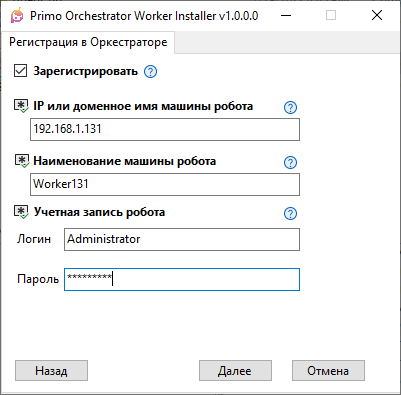

На вкладке **Регистрация в Оркестраторе** нужно заполнить поля **IP или доменное имя машины робота**, **Наименование машины робота** и ввести данные учетной записи робота – под ней будут запускаться роботы. Это необязательно административная учетная запись. 

По кнопке **Далее** будет предложено авторизоваться в Оркестраторе для выполнения автоматической регистрации машины робота:

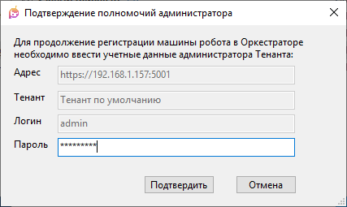

После этого по кнопке **Далее** откроется вкладка **Удержание RDP** инсталлятора:

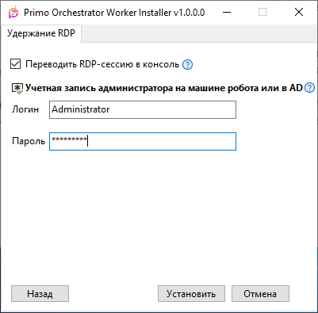

Требуется ввести учетные данные пользователя с правами администратора на машине робота. От этой учетной записи далее будут выполнены все системные операции по настройке машины робота и установке нужных компонентов.

Удержание RDP здесь осуществляется только для одной RDP-сессии за счет ее перевода в консоль. Если необходимо удержание многих RDP-сессий, RDP-пользователи должны быть настроены отдельно после регистрации машины робота в Оркестраторе. К машине робота должны быть разрешены RDP-подключения, должны быть настроены параметры подключения, открыт порт для RDP. Порт должен быть открыт и в случае единственного пользователя.

По кнопке **Установить** запустится процесс установки и автоматической регистрации машины робота в Оркестраторе:

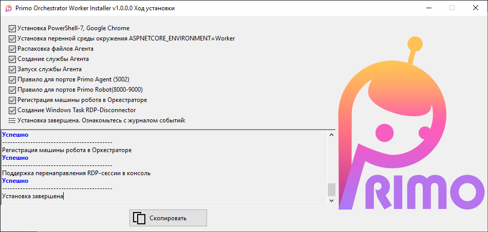

Зарегистрированная машина робота отобразится в UI Оркестратора:

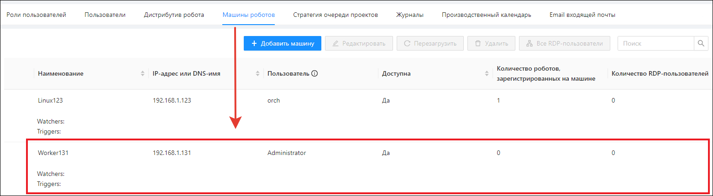

Далее через UI Оркестратора можно добавить RDP-пользователей для поддержки многих RDP-сессий. Сами пользователи при этом уже должны быть (локальные или доменные).

:small_blue_diamond: **Примечание**. Если регистрация машины робота не прошла, ее можно [зарегистрировать позже через UI](https://docs.primo-rpa.ru/primo-rpa/orchestrator/settings/register-robot) Оркестратора:

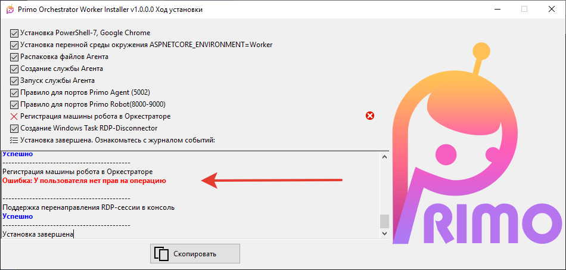

Среди запущенных служб появится служба `Primo.Orchestrator.Agent`:

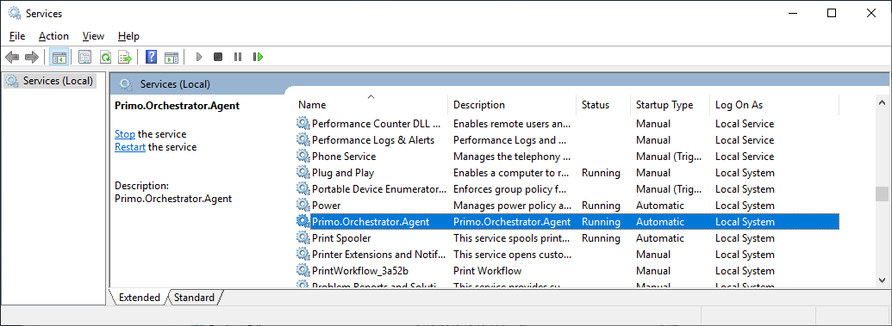

Среди заданий Windows появится задание RDP-Disconnector:

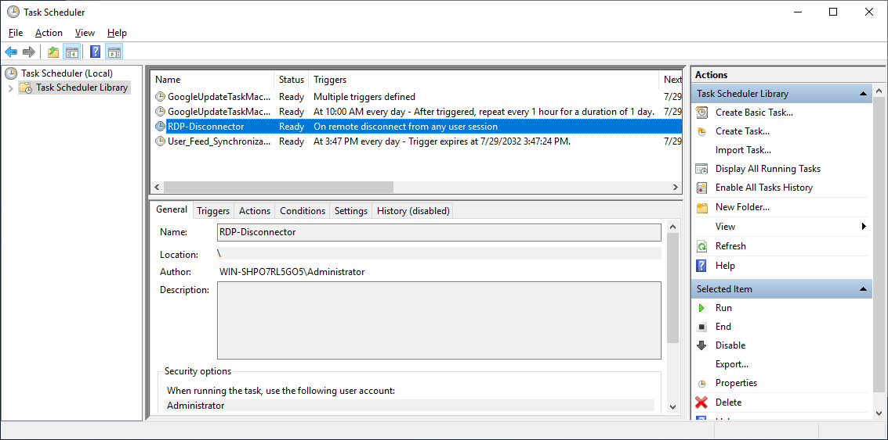

На диске `C:\` в корне появится файл `restore_console.bat`, который будет запускаться по заданию RDP-Disconnector:

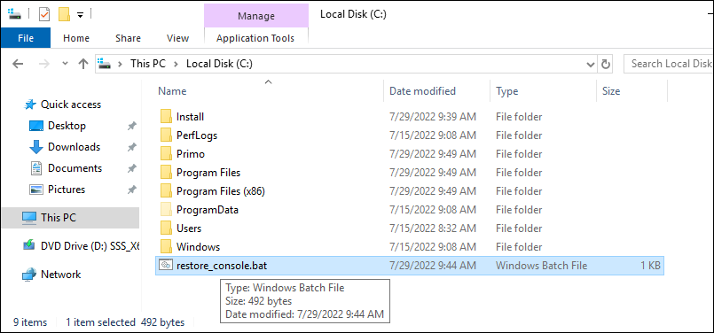
