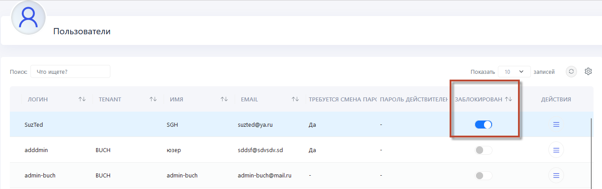
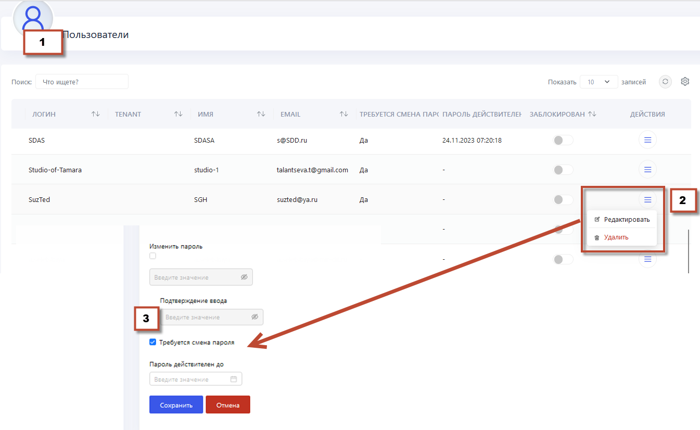
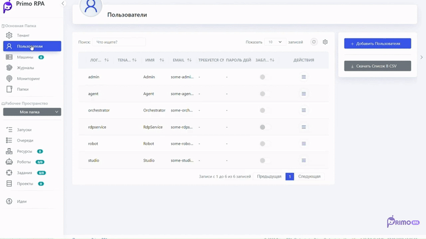

# Добавить пользователя

В Оркестраторе создание пользователя служит для настройки индивидуального доступа к автоматизированным рабочим процессам и для обеспечения безопасности системы. Это позволяет управлять ролями и правами доступа каждого пользователя, гарантируя, что каждый имеет доступ только к тем ресурсам и задачам, которые соответствуют его роли в организации.

##  Раздел «Пользователи»

Для добавления пользователя перейдите в раздел **Пользователи** в веб-интерфейсе Оркестратора.

1. Нажмите на кнопку **Добавить пользователя**, чтобы открыть соответствующую форму.
2. Введите данные:
   * **Логин** - уникальное имя для нового пользователя.
   * **Пароль** - надежный пароль.
   * **Личные данные** - настоящее имя пользователя и его электронную почту.
4. Выберите подходящую **Роль** из списка, определяющую доступ пользователя в системе.
5. Назначьте необходимые события или задачи (возможно установить все события).
6. После заполнения всех полей нажмите **Сохранить** для завершения процесса добавления пользователя.

## Дополнительные настройки

 **Блокировка учетной записи**
 
Имеется возможность временной блокировки аккаунта пользователя.

**Настройки пароля**

Опция позволяет указать обязательность смены пароля при первом входе в систему.

 

Об управлении ролями пользователя можно узнать [здесь](https://docs.primo-rpa.ru/primo-rpa/orchestrator-hope-ui/tenant/user_role_managment).

