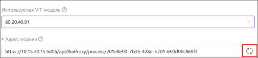

# AI Server 1.25.4.3

Список изменений для патч-версии 1.25.4.3, выпущенной в июне 2025-го года.

## Улучшения в работе с движком распознавания ViT

1. Повышена точность детекции и распознавания текста при использовании данного движка. Для этого была добавлена возможность помещать в область целевой ограничивающей 
рамки (bbox) не только значение, но и область с указанием наименования поля. При этом в процессе инференса будет экстактировано только значение данного поля.
Благодаря этому была существенно повышена точность определения ограничивающей рамки (bbox), а также точность экстракции, которая теперь производится с учетом 
контекста. 

1. Реализована возможность обновлять адрес модели - для этого добавлена кнопка "обновить" справа от поля "Адрес модели".

## Исправленные ошибки

TODO
## Инструкция по обновлению AI Server

[Обновление 1.25.4.2 → 1.25.4.3]() — ограничивается вариантом установки через Docker.