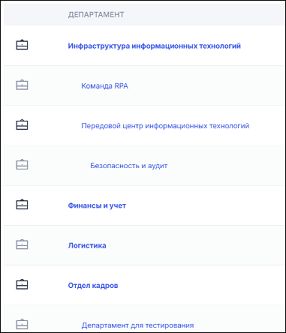
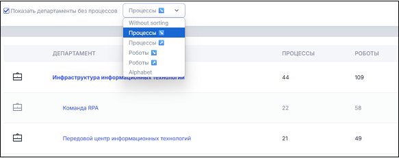
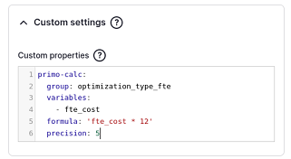

# Idea Hub 25.6

Список изменений для версии 25.6, выпущенной в июне 2025-го года.

### Получение статистических данных

1. Улучшено получение статистических данных по очередям для "Тип исходных данных: Primo RPA Global" - как для варианта через скрипт get_data, так и для варианта через SQL. 
Изменился набор таблиц БД Оркестратора, к которым необходим доступ:
* Добавились: **ExchangeQueueValues** и **ExchangeQueueValueEvents**;
* Больше не требуется доступ к **ExchangeQueueStatistics**.

### Департаменты

1. Реализована возможность выделять верхний уровень департаментов на странице департаментов жирным шрифтом. 
Для включения функции надо:
* В `settings.local.php` добавить `$settings['ui']['departments']['highlight_root'] = TRUE`;
* Либо в `.env` добавить `UI_DEPARTMENTS_HIGHLIGHT_ROOT=TRUE`.

2. На страницу департаментов добавлена колонка с количеством связанных с департаментом Роботов. 

3. Добавлена возможность сортировки по разным критериям на странице департаментов. По умолчанию сортировка производится по количеству связанных процессов от большего к меньшему. 
Сортировки и опции запоминаются, таким образом при повторном посещении сайта на странице будет отображаться ранее выбранный вариант сортировки. 

### Системы 

1. Добавлена сортировка для систем: теперь на странице Систем (/systems) они сортируются от самой используемой к наименее используемой. Также исправлен подсчёт количества процессов для систем.

### Внешний вид 

1. Добавлен новый внешний вид для блока логотипа. Данная функциональность меняется в настройках темы.

1. Реализована возможность отображения Главной страницы в зависимости от учетной записи. Пользователи теперь могут сделать любую страницу Главной для себя (кроме страницы списка процессов). 
Администраторы могут назначить любым пользователям новую Главную страницу через специальный интерфейс.

### Прочее

1. Добавлена возможность управлять точностью округления у полей Идей. Для настройки точности:
- Откройте страницу **Структура > Веб-формы**
- Напротив формы **Идея** нажмите кнопку **Build**
- Выберите поле, для которого нужно установить другую точность округления
- В открывшемся боковом меню перейдите на вкладку **Расширенные**
- Промотайте вкладку вниз и в поле **Custom settings** добавьте строчку **precision: *требуемое число*** 

## Исправленные ошибки

1. Исправили некорректную сортировку по умолчанию на странице департамента. Теперь по умолчанию в начале списка указаны те процессы, которые находятся в эксплуатации и подключены к Оркестратору.

1. Исправили ошибку в правилах доступа в плагине, позволяющем организовывать доступ к иерархии департаментов. 

1. Сделали исправления, благодаря которым перестало появляться сообщение об ошибке при попытке открыть страницу процессов конкретного департамента.

1. Исправили ошибку, возникавшую при пересчёте правил доступов к терминам таксономии.

## Дистрибутив

Idea Hub 25.6 доступен по [ссылке](https://disk.primo-rpa.ru/index.php/s/t9BHBjR6PP06Yax?path=%2FRelease%2FIdeaHub):

- `idea-hub.install.25.6.linux.tar` — архив для [установки](/idea-hub/installation/linux) Idea Hub с нуля.
- `idea-hub.update.25.6.linux.tar` — архив для [обновления](/idea-hub/installation/update) Idea Hub.
- `Dashboard libraries` — папка с архивом для [установки библиотеки панелей дашбордов](/idea-hub/installation/linux/panel-library).
