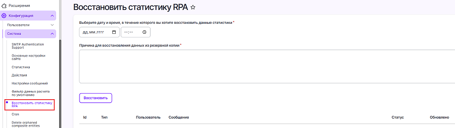

# Idea Hub 25.7

Список изменений для версии 25.7, выпущенной в июле 2025-го года.

### Процессы

1. Реализовали возможность динамического формирования ссылок на странице процесса. 
Для полей типа "Ссылка" добавлена возможность использовать токены в самих ссылках, а также возможность добавлять шаблонные URL с переменной из полей.
Это может быть полезно, например, при добавлении в карточку процесса, находящегося в эксплуатации, ссылки на мониторинг, сформированной с учетом ID данного процксса. 

### Департаменты

1. Добавили на странице департаментов возможность сворачивать департаменты, у которых есть дочерние элементы. 
Все сделанные настройки запоминаются для пользователя. 

 

### Внешний вид 

### Прочее

1. Добавили метод field() для обращения за информацией по сущности в формулах для всех сущностей, включая Лицензию, Очередь, Машину и Робота. 

1. Реализовали функционал восстановления статистических данных на определённую дату. 
Пользователь с правом "primo stat restore data" может войти на страницу **Конфигурация > Система > Восстановить статистику RPA**, выбрать целевое время с точностью до секунды, описать причину и откатить статистические данные на это время.  
**ВАЖНО:** После нажатия кнопки **Восстановить**, восстановление не начинается сразу. Оно попадает в план, и запускается при следующем запуске крон команды `drush cron`. 
В процессе выполнения и после завершения у записи будет меняться статус на актуальный.

## Исправленные ошибки

1. Исправили ошибку при которой использование департамента как главной страницы вызывало падение формы настроек.

## Дистрибутив

Idea Hub 25.7 доступен по [ссылке](https://disk.primo-rpa.ru/index.php/s/t9BHBjR6PP06Yax?path=%2FRelease%2FIdeaHub):

- `idea-hub.install.25.7.linux.tar` — архив для [установки](/idea-hub/installation/linux) Idea Hub с нуля.
- `idea-hub.update.25.7.linux.tar` — архив для [обновления](/idea-hub/installation/update) Idea Hub.
- `Dashboard libraries` — папка с архивом для [установки библиотеки панелей дашбордов](/idea-hub/installation/linux/panel-library).
