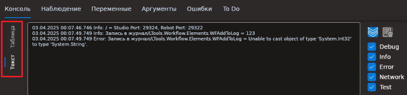
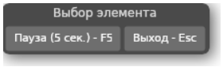

# Primo RPA Studio Linux 1.25.5

Раздел содержит описание изменений для версии приложения **Primo RPA Studio Linux 1.25.5**, выпущенной в мае 2025 года. 

## Новые функции и улучшения

1. Реализована возможность выводить логи в консоли в виде текста.

2. Улучшена общая производительность селекторов для групп активностей **Рабочий стол** и **Работа с UI**.

3. Появилось возможность захвата элементов приложения **Java**, при условии интеграции приложений Java с фреймворком `at-spi` путем использования специального механизма Java bridge.

4. Реализована задержка захвата для выпадающих списков в приложениях рабочего стола. Для этого было добавлено окно **Выбор элемента**, появляющееся в левом верхнем углу во время работы с приложением. Кнопка *Пауза* в данном окне выполняет паузу во время поиска элементов. Это может быть полезно в случаях, когда для выбора элемента необходимо выполнить дополнительные манипуляции мышкой. Кнопка *Выход* – позволяет выйти из режима поиска элементов. Другой вариант выхода из режима поиска – просто развернуть окно Студии.

5. Обновлена  браузерная версия расширений для браузеров Яндекс и Chrome до 3.80(1.80).

6. В окне лицензирования добавлена кнопка "Сохранить запрос на лицензию" и возможность изменения параметров лицензии для Студии и Robot Runner.

## Исправленные ошибки 

1. Исправлена ошибка, при которой блок последовательности внутри диаграммы очищался при запуске основного процесса. Теперь состояние вложенных процессов сохраняется корректно.

1. Решена проблема, из-за которой при выключенном флаге "Следовать за наполнением консоли" не работало наполнение консоли в поле *Текст*.

1. Восстановлена возможность редактировать поля описания процесса. При нажатии кнопки “ОК” сделанные изменения сохраняются.

1. Исправлена ошибка, из-за которой не запускалась задача в Robot Runner, если у другого пользователя на этой же машине был запущен робот (процесс из Студии или задача в Robot Runner).

1. Обеспечена возможность осуществлять поиск элементов (активностей) на обоих языках (русском и английском) вне зависимости от того, какой язык выбран в Студии.

1. Исправлена некорректная работа **Инспектор UI** с последними версиями браузеров Яндекс и Chrome, когда при попытке обновить дерево появлялось сообщение об ошибке "'NoneType' object has no attribute 'name'".

1. Для активности **Создать таблицу** решена проблема с отображением названий столбцов таблицы DataTable во вкладке **Вывод**. Теперь названия столбцов отображаются даже в том случае, если таблица пустая. 

1. Исправлена ошибка, из-за которой не фиксировался результат захвата элементов для выпадающих списков в приложениях рабочего стола. 

1. Найдено решение проблемы с зависанием Студии при попытке выбрать "Путь к тестовым данным" в окне редактирования процесса.

1. Исправлена проблема, из-за  которой при попытке перетащить активность **Ссылка на процесс** в любой контейнер, будь то контейнер **Try-Catch** или **Открыть браузер**, активность оставалась на старом месте, а в контейнер вставлялось пустое пространство

1. Исправлена ошибка, возникавшая при вводе некорректных данных для авторизации в Оркестраторе RobotRunner или если Оркестратор был выключен, из-за которой при попытке редактирования задачи выдавалось сообщение "Enum value '0' is invalid for type 'Primo.Orchestrator.Client.Common.Enums.Platform' and cannot be serialized...".

1. Для элемента **Прокрутка** группы **Работа с UI** восстановлена возможность прокрутки всей страницы браузера.

## Где найти 

[Скачать дистрибутив Primo RPA Studio Linux](https://disk.primo-rpa.ru/index.php/s/t9BHBjR6PP06Yax?path=%2FRelease%2FStudio)

[Скачать дистрибутив Primo RPA Robot](https://disk.primo-rpa.ru/index.php/s/t9BHBjR6PP06Yax?path=%2FRelease%2FRobot)
