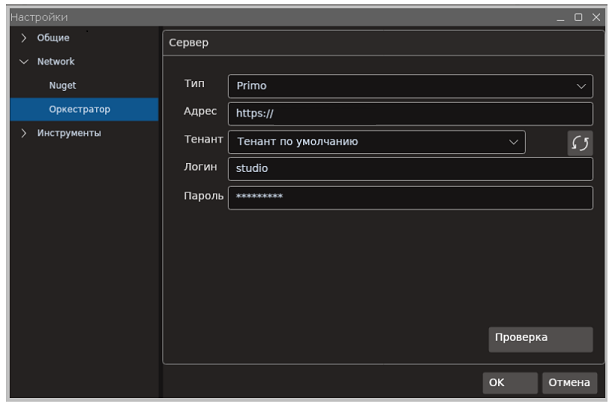

# Primo RPA Studio Linux 1.25.7

Раздел содержит описание изменений для версии приложения **Primo RPA Studio Linux 1.25.7**, выпущенной в июле 2025 года. 

## Новые функции и улучшения

1. Реализованы элементы группы **Браузер: События**:
* Событие открытия URL
* Событие закрытия URL

2. Реализованы активности группы **Криптография**:
* Прочитать Credentials
* Записать Credentials
* Удалить Credentials

3. Реализована активность группы **Рабочий стол: События**:
* События системы

4. Реализована активность группы **Рабочий стол**:
* Журнал системных сессий

5. Изменен внешний вид диалога для выбора авторизации в настройках подключения к Оркестратору (**Файл > Настройки > Network > Оркестратор**). 
Теперь при нажатии на стрелку поле "Тип" раскрывается в виде выпадающего списка.

6. В диалог создания нового проекта добавлен функционал для работы с шаблонами Robotic Enterprise Framework (REFramework, REF) через выпадающий список **Шаблон**.
Включение предустановленных шаблонов REFramework планируется в будущих релизах; на данный момент пользователи могут создавать шаблоны самостоятельно.

7. Реализована технология IntelliSense для работы с переменными и аргументами.

8. Реализован новый (асинхронный) метод получения лицензии attended-роботом. Асинхронная схема рассчитана на высокую пиковую нагрузку при одновременном получении лицензий аттендед-роботами.
Для использования данного метода был добавлен новый аргумент для запуска робота: **asyncattendedlicense**.

## Повышение производительности и стабильности

1. Значительно уменьшено потребление ресурсов процессора при использовании нескольких одновременно работающих элементов групп **Браузер: События** и **Рабочий стол: События**.

2. Повышена производительность активностей группы **Рабочий стол: События**, в которых выполняются частые запросы к сервису, предоставляющему состояния элементов управления рабочего стола. 
К таким событиям относятся **Событие изменения атрибута** и **Событие изменения состояния**.

3. Для активностей группы **Браузер: События** решена проблема с ростом потребления ресурсов CPU при закрытии браузера.

4. Найдено решение проблемы низкой производительности активности **Браузер: События: Событие кнопки браузера**.

## Исправленные ошибки 

### Элементы 

1. Решена проблема с аварийным закрытием Студии при сохранении и переоткрытии процесса с активностью **Командная строка**, находящейся в контейнере.

1. Исправлена ситуация с утечками памяти, происходившими при попытке открытия редактора шаблона поиска у элементов группы **Работа с UI**, находящихся в контейнере **Присоединиться к приложению**.

1. Исправлено некорректное построение дерева элементов для активностей группы **Работа с UI** на приложениях с большим количеством элементов, из-за которого часть дерева оставалась за границей области обзора.

1. Восстановлена работоспособность активностей групп **Браузер** и **Работа с UI** для случаев, когда один из атрибутов шаблона поиска представлен в формате json.

1. Устранена ошибка, приводившая к тому, что некоторые активности группы **Браузер: События** не работали при повторном запуске браузера.

1. Исправлена ошибка, из-за которой не работали браузерные активности на вкладках, открытых c помощью активности **Открыть вкладку браузера**.

1. Устранена проблема, вызывавшая некорректную работу активности **Закрыть браузер** (закрытие браузера у всех пользователей, а не только у текущего).

1. Исправлена ошибка, из-за которой при подключении к браузеру с помощью активности **Присоединиться к приложению** с использованием `[Browser Title]="*"`, активность **Закрыть браузер** не всегда закрывала браузер с первого раза.

1. Восстановлена работоспособность активности **Проверка результатов с оператором**: активность больше не зависает, сообщение об ошибке в терминале не появляется.

1. Решена проблема, вызывавшая прекращение выполнения проекта в случае и появление сообщения об ошибке, если у активности **C# script** был установлен чекбокс "Обновлять переменные".

1. Найдено решение проблемы, из-за которой не работали активности внутри контейнера **Действия** в режиме *Sequential* при срабатывании триггера "Событие изменения атрибута".

1. Исправлена ошибка, приводившая к появлению двойного фокуса ввода внутри активностей: теперь при выборе другой активности фокус ввода корректно переключается на новую активность.

### Браузеры и браузерные расширения

11. Решена проблема со смещением позиции клика мыши (для типов клика Button Left, Button Right, Button_Middle, Button Left Doubleclick) при использовании Selenium Webdriver в браузере Firefox.

23. Исправлена проблема с регистрацией браузерного расширения для Яндекс Браузера.

### Прочее

1. Устранена проблема, из-за которой при попытке уменьшить масштаб с помощью комбинации *Ctrl + колесо мыши* масштаб увеличивался независимо от направления вращения колеса мыши.

5. Найдено решение следующих проблем с построением дерева UI до элемента у дочерних окон:
    * при выборе в *Инспекторе UI* элемента, находящегося в дочернем окне, и попытке посмотреть дерево этого элемента, другие элементы в нем отсутствовали;
    * при нажатии "Редактировать шаблон поиска" -> показать дерево у пустого элемента в списке окон отсутствовали все дочерние окна.

10. Исправлена ошибка, из-за которой при запуске Студии с правами `sudo` переставал работать инспектор UI.

6. Исправлена некорректная работа контейнера события в режиме *Parallel* и *Sequential*. 
Теперь при одновременном срабатывании нескольких триггеров в режиме *Parallel* активности из блока "Действие" не теряются, а в режиме *Sequential* действие выполняется указанное количество раз.

8. Исправлены ошибки в работе селектора рабочего стола в Java приложениях: теперь селектор начинает работать в приложении сразу и не предлагает к выбору отсутствующие на вкладке приложения элементы.

16. Устранены проблемы, приводившие к несоблюдение расписания при запуске робота из Robot Runner по расписанию.

20. Исправлены ошибки в работе **Rate Limiter**:
* Убрано ограничение с последней итерации для случаев, когда количество элементов в цикле равно значению параметра ограничения или кратно ему;
* Добавлена возможность работы Rate Limiter в диаграммах;
* Исправлены проблемы в работе во вложенных последовательностях;
* При использовании Rate Limiter для вычисления числа итераций со скриптом и двух подпоследовательностей - исправлена ошибка с необновлявшимся значением переменной для второго вычисления скриптом;
* Также свойства RateLimiter были помещены в отдельную группу "Прочее" для всех циклов и последовательностей.

## Где найти 

[Скачать дистрибутив Primo RPA Studio Linux](https://disk.primo-rpa.ru/index.php/s/t9BHBjR6PP06Yax?path=%2FRelease%2FStudio)

[Скачать дистрибутив Primo RPA Robot](https://disk.primo-rpa.ru/index.php/s/t9BHBjR6PP06Yax?path=%2FRelease%2FRobot)

