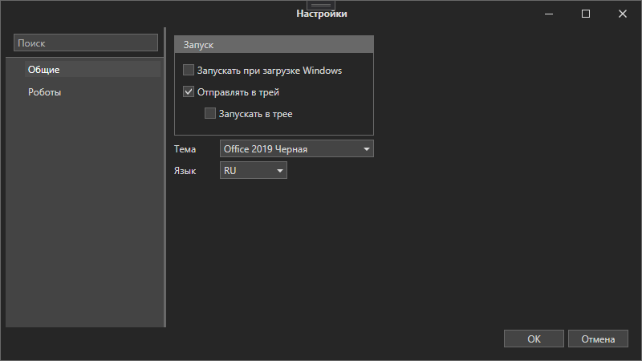
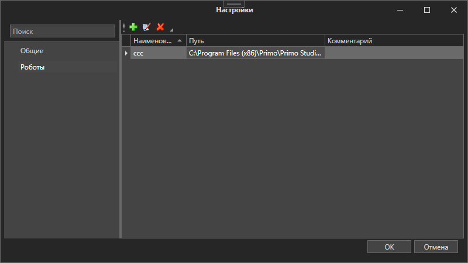

# ВЕРСИЯ ПОД WINDOWS

# Настройки

Для управления настройками программы перейдите в раздел меню **Файл ➝ Настройки**.

Блок **Общие** отвечает за базовые настройки Robot Runner:

Блок **Роботы** позволяет подключать папки с дистрибутивами Робота:

