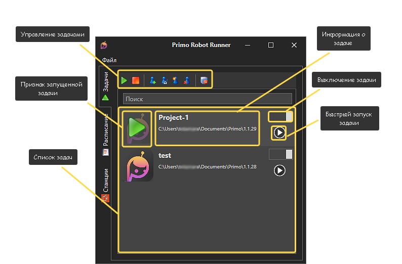
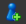
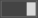
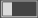
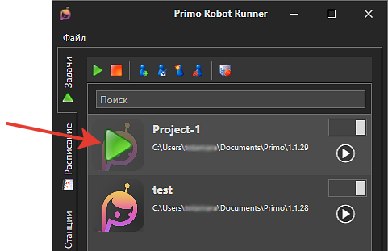

# ВЕРСИЯ ПОД WINDOWS

# Задачи

Задачи создаются и редактируются соответствующими кнопками меню:

## Панель управления задачами

При нажатии кнопки **Создать задачу**  откроется форма для указания ее настроек:

Параметры запуска задачи описаны в разделе [Запуск Робота из командной строки](https://docs.primo-rpa.ru/primo-rpa/primo-robot/launch-command).

Другие кнопки управления:
* Кнопка **Создать ярлык задачи** создает ярлык запуска задачи без Robot Runner.
* Кнопка **Закрыть роботов** прекращает работу всех запущенных локально роботов.
* Кнопка **Редактировать задачу** позволяет изменить параметры выбранной задачи.
* Кнопка **Удалить задачу** позволяет удалить выбранную задачу.

## Список задач

В списке задач отображаются все созданные задачи. Их можно запустить по расписанию или вручную по кнопке .

Переключатель  в строке с задачей управляет запуском задач по расписанию. Если переключатель выключен , то задача выполняться не будет. На ручной запуск задачи положение переключателя не влияет.

Если задача запущена, то в общем списке задач она будет отображаться со значком проигрывания. Когда задача завершается, треугольник пропадает.

