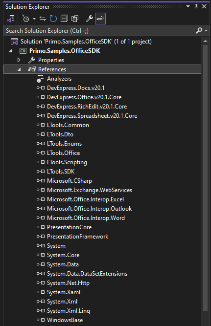

# Начало работы

1. Запустите Visual Studio.
2. Выберите **Create a new project** с типом проекта Class Library (.NET Framework).
3. Введите имя проекта. **ВНИМАНИЕ!** **Имя проекта и библиотеки dll должны начинаться с префикса "Primo."** 
4. Выберите фреймворк .NET Framework 4.6.1.
5. Найдите в папке Primo Studio указанные ниже сборки и добавьте их в References проекта сборки:
   * _LTools.Common.dll_
   * _LTools.Dto.dll_
   * _LTools.Enums.dll_
   * _LTools.Scripting.dll_
   * _LTools.SDK.dll_
   * _LTools.Office.dll_
 
6. В менеджере зависимостей Visual Studio найдите сборки MS Office в Assemblies > Extensions.\
   Для работы с **Excel** добавьте:
   * _DevExpress.Docs.v20.1.dll_
   * _DevExpress.Spreadsheet.v20.1.Core.dll_
   * _DevExpress.Office.v20.1.Core.dll_
   * _Microsoft.Office.Interop.Excel (необходим установленный MS Office)_

   Для работы с **Word** добавьте:
   * _DevExpress.Docs.v20.1.dll_
   * _DevExpress.RichEdit.v20.1.Core.dll_
   * _DevExpress.Office.v20.1.Core.dll_
   * _Microsoft.Office.Interop.Word (необходим установленный MS Office)_

   Для работы с **Outlook** добавьте:
   * _Microsoft.Office.Interop.Outlook (необходим установленный MS Office)_
   
   Для работы с **Exchange** добавьте:
   * _Microsoft.Exchange.WebServices.dll_

   Также добавьте стандартные сборки:

   * _PresentationCore_
   * _PresentationFramework_
   * _System.Xaml_
   * _WindowsBase_

   

7\. Добавьте в проект компонент типа **User Control (WPF)** (Add > New Item...):

   

   Этот элемент будет являться визуальной составляющей элемента Primo. Данные будущего элемента автоматически будут смаплены на DataContext этого контролла (пример приводится далее).

8\. Создайте класс (Add > Class…). Этот класс будет являться code-behind нашего элемента.

9\. Для создания элемента с синхронным поведением необходимо унаследовать класс `LTools.Office.SDK.PrimoComponent*<UI>`, где:
* UI – это имя вашего визуального компонента из шага 5.
* Вместо `*` нужно выбрать Excel, Word, Outlook либо Exchange, в зависимости от целевого использования. Пример: LTools.Office.SDK.PrimoComponentExcel.

## Дальнейшие шаги

:small_orange_diamond: *Далее все из LTools.SDK относится и к этому SDK, поскольку LTools.Office.SDK его наследует. Если вы уже работали с LTools.SDK и понимаете общий принцип, то рекомендуем сразу обратиться к разделу [Дополнительные свойства](https://docs.primo-rpa.ru/primo-rpa/developers/ltools.office.sdk/additional-properties), которым отличается LTools.Office.SDK от стандартного.*

Если вы работете с SDK впервые, то изучите последовательно все разделы:
- [Синхронный элемент](https://docs.primo-rpa.ru/primo-rpa/developers/ltools.sdk/sync-element);
- [Элемент с тайм-аутом](https://docs.primo-rpa.ru/primo-rpa/developers/ltools.sdk/to-element);
- [Простой контейнер](https://docs.primo-rpa.ru/primo-rpa/developers/ltools.sdk/simple-container);
- [Специальный контейнер](https://docs.primo-rpa.ru/primo-rpa/developers/ltools.sdk/custom-container);
- [Расширенные свойства](https://docs.primo-rpa.ru/primo-rpa/developers/ltools.sdk/extended-properties);
- [Дополнительные свойства](https://docs.primo-rpa.ru/primo-rpa/developers/ltools.office.sdk/additional-properties) - относятся только к LTools.Office.SDK;
- [Дополнительные методы](https://docs.primo-rpa.ru/primo-rpa/developers/ltools.sdk/additional-methods);
- [Кастомные свойства](https://docs.primo-rpa.ru/primo-rpa/developers/ltools.sdk/custom-properties);
- [Валидация ввода](https://docs.primo-rpa.ru/primo-rpa/developers/ltools.sdk/input-validation);
- [Привязка данных к UI](https://docs.primo-rpa.ru/primo-rpa/developers/ltools.sdk/ui-binding);
- [Сборка и отладка](https://docs.primo-rpa.ru/primo-rpa/developers/ltools.sdk/debugging);
- [Упаковка и публикация](https://docs.primo-rpa.ru/primo-rpa/developers/ltools.sdk/publish).

