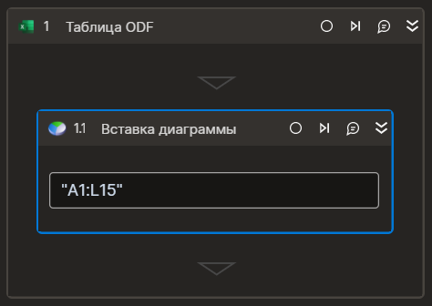

### Вставка диаграммы

Компонент создает диаграмму на листе таблицы  




Элемент работает корректно только внутри контейнера "Таблица ODF"

### Свойства
Символ `*` в названии свойства указывает на обязательность заполнения. Описание общих свойств см. в разделе [Свойства элемента](https://docs.primo-rpa.ru/primo-rpa/primo-studio/process/elements#svoistva-elementa).

| Свойство     | Тип    | Описание                                  | Пример          |
| ------------ | ------ | ----------------------------------------- | --------------- |
| **Таблица** | | | |
| Диапазон | String | Диапазон данных (A1:D12). Если указан символ "*", будет использован весь лист | `@"A1:L15"` |
| Вертикальный диапазон | Boolean | Отображать ряд на основе диапазона значений ячеек по строке или по столбцу | `true` |
| Индекс страницы | Int32 | Индекс страницы (счет с нуля, по умолчанию ноль когда название страницы тоже не указано) | `1`|
| Страница | String | Название страницы (работает только когда не указан индекс страницы) | `"Лист1"`|
| Тип | Aspose.Cells.Charts.ChartType | Тип диаграммы https://reference.aspose.com/cells/net/aspose.cells.charts/charttype/ | `Aspose.Cells.Charts.ChartType.Column`|
| **Расположение** | | | |
| Слева | Int32 | Отступ слева в пикселях | `200`|
| Сверху | Int32 | Отступ сверху в пикселях | `150`|
| Ширина | Int32 | Ширина диаграммы в пикселях | `800`|
| Высота | Int32 | Высота диаграммы в пикселях | `400`|
| **Вывод** | | | |
| Переменная | Aspose.Cells.Charts.Chart | Переменная для хранения ссылки на вставленную диаграмму| |

Типы доступных диаграмм могут быть представлены следующими группами:
1. Area — диаграмма с областями.
2. Bar — линейчатая диаграмма. 
3. Column — гистограмма.
4. Doughnut — кольцевая диаграмма.
5. Line Chart — линейный график. 
6. Pie — круговая диаграмма. 
7. XY scatter — точечная диаграмма.


### Только код
Пример использования элемента в процессе с типом **Только код** (Pure code):



```csharp
//app - [Primo.Office.OdfOxml.ExcelApp] Приложение Excel
//range - Диапазон: [String] Диапазон данных (A1:D12). Если указан символ "*", будет использован весь лист
//range - Вертикальный диапазон: [Boolean] Отображать ряд на основе диапазона значений ячеек по строке или по столбцу.
//sheetName - Страница: [String] Наименование страницы
//sheetIdx - Индекс страницы: [Int32] Индекс страницы
//chtartType - Тип: Тип диаграммы
//left - Слева: [Int32] Отступ слева
//top - Сверху: [Int32] Отступ сверху
//width - Ширина: [Int32] Ширина диаграммы
//height - Высота: [Int32] Высота диаграммы
//Aspose.Cells.Charts.Chart data = app.InsertChart(range, isVerticalRange, chtartType, [sheetName], [sheetIdx], [left], [top], [width], [height]);
Primo.Office.OdfOxml.ExcelApp app =  Primo.Office.OdfOxml.ExcelApp.Init(wf, "fileName");
Aspose.Cells.Charts.Chart data = app.InsertChart("*", false, LTools.Office.Model.Excel.ChartTypes.Line, "Лист1", 0, 10, 10, 800, 800);
app.Save();
```



```python
//app - [Primo.Office.OdfOxml.ExcelApp] Приложение Excel
//range - Диапазон: [String] Диапазон данных (A1:D12). Если указан символ "*", будет использован весь лист
//range - Вертикальный диапазон: [Boolean] Отображать ряд на основе диапазона значений ячеек по строке или по столбцу.
//sheetName - Страница: [String] Наименование страницы
//sheetIdx - Индекс страницы: [Int32] Индекс страницы
//chtartType - Тип: Тип диаграммы
//left - Слева: [Int32] Отступ слева
//top - Сверху: [Int32] Отступ сверху
//width - Ширина: [Int32] Ширина диаграммы
//height - Высота: [Int32] Высота диаграммы
app =  Primo.Office.OdfOxml.ExcelApp.Init(wf, "fileName")
data = app.InsertChart("*", false, LTools.Office.Model.Excel.ChartTypes.Line, "Лист1", 0, 10, 10, 800, 800) #Aspose.Cells.Charts.Chart
app.Save()
```



```javascript
//app - [Primo.Office.OdfOxml.ExcelApp] Приложение Excel
//range - Диапазон: [String] Диапазон данных (A1:D12). Если указан символ "*", будет использован весь лист
//range - Вертикальный диапазон: [Boolean] Отображать ряд на основе диапазона значений ячеек по строке или по столбцу.
//sheetName - Страница: [String] Наименование страницы
//sheetIdx - Индекс страницы: [Int32] Индекс страницы
//chtartType - Тип: Тип диаграммы
//left - Слева: [Int32] Отступ слева
//top - Сверху: [Int32] Отступ сверху
//width - Ширина: [Int32] Ширина диаграммы
//height - Высота: [Int32] Высота диаграммы
var host = new _lib.Microsoft.ClearScript.HostFunctions();
var lst = host.newObj(_lib.System.Collections.Generic.List(_lib.System.Collections.Generic.List(_lib.System.String)));
var lst2 = host.newObj(_lib.System.Collections.Generic.List(_lib.System.Collections.Generic.List(_lib.LTools.Office.Model.ExcelCellInfo)));
var lst3 = host.newObj(_lib.System.Data.DataTable);
var app = _lib.Primo.Office.OdfOxml.ExcelApp.Init(wf, ".\\book.xlsx", ";", _lib.LTools.Office.Model.InteropTypes.DX);	
var data = app.InsertChart("*", false, _lib.LTools.Office.Model.Excel.ChartTypes.Line, "Лист1", 0, 10, 10, 800, 800) //_lib.LTools.Office.Model.Excel.ExcelChartItem	
app.Save();
```


