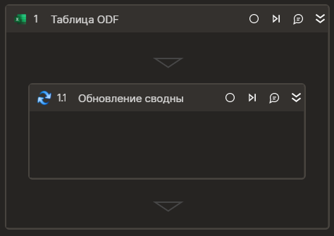

### Обновление сводных таблиц
Производит обновление сводных таблиц


### Только код
Пример использования элемента в процессе с типом **Только код** (Pure code):



```csharp
Primo.Office.OdfOxml.ExcelApp app = Primo.Office.OdfOxml.ExcelApp.Init(wf, [file]);
app.RefreshPivotTables();
```



```python
app = Primo.Office.OdfOxml.ExcelApp.Init(wf, [file])
app.RefreshPivotTables()
```



```javascript
var app =  _lib.Primo.Office.OdfOxml.ExcelApp.Init(wf, [file]);
app.RefreshPivotTables();
```

