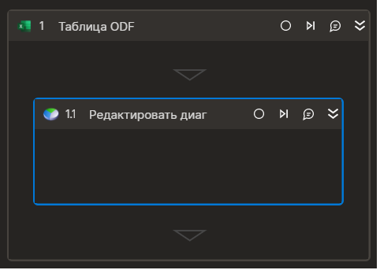

### Редактировать диаграмму

Элемент изменяет диаграмму в таблице   




Элемент работает корректно только внутри контейнера "Таблица ODF"

### Свойства
Символ `*` в названии свойства указывает на обязательность заполнения. Описание общих свойств см. в разделе [Свойства элемента](https://docs.primo-rpa.ru/primo-rpa/primo-studio/process/elements#svoistva-elementa).

| Свойство     | Тип    | Описание                                  | Пример          |
| ------------ | ------ | ----------------------------------------- | --------------- |
| **Таблица** | | | |
| Переменная     | Aspose.Cells.Charts.Chart | Переменная, хранящая ссылку на диаграмму | `a` |
|**Диапазон**||||
| Изменить диапазон | Boolean | Признак смены диапазона данных | `true` |
| Диапазон данных | String | Диапазон данных. Если указан символ "*", будет использован весь лист | `"A1:D12"` |
| Вертикальный диапазон | Boolean | Отображать ряд на основе диапазона значений ячеек по строке или по столбцу | `false` |
|**Заголовок**||||
| Изменить заголовок | Boolean | Признак изменения заголовка | `true` |
| Заголовок | String |  Текст заголовка | `"Диаграмма состояний"` |
| Отобразить заголовок | Boolean | Признак видимости заголовка | `true` |
|**Легенда**||||
| Изменить видимость легенды | Boolean | Признак изменения видимости легенды | `true` |
| Отобразить легенду | Boolean | Признак видимости легенды | `true` |
|**Метки данных**||||
| Изменить видимость меток данных | Boolean | Признак изменения видимости меток данных | `true` |
| Отобразить метки данных | Boolean | Признак видимости меток данных | `false` |
|**Оси**||||
| Тип оси | Model.Excel.AxisType | Тип редактируемой оси | `Category` |
| Изменить заголовок оси | Boolean | Признак изменения заголовка  оси | `true` |
| Заголовок оси | String |  Определяет заголовок оси | `"Высота, метры"` |
| Изменить границы оси | Boolean | Признак изменения границ оси | `true` |
| Минимальная | double? | Минимальная граница | `-5.5` |
| Максимальная | double? | Максимальная граница | `350.25` |

### Примечания
Свойство "Тип оси" может принимать одно из двух значений: "Category"(ось абсцисс, область определения) или "Value"(ось значений). 
Один элемент может изменить свойства лишь одной оси. Для того чтобы изменить свойства обеих осей, следует использавать два элемента "Редактировать диаграмму".

Диаграмма - составной объект, элемент "Редактировать диаграмму" может изменить один или несколько компонентов диаграммы. 
Свойства элемента "Редактировать диаграмму" сгруппированы так, что каждая группа представляет свойства определенного компонента( кроме групп "Общие" и "Таблица").
Каждая такая группа содержит свойство "Изменить ...", которое определяет, следует ли изменять этот компонент. Эсли это свойство не отмечено, все остальные свойства группы при выполнении элемента никоим образом не будут приниматься в расчет и не будут обрабатываться.
Например, в если в группе "Диапазон" не отмечено свойство "Изменить диапазон", то другие свойства группы ("Диапазон данных" и "Вертикальный диапазон") не будут влиять на изменение диаграммы.
Группа"Оси" имеет два таких свойства - "Изменить заголовок оси" и "Изменить границы оси", они определяют, соответственно, нужно ли менять заголовок или границы оси. 


### Только код
Пример использования элемента в процессе с типом **Только код** (Pure code):



```csharp
Primo.Office.OdfOxml.ExcelApp app =  Primo.Office.OdfOxml.ExcelApp.Init(wf, "fileName");
app.ChartSetRange(chart, "A1:D12", false);
app.ChartSetTitle(chart, "Диаграмма состояний", true);
app.ChartSetAxTitle(chart, Model.Excel.AxisType.Category, "Высота, метры", true);
app.ChartSetAxBounds(chart, Model.Excel.AxisType.Value, -5.5, 350.25);
app.ChartSetLegend(chart, true);
app.ChartSetDataLabels(chart, true);
```



```python
app =  Primo.Office.OdfOxml.ExcelApp.Init(wf, "fileName")
app.ChartSetRange(chart, "A1:D12", false)
app.ChartSetTitle(chart, "Диаграмма состояний", true)
app.ChartSetAxTitle(chart, Model.Excel.AxisType.Category, "Высота, метры", true)
app.ChartSetAxBounds(chart, Model.Excel.AxisType.Value, -5.5, 350.25)
app.ChartSetLegend(chart, true)
app.ChartSetDataLabels(chart, true)
```



```javascript
var app = _lib.Primo.Office.OdfOxml.ExcelApp.Init(wf, ".\\book.ods");
app.ChartSetRange(chart, "A1:D12", false);
app.ChartSetTitle(chart, "Диаграмма состояний", true);
app.ChartSetAxTitle(chart, Model.Excel.AxisType.Category, "Высота, метры", true);
app.ChartSetAxBounds(chart, Model.Excel.AxisType.Value, -5.5, 350.25);
app.ChartSetLegend(chart, true);
app.ChartSetDataLabels(chart, true);
```


