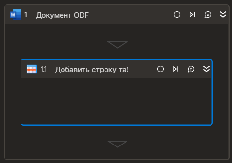

### ???????? ?????? ???????
??????? ????????? ?????? ? ???????. ??????? ???????? ????????? ?????? ?????? ?????????? "???????? ODF"



### ????????
?????? `*` ? ???????? ???????? ????????? ?? ?????????????? ??????????. ???????? ????? ??????? ??. ? ??????? [???????? ????????](https://docs.primo-rpa.ru/primo-rpa/primo-studio/process/elements#svoistva-elementa).

| ???????? | ???                 | ????????                 | ??????  
| -------- | ------------------- | ------------------------ |--------------- |
| ??????\* | Int32               | ?????????? ????? ??????? (?????? ? ????) |`1`|
| ??????   | List<String>       | ?????? ??????            |`new List<string>(){"a","b"}`|
| ??????   | System.Data.DataRow | ?????? ??????            |`table.NewRow()`|

### ?????? ?????????????


```csharp
Primo.Office.OdfOxml.WordApp app = Primo.Office.OdfOxml.WordApp.Init(wf, "fileName");
app.AddTableRow(0, new List<String> { "cell1" });
```



```python
dt = List[String]()
dt.Add("cell1")
app = Primo.Office.OdfOxml.WordApp.Init(wf, "fileName")
app.AddTableRow(0, dt)
```



```javascript
var host = new _lib.Microsoft.ClearScript.HostFunctions();
var lst = host.newObj(_lib.System.Collections.Generic.List(_lib.System.String));
lst.Add("cell1");
var app = _lib.Primo.Office.OdfOxml.WordApp.Init(wf, "fileName");
app.AddTableRow(0, lst);
```


