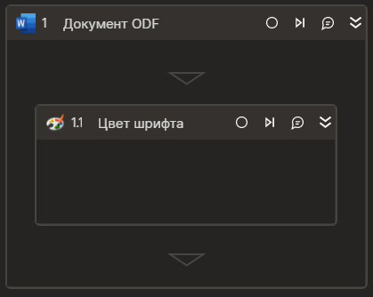

### Цвет шрифта

Элемент обрабатывает цвет текста документа  



Элемент работает корректно только внутри контейнера "Документ ODF"

### Свойства
Символ `*` в названии свойства указывает на обязательность заполнения. Описание общих свойств см. в разделе [Свойства элемента](https://docs.primo-rpa.ru/primo-rpa/primo-studio/process/elements#svoistva-elementa).

| Свойство     | Тип    | Описание                                  | Пример          |
| ------------ | ------ | ----------------------------------------- | --------------- |
| **Word** | | | |
| Начало   | Int32 | Индекс символа начала текста (отсчет с нуля, по умолчанию ноль) | `12` |
| Длина   | Int32 |  Длина текста (по умолчанию до конца документа) | `25` |
| Изменить цвет   | Boolean |  Признак изменения цвета | `true` |
| Новый цвет  | System.Drawing.Color | Устанавливаемый цвет шрифта |`System.Drawing.Color.LightBlue`|
| **Вывод** | | | |
| Цвет  | System.Drawing.Color | Переменная для сохранения текущего цвета шрифта. Если фрагмент имеет несколько цветов шрифта, устанавливается System.Drawing.Color.Transparent  ||


### Только код
Пример использования элемента в процессе с типом **Только код** (Pure code):



```csharp
System.Drawing.Color color = app.GetTextColor(10, 25);
app.SetTextColor(10, 25, new System.Drawing.Color(255, 100, 0, 0));
```



```python
color = app.GetTextColor(10, 25); #System.Drawing.Color
app.SetTextColor(10, 25, System.Drawing.Color(255, 100, 0, 0))
```



```javascript
var color = app.GetTextColor(10, 25); //_lib.System.Drawing.Color
app.SetTextColor(10, 25, clr);
```


