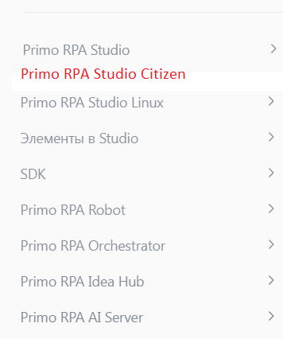

# Предварительный формат структуры документации для Студии Ситизен

1. Установка (указать специфику, сравнить с версией Pro)
    1.1. Системные требования (ссылка на Pro)
    1.2. Процедура установки (дистрибутив, процесс инсталляции, первый запуск)
    1.3. Лицензирование (ссылка на Pro, типы лицензий, активация) 

2. Запуск и начало работы
    2.1. Интерфейс (окно приветствия, главные панели инструментов)
    2.2. Анализ проекта (+ открытие существующего, поиск по проекту)
    2.3. Рабочая зона (Sequence) (структура последовательности, добавление и удаление активностей, свойства элемента/активности, копирование элементов, комментирование)

3. Настройки 
    3.1. Персонализация (тема, язык)
    3.2. Подключение к Оркестратору (окно ввода учетных данных, проверка соединения)
    3.3. Ручная и автоматическая установка расширений (текст + ссылка на Pro для автоматической установки)

4. Проекты (публикация в Оркестраторе, добавление версии)

Вопросы:

1) Получается, что информация по работе с проектом у нас разбита на 2 части - одна из них в разделе "Запуск и начало работы", а вторая - отдельный раздел, где описывается публикация. 
Логично будет разместить всю эту информацию вместе. Где лучше?

2) Где лучше разместить раздел по Ситизену в дереве навигации? Так, как на картинке ниже, или в виде подраздела внутри основной Студии (тогда получится больше уровней вложенности).

