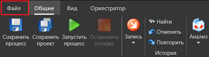
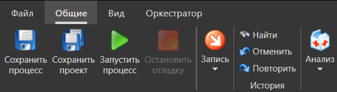
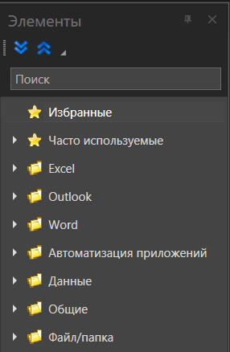
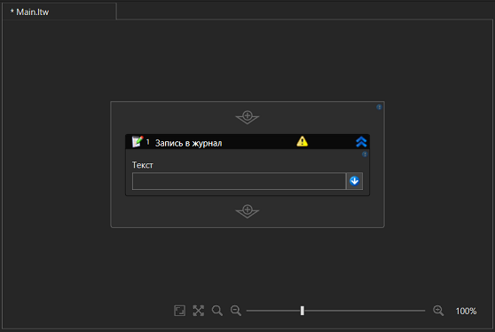
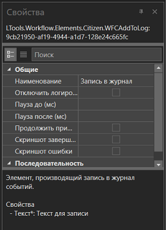

# Начало работы

После установки и запуска Primo RPA Studio Citizen откроется приветственное окно:

**Возможные действия:**

* **Создать проект** - запускает новый проект
* **Открыть проект** - позволяет выбрать **.ltp** файл проекта
* **Клонировать из Git** - импорт проекта из репозитория (требует настроенного Git)
* **История** - выбрать из списка последних открытых проектов

> Чтобы скрыть это окно при следующих запусках, снимите флажок **Показывать при запуске** в нижнем левом углу.

После закрытия окна приветствия, станет доступно окно Студии Ситизен:

## Компоненты рабочего пространства

### Главное меню приложения (Файл):

**Проект**

* Создать проект
* Открыть проект
* Недавние
* Закрыть проект

**Коллективная работа**

* Создать репозиторий
* Клонировать проект
* Удаленные репозитории

**Экспорт**

* Упаковать проект

**Настройки**

**О программе**

**Выход**

### Основная панель

Основная панель представляет собой ленту, разбитую на следующие группы:

**Общие**

* Сохранить проект
* Сохранить проект
* Запустить процесс
* Запись
* Найти
* Отменить
* Повторить
* История
* Анализ

**Вид**

* Скрыть все аннотации
* Показать все аннотации
* Панели

**Оркестратор**

* Опубликовать

### Панель элементов

Кнопки в виде синих стрелок позволяют:

* Раскрыть элементы
* Свернуть элементы

### Основная рабочая область

### Панель свойств

