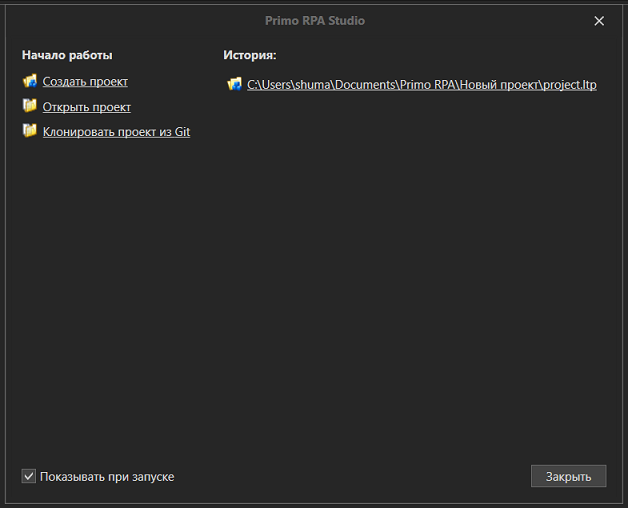

# Начало работы

После установки и запуска Primo RPA Studio Citizen откроется приветственное окно:

**Возможные действия:**

* **Создать проект** - запускает новый проект
* **Открыть проект** - позволяет выбрать **.ltp** файл проекта
* **Клонировать из Git** - импорт проекта из репозитория (требует настроенного Git)
* **История** - выбрать из списка последних открытых проектов

> Чтобы скрыть это окно при следующих запусках, снимите флажок **Показывать при запуске** в нижнем левом углу.

