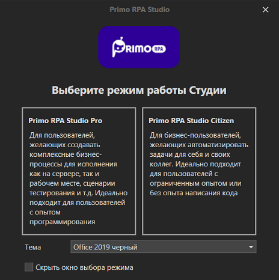
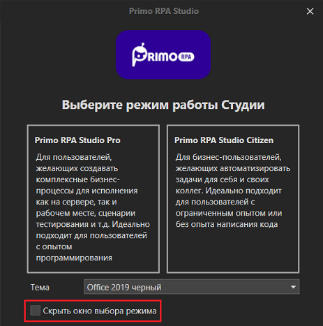

import { Callout } from 'nextra/components';

# Запуск Studio Citizen

Запустите приложение по ярлыку либо через **Пуск** > **Primo > Primo RPA Studio**.

Сначала Студия попросит выбрать режим работы:

- Studio **Pro** — режим для опытных пользователей, которые владеют навыками программирования и хотят создавать комплексные бизнес-процессы для исполнения как на сервере, так и на рабочем месте, сценарии тестирования и т.д.
- Studio **Citizen** — упрощенный режим для пользователей с ограниченным опытом программирования или вовсе без него. Походит для бизнес-пользователей, которые желают автоматизировать задачи для себя и своих коллег.

_:small_blue_diamond: [Чем отличаются издания](https://docs.primo-rpa.ru/ru/primo-studio/common/editions)_

<Callout type="warning">
  RPA-проект, который вы разработали в одном режиме, не получится потом открыть
  в другом режиме — они несовместимы.
</Callout>

Чтобы впоследствии не выбирать каждый раз режим при запуске Студии, установите чекбокс **Скрыть окно выбора режима**.

Выберите издание **Primo RPA Studio Citizen** - при этом откроется рабочая область для создания RPA-проектов.

## Выбор лицензии

При первом запуске Primo RPA Studio Citizen запрашивает лицензию. 
Для этого нужно выбрать тип лицензии и сформировать запрос вендору, после чего загрузить полученный ключ.

Подробнее о типах лицензий и процедуре их получения - см. [статью] ССЫЛКА
