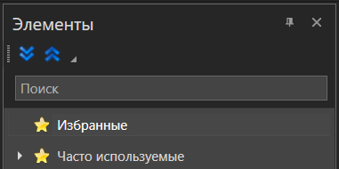
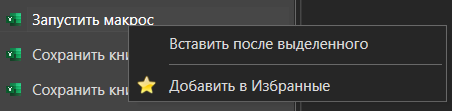
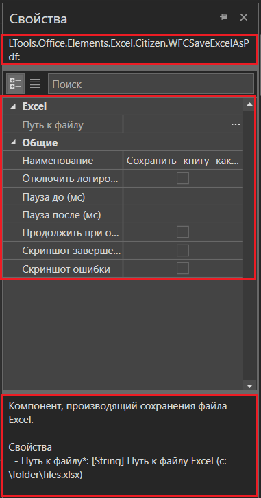
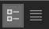
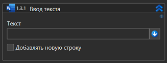
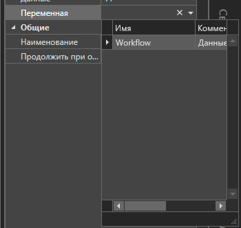
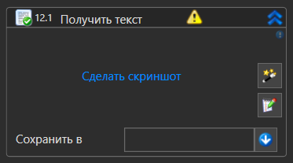
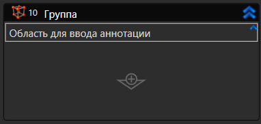

import { Callout } from 'nextra/components';

# Работа с элементами

Все доступные компоненты процесса можно найти в панели **Элементы**. Компоненты сгруппированы по тематике. 
Например, в группе **Excel** находятся все элементы, работающие с Excel.

В верхней части панели расположена поисковая строка для быстрого поиска элементов.

Под поисковой строкой можно увидеть иконки групп:

* **Часто используемые** — для быстрого доступа к элементам, которые вы применяете в проекте чаще всего.
* **Избранные** — для быстрого доступа к избранным элементам. В избранное элемент добавляется вручную. Для этого вызовите контекстное меню элемента и выберите пункт **Добавить в Избранные**:

## Добавить элемент в процесс

Добавить элемент можно одним из следующих способов:

* Перетаскиванием drag-and-drop — просто перетащите элемент из панели в нужную часть процесса.
* Командой контекстного меню. Выберите элемент на панели элементов, вызовите его контекстное меню ПКМ, выберите **Вставить после выделенного**. **Требование**: в процессе должен существовать хотя бы один элемент для указания позиции вставки.

## Свойства элемента

Каждый элемент имеет уникальные параметры, доступные в панели **Свойства**. 
Чтобы увидеть свойства элемента, добавьте его в процесс и нажмите на элемент. Справа отобразится окно с параметрами (свойствами).

Панель **Свойства** состоит из нескольких информационных блоков:

- В верхней части отображается внутреннее наименование элемента и его уникальный идентификатор (ComponentId);
- В центральной — список свойств;
- В нижней части — краткое описание этих свойств (*справка*).

Свойства могут быть отображены в виде обычного списка или в виде групп. Для переключения режимов используйте кнопки .

Все элементы обладают набором общих свойств:

1. **Наименование** — имя элемента, которое отображается в его заголовке и в журнале. Для удобства возможно изменить название элемента внутри процесса, например, когда используются несколько одинаковых компонентов.
1. **Отключить логирование** — позволяет отключить запись логов в консоли (только для данного элемента). Например, если он оперирует конфиденциальными данными. Существует возможность централизованно включить/отключить логирование для всех новых элементов, добавляемых в проект. Для этого перейдите в раздел **Файл > Настройки > Общие > Элементы** и установите нужное значение в чекбоксе **Отключить логирование у новых элементов**.
1. **Продолжить при ошибке** — сценарий будет выполняться даже в том случае, если при выполнении элемента возникла ошибка.
1. **Скриншот завершения** — позволяет сделать снимок экрана в момент завершения работы элемента. Эти скриншоты сохраняются в папку `.Screenshots`, которая создается автоматически внутри папки с процессом.
1. **Скриншот ошибки** — при возникновении ошибки будет сделан снимок экрана.
1. **Пауза до (мс)** — добавляет паузу перед выполнением элемента. Пауза может понадобиться, например, в случае, если сайт, с которым планируется выполнить определенное действие, долго загружается, и требуется подождать, прежде чем переходить к следующему элементу в процессе. 
1. **Пауза после (мс)** — добавляет паузу после выполнения элемента.

<Callout type="warning" emoji="⚠️">
  Если панель свойств или другие панели интерфейса случайно исчезли:
  
  1. Перейдите в верхнее меню **Вид** → **Панели**  
  2. Выберите **Сброс панелей**  
  3. Интерфейс восстановится в стандартное состояние

*Примечание: Это не влияет на ваш процесс или настройки, только на расположение элементов интерфейса.*

</Callout>

Частные свойства описаны в статьях, посвященных конкретным элементам. 

Вносить изменения в свойства можно также в слотах самого элемента:

### Значения свойств

Значения бывают следующих видов:

- **Константа** — обычный текст или чекбокс. В случае текста рядом часто можно увидеть кнопку переключения межу режимами **Код** и **Без кода** — .png>) /> alt="alt" data-size="line" /> В состоянии **Без кода** введенные данные будут интерпретироваться как константы либо как имена переменных (то есть не будут считаться кодом).
- **Переменная** — выбирается из списка переменных, созданных для данного процесса, и выглядит как выпадающий список:

  

- **Шаблон поиска** — выражение, описывающее ССЫЛКА [шаблон поиска](/citizen-windows/launch/processes/search_pattern) элемента управления. Наличие шаблона поиска зависит от типа элемента.

## Скриншоты элементов

Некоторые элементы содержат в себе функцию **Сделать скриншот**, которая позволяет сделать снимок выбранного сегмента экрана. Скриншоты могут помочь пользователям быстрее понять, с чем работает тот или иной элемент в процессе.

Чтобы создать скриншот, нажмите на **Сделать скриншот** и выделите сегмент экрана. Созданный скриншот отобразится на панели элемента.

Дополнительно скриншот сохранится в папку проекта `.Resources`. Название скриншота представляет собой ID элемента, к которому относится изображение.

Управление скриншотом осуществляется через контекстное меню скриншота. Доступны команды:

- **Сделать скриншот** — позволяет заменить текущий скриншот.
- **Очистить** — позволяет удалить скриншот.

<Callout type="warning">
  **Соблюдайте следующие рекомендации при работе с функцией скриншотов:** 1.
  Использовать только один монитор. 1. В RDP-сессиях, убедитесь, что: - масштаб
  удаленного рабочего стола равен 100%; - отключено интеллектуальное изменение
  размера.
</Callout>

## Аннотации

К каждому элементу процесса можно добавить краткое описание (*аннотацию*). Описание будет отображаться сразу под названием элемента.

Чтобы добавить аннотацию, активируйте панель элемента и нажмите в правом верхнем углу восклицательный знак — появится область для ввода текста.

## Управление элементами

Дополнительные действия с элементами можно осуществить при вызове контекстного меню. При нажатии ПКМ (правой клавиши мыши) доступны команды:

- **Вырезать**
- **Копировать**
- **Вставить**
- **Удалить**
- **Закомментировать элементы** — временное отключение выполнения. Элемент будет помещен в контейнер **Закомментировать** и проигнорируется при запуске/отладке процесса. При выборе сразу нескольких элементов, элементы будут закомментированы массово. Команда недоступна для корневой последовательности.
- **Раскомментировать элементы** — команда отображается только для контейнера **Закомментировать**, в котором находятся закомментированные элементы.
- **Запуск с элемента** — запускает процесс с выбранного элемента.
- **Включить логирование**
- **Отключить логирование** 
- **Помощь** — открывает в браузере страницу документации по элементу.

## Пакетное включение логирования элементов

Студия Ситизен содержит возможность массового управления логированием элементов. Теперь можно отключить или включить логирование для нескольких активностей сразу. Чтобы это сделать:

1. Выберите необходимые элементы, зажав клавишу *Shift* и выделив первую и последнюю активности в списке.
2. Нажмите правой клавишей мыши на выделенные элементы и выберите опцию *Отключить логирование* или *Включить логирование*.

<Callout type="info" emoji="ℹ️">
  Информация об исключении будет логироваться независимо от настроек пакетного
  логирования элемента Исключение.
</Callout>

### Отображение свойств элементов и редактор синтаксиса

Часто используемые свойства элементов процесса могут быть отображены непосредственно на панели элемента. 
Теперь вводимые данные в параметрах активности автоматически синхронизируются с соответствующими свойствами элемента, отображаемыми в правой части окна. 
Эта функция позволяет ускорить настройку и контроль параметров.

Для активации данной функции:

1. Перейдите в раздел _Файл → Настройки → Общие → Элементы_.
2. Выберите версию _v2_.
3. Для процессов с типом _"Диаграмма"_ установите галочку _"Отображать дизайн элементов диаграммы"_.

Кроме того, встроен **редактор синтаксиса (IntelliSense)**, поддерживающий автозаполнение методов и программных выражений.

Для активации редактора синтаксиса:

1. Перейдите в раздел _Файл → Настройки_.
2. Установите галочку в параметре _"Использовать строчный редактор"_.
   Редактор включен по умолчанию.

С помощью встроенного редактора синтаксиса вы можете проверять правильность введённых выражений. При вводе некорректного выражения редактор подсветит ошибку, выделив проблемное место красным подчёркиванием.

#### Автоматическое определение параметров с версии 1.25.3

- Новые кнопки "Выбрать" для упрощения заполнения свойств:

  - **Браузерные активности**:
    - "Открыть браузер" → кнопка "Выбрать браузер" (автозаполнение типа браузера и URL)
    - "Присоединиться к браузеру" → автозаполнение заголовка вкладки и URL
    - "Активировать вкладку браузера" → автоматическое определение параметров вкладки
    - "Вход в систему" → кнопка "Выбрать вкладку"
  - **Работа с процессами**:
    - "Уничтожить процесс" → кнопка "Выбрать процесс" (автозаполнение имени процесса и заголовка)
    - "Присоединиться к приложению" → автоматическое определение параметров приложения

### Элементы NuGet-пакетов

Элементы делятся на два типа:

1. **Встроенные** - базовые элементы, включенные в стандартную комплектацию Primo RPA Studio
2. **[Дополнительные NuGet](/primo-studio/settings/nuget)** - не входят в базовую комплектацию и требуют отдельной установки через NuGet-пакеты

После установки NuGet-пакета новые элементы автоматически появляются в панели элементов

**Как работать с дополнительными элементами:**

1. Установите нужный NuGet-пакет через:
   - [Менеджер зависимостей](/primo-studio/projects/manage-dependencies#менеджер-зависимостей) в Primo RPA Studio
   - Ручную загрузку с NuGet.org
2. После установки проверьте появление новых элементов
3. Используйте их в процессах как обычные встроенные элементы

