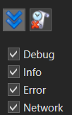

# Выполнение процессов

Студия Ситизен предоставляет возможность проверить работоспособность RPA-сценария до публикации проекта. Для этого можно запустить процесс встроенным роботом и пошагово отследить результат выполнения.

Запустить процесс можно командой **Запустить процесс** на панели быстрого доступа или на вкладке меню «Общие»:

## Консоль

Команда запуска запускает экземпляр робота для немедленного исполнения текущего процесса. 
Отследить его выполнение можно в панели «Консоль». 

Консоль имеет два режима отображения: текстовый и табличный (по умолчанию). Переключить режим можно с помощью опций **Таблица**/**Текст**.

Фильтры DEBUG, INFO, ERROR, NETWORK отвечают за сбор сообщений с соответствующим типом. Над фильтрами расположены кнопки:
*  **Следовать за наполнением консоли** — текст консоли будет всегда фокусироваться на последнем полученном сообщении.
*  **Очистить консоль** — очищает содержимое консоли.

Сообщения в консоли можно копировать и открывать для просмотра в диалоговом окне. 
Обе команды доступны в контекстном меню выбранного сообщения. 
Скопировать сообщение также можно комбинацией `Ctrl` + `C`, при этом допускается множественное копирование выбранных сообщений.

Дополнительные настройки консоли открываются, если кликнуть по заголовкам таблицы и вызвать контекстное меню. Так, команда **Показать выбор колонок** управляет отображением столбцов в консольной таблице.

### Панель «Наблюдение»

Работать с переменными и выражениями можно также в панели **Наблюдение**. По функциональности она соответствует панели Watch классических сред разработки. В таблице панели указывается вычисляемое выражение, тип данных результата вычисления и сам результат:

.png>)

**Управление наблюдением:**

1. **Создание**. Чтобы создать новое наблюдение, нажмите иконку  (3) (1) (1) (2) (1) (2).png>) в левом верхнем углу панели. После чего введите текст вычисляемого выражения в открывшемся окне:

   

1. **Просмотр значения**. Чтобы просмотреть результат вычисления, нажмите иконку  в столбце **Значение**. Отображенный результат можно скопировать комбинацией клавиш `Ctrl` + `C` либо командой контекстного меню.
1. **Обновление результата**. Обновить результат вычисления можно иконкой  в строке с соответствующим наблюдением. Запрос обновления выполнится корректно только, если запущена отладка процесса.
1. **Редактирование**. Изменить вычисляемое выражение можно в ячейке таблицы либо в специальном окне, которое открывается двойным кликом по строке наблюдения.
1. **Удаление**. Чтобы удалить наблюдение, выделите строку в таблице и нажмите иконку  (1) (2) (1) (1) (2) (1) (8).png>) либо клавишу `Delete`.

