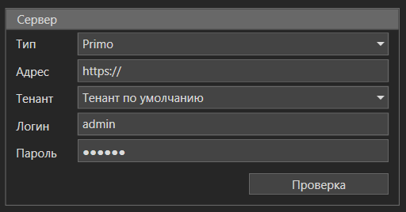
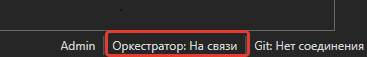
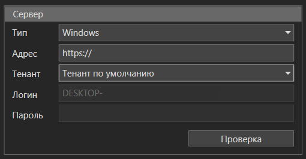

# Подключение к Оркестратору

Настройки подключения Студии к Оркестратору:

1. Откройте Студию и перейдите в меню *Настройки*.
2. Выберите раздел *Оркестратор*.
3. В выпадающем списке *Тип* выберите вариант подключения: *Primo* — для стандартного подключения с указанием:
   - Адрес сервера Оркестратора.
   - Тенант пользователя.
   - Логин пользователя.
   - Пароль пользователя.
4. Нажмите кнопку *Проверка*, чтобы убедиться, что подключение успешно.
5. Нажмите *ОК* для сохранения настроек.

Индикатор состояния соединения всегда можно найти в правом нижнем углу главного окна Студии:

Нажатие на индикатор предоставляет быстрый доступ к настройкам подключения.

## Подключение Студии к Оркестратору с использованием AD авторизации:

1. Откройте Студию и перейдите в меню *Настройки*.
2. Выберите раздел *Оркестратор*.
3. В выпадающем списке *Тип* выберите вариант подключения:
   - *Windows* — для подключения через учетную запись Windows с использованием AD авторизации. 
4. Укажите нужный *Адрес* сервера Оркестратора
5. Нажмите кнопку *Проверка*, чтобы убедиться, что подключение успешно.
6. Нажмите *ОК* для сохранения настроек.

> Если вы используете AD авторизацию, убедитесь, что группы Active Directory (AD) добавлены в системные роли, такие как *Robot* или *Studio*, для выполнения операций через Оркестратор.

