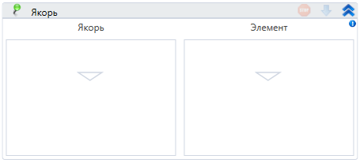

# Якорь

Компонент, производящий операцию над элементом, основываясь на его положении относительно элемента-якоря.

В качестве якоря можно использовать элемент "Присутствие элемента"

| Свойство       | Тип                                    | Описание                                 |
| -------------- | -------------------------------------- | ---------------------------------------- |
| Расположение\* | LTools.WebBrowser.Model.AnchorPosition | Расположение элемента относительно якоря |
