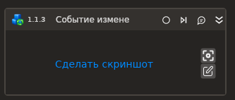

# Событие изменения аттрибута

Компонент, ожидающий событие изменения атрибута элемента страницы.

| Свойство           | Тип                                          | Описание                                                         |
| ------------------ | -------------------------------------------- | ---------------------------------------------------------------- |
| Шаблон поиска      | String                                       | Шаблон поиска элемента управления                                |
| Тип браузера       | LTools.WebBrowser.Model. BrowserTypes\_Short | Тип используемого браузера                                       |
| Заголовок браузера | String                                       | Заголовок подключаемого браузера                                 |
| Атрибут            | String                                       | Отслеживаемый атрибут. ".text" для отслеживания изменения текста |
