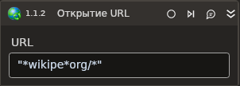

# Событие закрытия URL

Элемент, отслеживающий открытие веб-страниц в браузере.

| Свойство       | Тип    | Описание                    |
| -------------- | ------ | --------------------------- |
| Тип браузера | LTools.WebBrowser.Model.BrowserTypes | Тип используемого браузера |
| URL | System.String | Отслеживаемый URL, поддерживает маски (*) |
