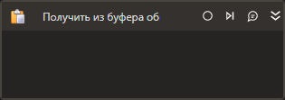

# Получить из буфера обмена

*Eng: Get from Clipboard*

Элемент позволяет извлекать данные из буфера обмена.



## Свойства
Описание общих свойств см. в разделе [Свойства элемента](https://docs.primo-rpa.ru/primo-rpa/primo-studio/process/elements#svoistva-elementa).

| Свойство  | Тип    | Описание          |
| --------- | ------ | ----------------- |
| Результат | String | Название переменной для хранения полученных данных |

## Пример на Learning

RPA-сценарий, демонстрирующий работу элемента, доступен на [Learning](https://github.com/PrimoRPA/Learning). Скачайте проект StudioActivities, откройте его в Студии и выберите процесс `StudioActivities/Ru/Буфер обмена/Копировать-Вставить.ltw` для просмотра.

## Только код

Пример использования элемента в процессе с типом **Только код** (Pure code):



```csharp
string str = LTools.Desktop.DesktopApp.GetFromClipboard(wf);
```



```python
str = LTools.Desktop.DesktopApp.GetFromClipboard(wf)
```



```javascript
var str = _lib.LTools.Desktop.DesktopApp.GetFromClipboard(wf);
```


