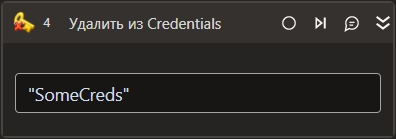

# Удалить из Credentials



Компонент, производящий удаление учетных данных из системного хранилища учетных данных.

## Свойства

Символ `*` в названии свойства указывает на обязательность заполнения. 
Описание общих свойств см. в разделе [Свойства элемента](https://docs.primo-rpa.ru/primo-rpa/primo-studio/process/elements#svoistva-elementa).

1. **Ключ\*** *[System.String]* - Ключ для поиска записанных данных

## Только код

Пример использования элемента в процессе с типом **Только код** (Pure code):



```csharp
LTools.Cryptography.CryptoApp.CredentialsDelete(wf, "Key");
```



```python
LTools.Cryptography.CryptoApp.CredentialsDelete(wf, "Key")
```



```javascript
_lib.LTools.Cryptography.CryptoApp.CredentialsDelete(wf, "Key");
```


