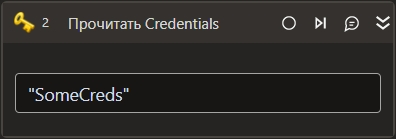

# Прочитать Credentials

*Eng: Get Credentials*

Элемент позволяет получить доступ к логинам и паролям безопасным способом, читая их из системного хранилища учетных данных операционной системы. Применяется для автоматизации процессов, требующих аутентификации, без необходимости жестко кодировать учетные данные в тексте скрипта.



## Свойства

Символ `*` в названии свойства указывает на обязательность заполнения. Описание общих свойств см. в разделе [Свойства элемента](https://docs.primo-rpa.ru/primo-rpa/primo-studio/process/elements#svoistva-elementa).

| Свойство              | Тип                          | Описание                                           |
| --------------------- | ---------------------------- | -------------------------------------------------- |
| Ключ\*                | System.String                       | Уникальный ключ для поиска записанных данных      |
| Данные защищены\*     | System.Boolean                      | Указывает, были ли данные дополнительно защищены (зашифрованы). Доступно только для Windows. По умолчанию параметр выключен |
| Хранить незакрытый пароль\* | System.Boolean                | Возвращать ли пароль в незашифрованном виде. По умолчанию параметр включен - пароль возвращается незашифрованным |
| Переменная\*          | LTools.Common.Model.UserPass | Переменная, в которой будут храниться извлеченные учетные данные. Свойства модели UserPass приводятся ниже  |

LTools.Common.Model.UserPass - модель учетных данных. Имеет свойства:
  - Login: [System.String] Логин.
  - Password: [System.String] Пароль.
  - SecurePassword: [System.Security.SecureString] Пароль в виде SecureString.


## Как использовать

1. Перенесите элемент **Прочитать Credentials** в свой процесс.
2. Задайте необходимые свойства, включая `Ключ` для поиска данных и `Переменная` для хранения результатов.
3. (Только Windows) при необходимости активируйте свойство `Данные защищены`, чтобы включить шифрование данных.

##  Learning

Для обучения работе с элементом **Прочитать Credentials** скачайте RPA-проект по ссылке: [Скачать архив Learning](https://github.com/PrimoRPA/Learning/archive/refs/heads/master.zip).

1. Скачайте архив с обучающими материалами с указанной страницы.
2. Распакуйте его и откройте проект `StudioActivities` в Студии.
3. Найдите процесс `StudioActivities/Ru/Криптография/Credentials.ltw` для знакомства с работой элемента.


## Только код

Пример использования элемента в процессе с типом **Только код** (Pure code):




```csharp
LTools.Common.Model.UserPass ret = LTools.Cryptography.CryptoApp.CredentialsGet(wf, "Key", true);
```



```python
ret = LTools.Cryptography.CryptoApp.CredentialsGet(wf, "Key", True)
```



```javascript
var ret = _lib.LTools.Cryptography.CryptoApp.CredentialsGet(wf, "Key", true);
```


