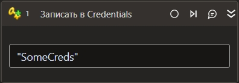

import { Tabs } from 'nextra/components';

# Записать в Credentials



Компонент, производящий запись учетных данных в системное хранилище учетных данных

## Свойства

Символ `*` в названии свойства указывает на обязательность заполнения. 
Описание общих свойств см. в разделе [Свойства элемента](https://docs.primo-rpa.ru/primo-rpa/primo-studio/process/elements#svoistva-elementa).

1. **Ключ\*** *[System.String]* - Ключ для поиска записанных данных
1. **Имя пользователя\*** *[System.String]* - Имя пользователя
1. **Пароль\*** *System.String* - Пароль
1. **Защищенный пароль** *[System.Security.SecureString]* - Защищенный пароль
1. **Защищать данные** *[Boolean]* - Признак использования дополнительной защиты данных. Доступно только в Windows

## Только код

Пример использования элемента в процессе с типом **Только код** (Pure code):



```csharp
LTools.Cryptography.CryptoApp.CredentialsSet(wf, "Key", true, "login", "password");
```



```python
LTools.Cryptography.CryptoApp.CredentialsSet(wf, "Key", True, "login", "password")
```



```javascript
_lib.LTools.Cryptography.CryptoApp.CredentialsSet(wf, "Key", true, "login", "password");
```


