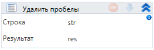

# Удалить пробелы

Компонент, удаляющий пробелы в начала и конце строки.

| Свойство    | Тип    | Описание         |
| ----------- | ------ | ---------------- |
| Строка\*    | String | Исходная строка  |
| Результат\* | String | Очищенная строка |
