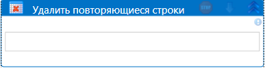

# Удалить повторяющиеся строки

Компонент, объединяющий таблицы.

| Свойство             | Тип                   | Описание                                      |
| -------------------- | --------------------- | --------------------------------------------- |
| Таблица\*            | System.Data.DataTable | Исходная таблица                              |
| Результат\*          | System.Data.DataTable | Переменная, в которую нужно сохранить измененную таблицу |

