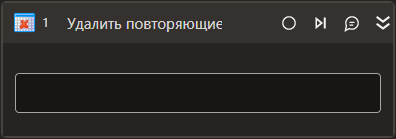

# Удалить повторяющиеся строки

Компонент, удаляющий повторяющиеся строки из таблицы.

| Свойство             | Тип                   | Описание                                                 |
| -------------------- | --------------------- | -------------------------------------------------------- |
| Таблица\*            | System.Data.DataTable | Исходная таблица                                         |
| Результат\*          | System.Data.DataTable | Переменная, в которую нужно сохранить измененную таблицу |
