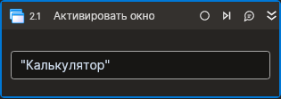

# Активировать окно



Компонент, выводящий окно процесса на передний план. Компонент корректно работает только внутри контейнера Присоединиться к приложению.

| Свойство          | Тип    | Описание                                           |
| ----------------- | -----  | -------------------------------------------------- |
| Заголовок         | String | Заголовок окна |
| Заголовок (RegEx) | String | Заголовок окна (регулярное выражение) |

## Только код  
Пример использования элемента в процессе с типом **Только код** (Pure code):
> Для работы с примером необходимо установить приложение **mate-calc**.



```csharp
LTools.Desktop.DesktopApp app = LTools.Desktop.DesktopApp.Init(wf, "Калькулятор", null, 10000, true, LTools.Desktop.Model.DesktopTypes.UIAUTOMATION);
app.Activate("Калькулятор");
```



```python
app = LTools.Desktop.DesktopApp.Init(wf, "Калькулятор*", None, 10000, True, LTools.Desktop.Model.DesktopTypes.UIAUTOMATION)
app.Activate("Калькулятор")
```



```javascript
let app = _lib.LTools.Desktop.DesktopApp.Init(wf, "Калькулятор", null, 10000, true, _lib.LTools.Desktop.Model.DesktopTypes.UIAUTOMATION);
app.Activate("Калькулятор");
```


